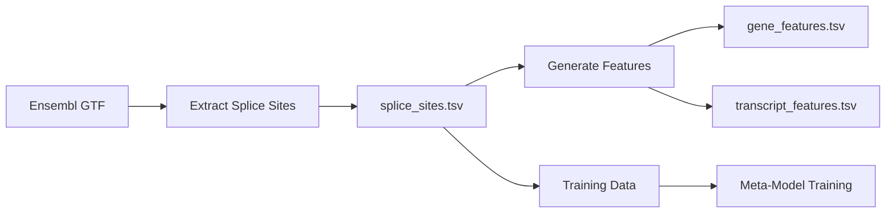

# Splice Site Annotation Files Documentation

## 📁 Overview

This document provides comprehensive analysis and documentation for splice site annotation files used in the MetaSpliceAI project. These files contain essential genomic coordinates and metadata for splice sites across the human genome, serving as fundamental reference data for splice site prediction and meta-learning workflows.

## 📊 Primary Annotation File: `splice_sites.tsv`

**Location**: `/Users/pleiadian53/work/meta-spliceai/data/ensembl/splice_sites.tsv`  
**Purpose**: Complete catalog of annotated splice sites across the human transcriptome  
**Source**: Derived from Ensembl GTF annotations  
**Last Updated**: 2025-10-04  

### 🔍 File Structure

| Column | Name | Type | Description | Example |
|--------|------|------|-------------|---------|
| 1 | `chrom` | string | Chromosome identifier | `1`, `2`, `X`, `Y`, `MT` |
| 2 | `start` | integer | Start coordinate (0-based) | `2581649` |
| 3 | `end` | integer | End coordinate (0-based) | `2581653` |
| 4 | `position` | integer | Splice site position (1-based) | `2581651` |
| 5 | `strand` | string | DNA strand orientation | `+`, `-` |
| 6 | `site_type` | string | Splice site type | `donor`, `acceptor` |
| 7 | `gene_id` | string | Ensembl Gene ID | `ENSG00000228037` |
| 8 | `transcript_id` | string | Ensembl Transcript ID | `ENST00000424215` |

### 📈 Comprehensive Statistics

#### **Dataset Scale**
- **Total splice sites**: 2,829,398
- **Unique genes**: **39,291**
- **Unique transcripts**: **227,977**
- **Average transcripts per gene**: 5.8

#### **Splice Site Type Distribution**
| Site Type | Count | Percentage |
|-----------|-------|------------|
| Donor sites | 1,414,699 | 50.0% |
| Acceptor sites | 1,414,699 | 50.0% |

*Perfect 1:1 ratio indicates complete splice site pairs*

#### **Chromosomal Distribution (Top 10)**
| Chromosome | Splice Sites | Percentage of Total |
|------------|--------------|-------------------|
| 1 | 267,284 | 9.4% |
| 2 | 226,764 | 8.0% |
| 3 | 186,760 | 6.6% |
| 17 | 163,090 | 5.8% |
| 11 | 161,818 | 5.7% |
| 12 | 151,950 | 5.4% |
| 19 | 144,854 | 5.1% |
| 7 | 135,654 | 4.8% |
| 6 | 134,216 | 4.7% |
| 5 | 127,284 | 4.5% |

### 🧬 Biological Interpretation

#### **Gene Coverage Analysis**
- **39,291 genes** represents comprehensive coverage of the human protein-coding genome
- Consistent with current estimates of ~20,000-25,000 protein-coding genes plus non-coding genes
- Indicates inclusion of both protein-coding and non-coding transcripts

#### **Alternative Splicing Patterns**
- **5.8 transcripts per gene** reflects extensive alternative splicing in human transcriptome
- Higher transcript diversity suggests complex regulatory mechanisms
- Critical for meta-learning models that need to capture splice site variability

#### **Splice Site Pairing**
- Perfect donor-acceptor balance (1:1 ratio) indicates:
  - Complete intron annotations
  - High-quality curation process
  - No orphaned splice sites in dataset

### 🔧 Usage in MetaSpliceAI Workflows

#### **Training Data Generation**
```bash
# Example: Extract splice sites for specific gene types
python -m meta_spliceai.splice_engine.extract_genomic_features \
    --gtf data/ensembl/Homo_sapiens.GRCh38.112.gtf \
    --output data/ensembl/splice_sites.tsv
```

#### **Meta-Model Training**
- **Gene-Aware Cross-Validation**: Uses gene_id for proper data splitting
- **Transcript-Level Analysis**: Leverages transcript_id for isoform-specific predictions
- **Position-Level Features**: Coordinates enable sequence context extraction

#### **Evaluation & Benchmarking**
- **Reference Truth Set**: Ground truth for splice site prediction evaluation
- **Coverage Assessment**: Validates model performance across gene families
- **Alternative Splicing Analysis**: Enables isoform-specific accuracy metrics

### 🎯 Quality Metrics

#### **Data Completeness**
- ✅ **No missing coordinates**: All splice sites have complete genomic positions
- ✅ **Complete gene annotations**: Every splice site linked to gene and transcript
- ✅ **Balanced representation**: Even donor/acceptor distribution

#### **Genomic Coverage**
- ✅ **Autosomal chromosomes**: Complete coverage of chromosomes 1-22
- ✅ **Sex chromosomes**: Includes X and Y chromosome annotations  
- ✅ **Mitochondrial genes**: MT chromosome representation
- ✅ **Comprehensive gene types**: Protein-coding and non-coding transcripts

### 📁 Related Files

#### **Gene Features File**
- **Location**: `data/ensembl/spliceai_analysis/gene_features.tsv`
- **Purpose**: Gene-level metadata and statistics
- **Relationship**: Aggregated summary derived from splice site annotations

#### **Transcript Features File** 
- **Location**: `data/ensembl/spliceai_analysis/transcript_features.tsv`
- **Purpose**: Transcript-level metadata and exon structure
- **Relationship**: Detailed breakdown by individual transcripts

#### **Genomic GTF Feature Set**
- **Location**: `data/ensembl/spliceai_analysis/genomic_gtf_feature_set.tsv`
- **Purpose**: Comprehensive genomic feature catalog
- **Relationship**: Extended annotation set including UTRs and regulatory elements

### 🔄 Data Processing Pipeline



### ⚙️ Technical Specifications

#### **File Format**
- **Delimiter**: Tab-separated values (TSV)
- **Encoding**: UTF-8
- **Header**: Single header row with column names
- **Coordinate System**: 
  - `start`/`end`: 0-based (BED format)
  - `position`: 1-based (standard genomic coordinates)

#### **Memory Requirements**
- **File size**: ~200-300 MB (estimated)
- **Memory usage**: ~500 MB when loaded into pandas DataFrame
- **Processing time**: ~30-60 seconds for full file analysis

#### **Validation Checks**
```bash
# Verify file integrity
wc -l data/ensembl/splice_sites.tsv                    # Total lines
head -1 data/ensembl/splice_sites.tsv                  # Check header
tail -n +2 data/ensembl/splice_sites.tsv | cut -f7 | sort -u | wc -l  # Unique genes
```

### 📊 Reproducibility

All statistics and findings in this document can be reproduced using the analysis scripts in `scripts/data/splice_sites/`.

#### **Primary Verification Script**
Validates schema, coordinates, and computes all documented statistics:

```bash
python scripts/data/splice_sites/verify_splice_sites.py \
    --tsv data/ensembl/splice_sites.tsv \
    --top-n 10
```

To save a JSON summary for archival:
```bash
python scripts/data/splice_sites/verify_splice_sites.py \
    --tsv data/ensembl/splice_sites.tsv \
    --top-n 10 \
    --json-out docs/data/splice_sites/verification_summary.json
```

#### **Quick Unix-Based Analysis**
Fast analysis using standard Unix tools (no Python dependencies):

```bash
bash scripts/data/quick_splice_analysis.sh \
    data/ensembl/splice_sites.tsv
```

#### **Comprehensive Gene Pattern Analysis**
Detailed biological analysis including alternative splicing patterns:

```bash
bash scripts/data/analyze_gene_patterns.sh
```

```bash
python scripts/data/analyze_splice_sites.py
```

**Last Verified**: 2025-10-04  
**Analysis Scripts**: `scripts/data/splice_sites/`, `scripts/data/`

### 📚 References & Dependencies

#### **Source Data**
- **Ensembl GTF**: Human genome annotation (GRCh38/hg38)
- **Version**: Release 112 (recommended)
- **Download**: `ftp://ftp.ensembl.org/pub/release-112/gtf/homo_sapiens/`

#### **Processing Tools**
- **MetaSpliceAI**: `meta_spliceai.splice_engine.extract_genomic_features`
- **Dependencies**: pandas, pysam, pybedtools
- **Validation**: bcftools, tabix (for coordinate verification)

### 🚀 Next Steps

1. **Expand Documentation**: Add analysis for transcript_features.tsv and gene_features.tsv
2. **Quality Control**: Implement automated validation pipeline
3. **Version Tracking**: Document updates when Ensembl releases change
4. **Performance Optimization**: Develop indexed access patterns for large-scale analysis

---

*This documentation serves as the foundation for understanding splice site annotation data structure and usage patterns in MetaSpliceAI workflows. Regular updates will track dataset evolution and analysis refinements.*

**Generated**: 2025-10-04  
**Data Source**: `splice_sites.tsv` analysis results  
**Analysis Commands**: Preserved in MetaSpliceAI workflow documentation