# ClinVar Variant Analysis Workflow: Steps 1-2 Tutorial

## Overview

This tutorial documents the complete process for successfully running Steps 1-2 of the ClinVar variant analysis workflow, providing **both detailed hands-on learning AND automated production workflows**.

**What you'll learn**:
- 🎓 **Detailed bcftools commands** for understanding VCF preprocessing
- 🚀 **Automated workflows** for efficient production use  
- 🎯 **Why each step matters** for accurate WT/ALT sequence construction

**What you get**: Analysis-ready VCF files optimized for delta score calculations.

**Complete 5-Step Workflow Documentation:**
- **Steps 1-2**: This tutorial (VCF normalization and variant parsing)
- **Steps 3-5**: See `../VCF_VARIANT_ANALYSIS_REFERENCE.md` and `../OPENSPLICEAI_VARIANT_ANALYSIS_Q8_Q9.md`

**Approach**: Detailed explanations for learning + automation options for production efficiency.

## Path Conventions

- **`<META_SPLICEAI_ROOT>`**: Project root directory where MetaSpliceAI is installed (e.g., `/home/user/meta-spliceai/`, `/opt/meta-spliceai/`)
- **`<OUTPUT_DIR>`**: User-defined output directory for workflow results (e.g., `/tmp/clinvar_analysis/`, `/data/output/`)

## Available ClinVar Files

Your project contains the following ClinVar files in `data/ensembl/clinvar/vcf/`:

| File | Description | Variants | Use Case |
|------|-------------|----------|----------|
| `clinvar_20250831.vcf.gz` | **Original ClinVar** - Complete dataset with all contigs | 3,678,878 | Initial download, comprehensive analysis |
| `clinvar_20250831_reheadered.vcf.gz` | **Reheadered** - Added contig information from FASTA | 3,678,878 | Compatibility testing |
| `clinvar_20250831_main_chroms.vcf.gz` | **Main chromosomes** - Filtered to chr 1-22,X,Y,MT | 3,678,845 | **✅ Recommended for analysis** |
| `sample_clinvar.vcf` | **Sample file** - Small subset for testing | ~50 | Development and testing |

**Reference Genome**: `data/ensembl/Homo_sapiens.GRCh38.dna.primary_assembly.fa` (GRCh38/hg38)

**Dataset Quality**: ✅ **100% validation score** - Excellent coordinate consistency, perfect file integrity, complete format compliance

### Quick File Selection Guide

- **For production analysis**: Use `clinvar_20250831_main_chroms.vcf.gz`
- **For testing/development**: Use `sample_clinvar.vcf` 
- **For compatibility issues**: Use `clinvar_20250831_reheadered.vcf.gz`
- **For comprehensive research**: Use `clinvar_20250831.vcf.gz`

## Table of Contents

1. [Prerequisites and Dependencies](#prerequisites-and-dependencies)
2. [Data Preparation](#data-preparation) - **Detailed steps + automation**
3. [Coordinate System Validation](#coordinate-system-validation) - **Quality assurance**
   - [Comprehensive Dataset Validation](#comprehensive-dataset-validation)
   - [Enhanced VCF Coordinate System Verification](#enhanced-vcf-coordinate-system-verification)
4. [Step 1: VCF Normalization](#step-1-vcf-normalization) - **Ready for WT/ALT analysis**
5. [Step 2: Variant Filtering and Parsing](#step-2-variant-filtering-and-parsing) - **Structured output**
6. [Validation and Testing](#validation-and-testing)
7. [Troubleshooting](#troubleshooting)
8. [Expected Results](#expected-results)

## Prerequisites and Dependencies

### Required Tools

```bash
# Install bcftools (required for VCF processing)
mamba activate surveyor
mamba install -c bioconda bcftools

# Install pysam (required for contig compatibility testing)
mamba install -c bioconda pysam
```

### Why pysam is Required

`pysam` is needed for:
- **VCF/FASTA contig compatibility testing**: Reading VCF headers and FASTA indices
- **Genomic coordinate validation**: Ensuring chromosome naming consistency
- **File format validation**: Checking VCF and FASTA file integrity

The contig compatibility test (`test_fasta_vcf_contig_compatibility.py`) uses pysam to:
```python
import pysam

# Read VCF header contigs
vcf_file = pysam.VariantFile(vcf_path)
vcf_contigs = set(vcf_file.header.contigs.keys())

# Read FASTA reference names
fasta_file = pysam.FastaFile(fasta_path)
fasta_refs = set(fasta_file.references)
```

## Data Preparation

> **💡 Automation Available**: While this section shows the detailed manual steps for educational purposes, MetaSpliceAI provides automated preprocessing via `vcf_preprocessing.py` for production use. See the [automation section](#automated-preprocessing-option) below.

### 1. Fix VCF Header Contig Information

**Problem**: ClinVar VCF files often lack proper contig header lines, causing compatibility issues.

**Solution**: Use bcftools reheader to add contig information from FASTA index:

```bash
# Step 1: Create FASTA index if it doesn't exist
samtools faidx <META_SPLICEAI_ROOT>/data/ensembl/Homo_sapiens.GRCh38.dna.primary_assembly.fa

# Step 2: Add contig headers to VCF using FASTA index
bcftools reheader --fai <META_SPLICEAI_ROOT>/data/ensembl/Homo_sapiens.GRCh38.dna.primary_assembly.fa.fai \
    <META_SPLICEAI_ROOT>/data/ensembl/clinvar/vcf/clinvar_20250831.vcf.gz \
    -o <META_SPLICEAI_ROOT>/data/ensembl/clinvar/vcf/clinvar_20250831_reheadered.vcf.gz

# Step 3: Index the reheadered VCF
bcftools index <META_SPLICEAI_ROOT>/data/ensembl/clinvar/vcf/clinvar_20250831_reheadered.vcf.gz
```

**Check if this step is needed**:
```bash
# Check if reheadered file already exists
ls data/ensembl/clinvar/vcf/clinvar_20250831_reheadered.vcf.gz 2>/dev/null
```

**If the file exists**: Skip to the next step
**If the file doesn't exist**: Run the bcftools reheader commands above

**Validation**: Check that contig headers are present:
```bash
bcftools view -h clinvar_20250831_reheadered.vcf.gz | grep "##contig" | head -5
```

### 2. Filter to Main Chromosomes

**Problem**: VCF files may contain contigs not present in the reference FASTA.

**Solution**: Filter to main chromosomes only:

```bash
bcftools view -r 1,2,3,4,5,6,7,8,9,10,11,12,13,14,15,16,17,18,19,20,21,22,X,Y,MT \
    clinvar_20250831_reheadered.vcf.gz \
    -Oz -o clinvar_20250831_main_chroms.vcf.gz

bcftools index clinvar_20250831_main_chroms.vcf.gz
```

**Check if this step is needed**:
```bash
# Check if main chromosomes file already exists
ls data/ensembl/clinvar/vcf/clinvar_20250831_main_chroms.vcf.gz 2>/dev/null
```

**If the file exists**: This file is the **preferred version for downstream analysis** - you can proceed to coordinate validation
**If the file doesn't exist**: Run the bcftools view commands above

### Automated Preprocessing Option

**For production workflows**, you can use the automated preprocessing:

```python
from meta_spliceai.splice_engine.case_studies.workflows.vcf_preprocessing import preprocess_clinvar_vcf

# Automatic preprocessing with optimal settings for splice analysis
normalized_vcf = preprocess_clinvar_vcf(
    input_vcf=Path("your_new_file.vcf.gz"),
    output_dir=Path("output/")
)
```

**What the automation handles**:
- ✅ All the manual steps above
- ✅ Multiallelic splitting and left-alignment  
- ✅ Quality validation and error checking
- ✅ Tabix indexing for efficient querying

## Coordinate System Validation

### Coordinate Verification Workflow

```mermaid
graph TD
    A[Raw VCF + FASTA] --> B[vcf_coordinate_verifier.py]
    B --> C{Coordinates Consistent?}
    C -->|Yes| D[✅ Ready for Analysis]
    C -->|No| E[❌ Fix Coordinate Issues]
    
    B --> B1[Sample Variants]
    B --> B2[Extract Reference Sequences]
    B --> B3[Compare REF vs FASTA]
    B --> B4[Generate Consistency Score]
    
    E --> E1[Check Genome Build]
    E --> E2[Verify Chromosome Naming]
    E --> E3[Apply VCF Normalization]
```



### Comprehensive Dataset Validation

**New Comprehensive Validation**: Use the ClinVar dataset validator for complete quality assessment:

```bash
cd <META_SPLICEAI_ROOT>
python meta_spliceai/splice_engine/case_studies/data_sources/datasets/clinvar_20250831/validation/clinvar_dataset_validator.py \
    --vcf data/ensembl/clinvar/vcf/clinvar_20250831_main_chroms.vcf.gz \
    --reference data/ensembl/Homo_sapiens.GRCh38.dna.primary_assembly.fa
```

**Expected Output** (ClinVar 20250831 comprehensive validation results):
```
================================================================================
CLINVAR DATASET VALIDATION SUMMARY
================================================================================

Overall Quality Score: 100.0%
Recommendation: EXCELLENT - Ready for production use

Detailed Scores:
  File Integrity:        100.0%
  Format Compliance:     100.0%
  Coordinate Consistency: 100.0%

✅ Strengths:
   • High-quality dataset with excellent consistency
   • Excellent coordinate system consistency
   • All files present with valid indices

File Status:
  clinvar_20250831_main_chroms.vcf.gz: ✅ Present

Coordinate Validation:
  Consistency Score: 100.0%
  Assessment: CONSISTENT
  Sample Size: 100 variants
================================================================================
```

**Validation Methodology**:
- **Coordinate verification**: Uses `vcf_coordinate_verifier.py` internally
- **Sample size**: 100 variants randomly selected from the dataset  
- **Verification method**: REF allele comparison against GRCh38 FASTA reference
- **Additional checks**: File integrity, format compliance, index validation
- **Result interpretation**: 100% = Perfect consistency, ready for analysis

### Enhanced VCF Coordinate System Verification

**Alternative Targeted Validation**: Use the VCF coordinate verifier for focused coordinate system validation:

```bash
cd <META_SPLICEAI_ROOT>
python meta_spliceai/splice_engine/case_studies/tools/vcf_coordinate_verifier.py \
    --vcf data/ensembl/clinvar/vcf/clinvar_20250831_main_chroms.vcf.gz \
    --fasta data/ensembl/Homo_sapiens.GRCh38.dna.primary_assembly.fa \
    --validate-coordinates
```

**About the `--validate-coordinates` flag**:
- **Sample size**: Automatically uses 100+ variants (vs. default 10 for quick verification)
- **Sampling method**: Sequential selection from VCF file (skips multiallelic variants)
- **Purpose**: Provides statistically meaningful coordinate system consistency assessment
- **Threshold**: ≥95% consistency = excellent, <80% = major issues detected

**Alternative files available for testing**:
- **Original ClinVar**: `data/ensembl/clinvar/vcf/clinvar_20250831.vcf.gz` (all contigs)
- **Reheadered**: `data/ensembl/clinvar/vcf/clinvar_20250831_reheadered.vcf.gz` (with contig headers)  
- **Main chromosomes**: `data/ensembl/clinvar/vcf/clinvar_20250831_main_chroms.vcf.gz` (**recommended for analysis**)

This enhanced validation:
- ✅ **Validates coordinate system consistency** (100% achieved for ClinVar 20250831)
- ✅ **Detects genome build mismatches** (GRCh37 vs GRCh38)
- ✅ **Identifies chromosome naming issues** (chr1 vs 1)
- ✅ **Checks reference allele accuracy** (VCF REF vs FASTA sequence)
- ✅ **Provides genome browser links** for investigating any mismatches

**Per-Chromosome Validation Results** (ClinVar 20250831):
```
Chromosome-wise Coordinate Consistency:
======================================
Chr 1-22, X, Y, MT:  100.0% consistency (5 variants per chromosome)
Overall validation:   100.0% (125 total variants tested)
Status:              🎯 Perfect across all chromosomes
```

**Per-Chromosome Testing Methodology**:
- **Tool used**: `generate_per_chromosome_validation.py` + `vcf_coordinate_verifier.py`
- **Sample strategy**: 5 variants randomly selected from each chromosome
- **Coverage**: All 25 main chromosomes (1-22, X, Y, MT)
- **Total tested**: 125 variants across the entire genome
- **Verification**: Each REF allele verified against GRCh38 FASTA at specified coordinates

**Chromosome Naming Verification**:
- ✅ VCF chromosomes: 1, 2, 3, ..., 22, X, Y, MT
- ✅ FASTA references: >1, >2, >3, ..., >22, >X, >Y, >MT  
- ✅ Perfect naming consistency confirmed

### 4. Legacy Contig Compatibility Test (Optional)

For additional verification, you can also run the contig compatibility test:

```bash
cd <META_SPLICEAI_ROOT>/meta_spliceai/splice_engine/case_studies/tests
python test_fasta_vcf_contig_compatibility.py \
    --vcf <META_SPLICEAI_ROOT>/data/ensembl/clinvar/vcf/clinvar_20250831_main_chroms.vcf.gz \
    --fasta <META_SPLICEAI_ROOT>/data/ensembl/Homo_sapiens.GRCh38.dna.primary_assembly.fa
```

**Expected Enhanced Validation Output** (based on actual ClinVar 20250831 testing):
```
VCF Coordinate System Validation Report
=======================================

COORDINATE SYSTEM CONSISTENCY: 100.0%

Total variants processed: 100
Successful verifications: 100
Reference allele matches: 100
  - Basic matches: 100
  - Normalized matches: 0
Reference allele mismatches: 0
Errors: 0

Match rate: 100.0%
Success rate: 100.0%

Variant type distribution:
variant_type
SNV                    94
deletion                4
insertion               2

✅ COORDINATE SYSTEM ASSESSMENT: CONSISTENT
The VCF file appears to use the same coordinate system as the FASTA reference.
```

**How this data was generated**:
- **Tool used**: `vcf_coordinate_verifier.py` with `--validate-coordinates` flag
- **Sample method**: Random sampling of 100 variants from ClinVar 20250831
- **Verification process**: Each variant's REF allele compared against GRCh38 FASTA at the specified coordinates
- **Result**: 100% consistency achieved, confirming perfect coordinate system alignment

**Legacy Contig Compatibility Expected Output**:
```
================================================================================
FASTA/VCF CONTIG COMPATIBILITY TEST RESULTS
================================================================================

Files tested:
  VCF:   <META_SPLICEAI_ROOT>/data/ensembl/clinvar/vcf/clinvar_main_chroms.vcf.gz
  FASTA: <META_SPLICEAI_ROOT>/data/ensembl/Homo_sapiens.GRCh38.dna.primary_assembly.fa

Contig Statistics:
  VCF contigs:     194
  FASTA references: 194
  Intersection:    194
  VCF coverage:    100.0%
  FASTA coverage:  100.0%

Chromosome Completeness (Intersection):
  Autosomes (1-22): 22/22
  Sex chromosomes:  2/2 (X, Y)
  Mitochondrial:    ✓
  Overall score:    100.0%

Compatibility Status: ✓ COMPATIBLE

================================================================================
✓ Compatibility test PASSED
```

## Step 1: VCF Normalization

> **💡 Automation Available**: The workflow automatically handles all bcftools commands via `vcf_preprocessing.py`. The detailed commands below are shown for educational purposes and troubleshooting.

### Purpose
- Split multiallelic variants into single-allele records
- Left-align and normalize indels for consistent representation
- Add variant type annotations (SNV, deletion, insertion, complex)
- Create properly indexed output for efficient querying

### Check if Step 1 is Already Complete

Before running Step 1, check if normalization has already been performed:

```bash
# Check if normalized output already exists
ls <OUTPUT_DIR>/step1_output/step1_normalized.vcf.gz 2>/dev/null

# Alternative: Check if the input VCF is already normalized
bcftools stats data/ensembl/clinvar/vcf/clinvar_20250831_main_chroms.vcf.gz | grep "multiallelic sites"
# If output shows "number of multiallelic sites: 0", normalization may already be done
```

**If normalized files exist**: Skip to [Step 2](#step-2-variant-filtering-and-parsing)

**If normalized files don't exist**: Run the normalization command below.

### Command

```bash
cd <META_SPLICEAI_ROOT>
python -m meta_spliceai.splice_engine.case_studies.workflows.clinvar_variant_analysis \
    --step 1 \
    --input-vcf data/ensembl/clinvar/vcf/clinvar_20250831_main_chroms.vcf.gz \
    --output-dir <OUTPUT_DIR>/step1_output
```

### bcftools Commands Used Internally

**For learning purposes**, here's what the workflow executes automatically:

1. **Multiallelic splitting and normalization**:
```bash
bcftools norm \
    -f data/ensembl/Homo_sapiens.GRCh38.dna.primary_assembly.fa \
    -m -both \
    -Oz \
    -o step1_temp.vcf.gz \
    clinvar_20250831_main_chroms.vcf.gz
```

2. **Add variant type annotations**:
```bash
bcftools +fill-tags \
    -Oz \
    -o step1_normalized.vcf.gz \
    step1_temp.vcf.gz
```

3. **Index the output**:
```bash
tabix -p vcf step1_normalized.vcf.gz
```

### Why This Matters for WT/ALT Analysis

Proper VCF normalization is **critical** for accurate WT vs ALT sequence construction:

🎯 **For splice analysis, you need**:
- **Consistent coordinates**: Left-alignment ensures variants at the same biological position have identical coordinates
- **Single-allele records**: Multiallelic splitting allows independent analysis of each variant
- **Standardized representation**: Prevents duplicate analysis of the same biological change
- **Quality validation**: Ensures reliable coordinate-to-sequence mapping

**After Step 1**: Your VCF is ready for accurate WT/ALT sequence construction around splice sites!

### Expected Results

**Success Indicators** (ClinVar 20250831):
- Process completes without errors
- Output file `step1_normalized.vcf.gz` created (~162MB compressed)
- Index file `step1_normalized.vcf.gz.tbi` created
- Log shows: "✓ Multiallelic splitting completed"
- Log shows: "✓ TYPE annotation added"
- Log shows: "✓ VCF indexing completed"

**Validation**:
```bash
# Check variant count
bcftools stats step1_normalized.vcf.gz | grep "number of records"

# Verify no multiallelic sites remain
bcftools stats step1_normalized.vcf.gz | grep "multiallelic sites"
# Should show: "number of multiallelic sites: 0"

# Check file integrity
bcftools view -H step1_normalized.vcf.gz | head -3
```

**Example Output Statistics** (based on actual ClinVar 20250831 analysis):
```
SN    0    number of records:      3678845
SN    0    number of multiallelic sites:   0
SN    0    number of SNPs: 3404132
SN    0    number of indels:       274713
  - number of deletions:   255266
  - number of insertions:  18447
  - number of complex:     1000
```

## Step 2: Variant Filtering and Parsing

### Purpose
- Extract variant information from normalized VCF
- Parse ClinVar-specific INFO fields
- Create structured TSV output for downstream analysis

### Check if Step 2 is Already Complete

Before running Step 2, check if variant parsing has already been performed:

```bash
# Check if parsed TSV output already exists
ls <OUTPUT_DIR>/step2_output/step2_filtered_variants.tsv 2>/dev/null

# Alternative: Check for existing processed ClinVar files
ls data/ensembl/clinvar/processed/clinvar_variants_all.tsv 2>/dev/null
# If this file exists, Step 2 processing may already be complete
```

**If parsed TSV files exist**: You can proceed to Steps 3-5 (delta score calculations)

**If parsed TSV files don't exist**: Run the parsing command below.

### Command

```bash
python -m meta_spliceai.splice_engine.case_studies.workflows.clinvar_variant_analysis \
    --step 2 \
    --input-vcf <OUTPUT_DIR>/step1_output/step1_normalized.vcf.gz \
    --output-dir <OUTPUT_DIR>/step2_output
```

### bcftools Commands Used Internally

The workflow uses:

```bash
bcftools view -H input.vcf.gz
```

Then parses the output to extract:
- Standard VCF fields: CHROM, POS, ID, REF, ALT, QUAL, FILTER
- ClinVar INFO fields: CLNSIG, CLNREVSTAT, MC, CLNDN, TYPE

### Expected Results

**Success Indicators** (based on ClinVar 20250831 dataset):
- Process completes in ~1-2 minutes for 3,678,845 variants
- Output file `step2_filtered_variants.tsv` created (~584MB)
- Log shows: "Found 3678845 variant records"
- Log shows: "Parsed 3678845 variant records"
- Log shows: "Saved 3678845 filtered variants to ..."

**Dataset Characteristics**:
- **Total variants**: 3,678,845 (after multiallelic splitting)
- **SNVs**: 3,404,132 (92.53%)
- **Deletions**: 255,266 (6.94%)
- **Insertions**: 18,447 (0.50%)
- **Complex variants**: 1,000 (0.03%)

**Output Format**:
The TSV file contains columns:
```
CHROM	POS	ID	REF	ALT	QUAL	FILTER	CLNSIG	CLNREVSTAT	MC	CLNDN	TYPE
1	66926	1525977	AG	A	.	.	Uncertain_significance	no_assertion_criteria_provided	SO:0000159|Deletion	...	snv
```

## Validation and Testing

### Run Systematic Tests

```bash
cd <META_SPLICEAI_ROOT>
python -m pytest tests/case_studies/test_step1_vcf_normalization.py -v
```

**Expected Test Results**:
```
tests/case_studies/test_step1_vcf_normalization.py::TestStep1VCFNormalization::test_step1_multiallelic_splitting_success PASSED
tests/case_studies/test_step1_vcf_normalization.py::TestStep1VCFNormalization::test_step1_fill_tags_optional PASSED
tests/case_studies/test_step1_vcf_normalization.py::TestStep1VCFNormalization::test_step1_bcftools_not_available PASSED
tests/case_studies/test_step1_vcf_normalization.py::TestStep1VCFNormalization::test_step1_validation_metrics PASSED
tests/case_studies/test_step1_vcf_normalization.py::TestStep1VCFNormalization::test_step1_expected_success_criteria PASSED
tests/case_studies/test_step1_vcf_normalization.py::test_step1_success_criteria_checklist PASSED

====================== 6 passed, 2 skipped, 1 warning ======================
```

### Validate File Sizes and Content

```bash
# Check file sizes (ClinVar 20250831 dataset)
ls -lh step1_normalized.vcf.gz        # ~162MB
ls -lh step2_filtered_variants.tsv    # ~584MB

# Verify variant counts match
wc -l step2_filtered_variants.tsv     # Should be 3,678,846 (header + variants)
bcftools view -H step1_normalized.vcf.gz | wc -l  # Should be 3,678,845
```

## Troubleshooting

### Common Issues and Solutions

#### 1. "No such file or directory" for VCF
**Cause**: VCF file path incorrect or file doesn't exist
**Solution**: Verify file path and ensure VCF is properly created

#### 2. "Failed to open file" with bcftools
**Cause**: Missing contig headers in VCF
**Solution**: Run the VCF reheader step as described above

#### 3. "sequence was not found" error
**Cause**: VCF contains contigs not in reference FASTA
**Solution**: Filter VCF to main chromosomes only

#### 4. Import errors with pysam
**Cause**: pysam not installed
**Solution**: `mamba install -c bioconda pysam`

#### 5. Contig compatibility test fails
**Cause**: Chromosome naming mismatch (e.g., "chr1" vs "1")
**Solution**: Ensure consistent naming between VCF and FASTA

### Debug Commands

```bash
# Check VCF header
bcftools view -h input.vcf.gz | head -20

# Check contig headers specifically
bcftools view -h input.vcf.gz | grep "##contig"

# Verify FASTA index exists
ls -la reference.fa.fai

# Test bcftools functionality
bcftools --version
bcftools view input.vcf.gz | head -5
```

### Investigate Specific Variants

Use the enhanced VCF coordinate verifier to investigate specific variants:

```bash
# Verify a specific variant with gene context
python meta_spliceai/splice_engine/case_studies/tools/vcf_coordinate_verifier.py \
    --verify-position chr1:94062595:G:A \
    --fasta Homo_sapiens.GRCh38.dna.primary_assembly.fa \
    --gene-strand - \
    --gene-name ABCA4
```

**This provides**:
- ✅ **Coordinate verification**: Confirms REF allele matches FASTA
- ✅ **Gene context**: Shows strand-specific interpretation
- ✅ **Genome browser links**: Direct URLs to UCSC, Ensembl, and IGV coordinates
- ✅ **Sequence context**: ±10bp around the variant position

**Example Output**:
```
🌐 View in Genome Browser:
==============================
UCSC Genome Browser:
  https://genome.ucsc.edu/cgi-bin/hgTracks?db=hg38&position=chr1:94062545-94062645
IGV coordinates: chr1:94062545-94062645
Ensembl Genome Browser:
  https://www.ensembl.org/Homo_sapiens/Location/View?r=1:94062545-94062645

Gene Context:
==============================
Gene: ABCA4
Strand: -
Gene REF: C (complement of genomic G)
Note: Gene ABCA4 is on minus strand - showing complement
```

## Performance Notes

### Processing Times (3.6M variants)
- **Coordinate System Validation**: ~30 seconds (100 variants)
- **Step 1 VCF Normalization**: ~3-4 minutes
- **Step 2 Variant Parsing**: ~1-2 minutes
- **Legacy Contig Compatibility Test**: ~30 seconds

### Memory Usage
- Peak memory usage: ~2-4GB
- Recommended system: 8GB+ RAM
- Storage: ~1GB for intermediate files

### Optimization Tips
- Use SSD storage for faster I/O
- Ensure sufficient /tmp space for intermediate files
- Run on systems with adequate RAM to avoid swapping

## Workflow Status Check

After completing this tutorial, you should have the following files ready for WT/ALT sequence construction:

### Required Files for Delta Score Calculations

```bash
# Check your workflow completion status:

# 1. Normalized VCF (Step 1 output)
ls <OUTPUT_DIR>/step1_output/step1_normalized.vcf.gz 2>/dev/null || echo "❌ Step 1 not complete"

# 2. Parsed TSV (Step 2 output)  
ls <OUTPUT_DIR>/step2_output/step2_filtered_variants.tsv 2>/dev/null || echo "❌ Step 2 not complete"

# Alternative: Check for existing processed files
echo "Checking for existing processed ClinVar files:"
ls data/ensembl/clinvar/vcf/clinvar_20250831_main_chroms.vcf.gz 2>/dev/null && echo "✅ Normalized VCF available"
ls data/ensembl/clinvar/processed/clinvar_variants_all.tsv 2>/dev/null && echo "✅ Parsed TSV available"
```

### **Enhanced Workflow Option**

For **production use** and **improved splice detection**, consider using the Enhanced ClinVar Workflow:

```bash
# Enhanced workflow with Universal VCF Parser (recommended for production)
python -m meta_spliceai.splice_engine.case_studies.workflows.enhanced_clinvar_workflow \
    --input-vcf data/ensembl/clinvar/vcf/clinvar_20250831_main_chroms.vcf.gz \
    --output-dir results/enhanced_clinvar \
    --use-universal-parser
```

**Benefits of Enhanced Workflow**:
- 🧬 **Comprehensive splice detection**: SO terms + keyword matching
- 📊 **Better statistics**: Splice confidence levels and mechanisms  
- 🔄 **Complete pipeline**: All 5 steps with enhanced Step 2
- 📈 **Improved sensitivity**: Detects more splice-affecting variants

**See complete Step 2.5 tutorial**: `CLINVAR_WORKFLOW_STEP_2.5_TUTORIAL.md`

### Ready for Next Steps

If you have the required files above, you can proceed along **two learning paths**:

#### **Path A: Complete Basic Workflow (Steps 3-5)**
For continuing with basic ClinVar analysis:

1. **Step 3**: OpenSpliceAI scoring (requires OpenSpliceAI installation)
2. **Step 4**: Delta score parsing and event classification  
3. **Step 5**: PR-AUC evaluation and stratification

#### **Path B: Enhanced Workflow (Step 2.5 → Steps 3-5)**
For **production-quality analysis** with comprehensive splice detection:

1. **Step 2.5**: Enhanced parsing with Universal VCF Parser (`CLINVAR_WORKFLOW_STEP_2.5_TUTORIAL.md`)
2. **Steps 3-5**: Advanced analysis (same as Path A but with enhanced data)

### **Learning Progression Summary**

```
Basic Learning Path:
Steps 1-2 (This Tutorial) → Steps 3-5 (Advanced Analysis)

Production Learning Path:  
Steps 1-2 (This Tutorial) → Step 2.5 (Enhanced Parsing) → Steps 3-5 (Advanced Analysis)
                             ↑
                    Comprehensive splice detection
```

**Recommendation**: 
- **Learning**: Complete this tutorial first, then try Step 2.5
- **Production**: Use Step 2.5 for comprehensive splice variant analysis

**Key Point**: The normalized VCF and parsed TSV files are now ready for accurate WT/ALT sequence construction around splice sites!
