# Incremental Builder Core Architecture and Workflow

**Comprehensive guide to the `incremental_builder.py` module: architecture, workflow logic, and position-centric data representation**

## Overview

The `incremental_builder.py` is the cornerstone module for creating large-scale meta-model training datasets using a **position-centric data representation**. It addresses the fundamental challenge of building datasets with tens of millions of training instances while maintaining memory efficiency and fault tolerance.

### Key Innovations

- ✅ **Memory-Efficient Batch Processing**: Processes genes in configurable batches to avoid OOM errors
- ✅ **Position-Centric Representation**: Each training instance represents a single nucleotide position with contextual features
- ✅ **Fault-Tolerant Design**: Supports resumption after interruptions
- ✅ **Systematic Resource Management**: Integrates with genomic resource managers for consistent path resolution
- ✅ **Enhanced Gene Manifests**: Generates comprehensive metadata with splice site density and gene characteristics
- ✅ **Flexible Gene Selection**: Supports multiple selection strategies (error-based, random, custom, all)

---

## Core Architecture

### 1. Position-Centric Data Representation

**Fundamental Concept**: Each row in the training dataset represents a **single nucleotide position** with rich contextual features:

```python
# Example training instance (one row)
{
    'gene_id': 'ENSG00000121940',
    'position': 108881885,           # Genomic coordinate
    'chrom': '1', 
    'strand': '-',
    'pred_type': 'donor',            # Label: neither/donor/acceptor
    'sequence_context': 'AGTCAG...',  # Surrounding sequence
    '3mer_AGT': 2,                   # K-mer features (raw counts)
    '3mer_GTC': 1,
    # ... hundreds of contextual features
    'splice_density_per_kb': 22.19,  # Gene-level characteristics
    'gene_length': 81643,
    # ... enriched features
}
```

**Why Position-Centric?**
- **Granular Learning**: Models learn splice patterns at nucleotide resolution
- **Contextual Features**: Each position includes surrounding sequence context
- **Scalable Architecture**: Supports genome-wide training datasets
- **Meta-Learning Ready**: Compatible with advanced architectures (CRF, multimodal models)

### 2. Three-Stage Pipeline Architecture

```mermaid
graph TD
    A["🎯 Gene Selection<br/>subset_analysis_sequences()"] --> B["🔄 Batch Processing<br/>build_base_dataset()"]
    B --> C["📊 Feature Enrichment<br/>apply_feature_enrichers()"]
    C --> D["⚖️ TN Downsampling<br/>downsample_tn()"]
    D --> E["🔗 Master Assembly<br/>Hard-link to master/"]
    E --> F["📋 Enhanced Manifest<br/>_generate_gene_manifest()"]
    
    style A fill:#e1f5fe
    style B fill:#f3e5f5
    style C fill:#e8f5e8
    style D fill:#fff3e0
    style E fill:#fce4ec
    style F fill:#f1f8e9
```



---

## Workflow Logic Deep Dive

### Stage 1: Gene Selection and Normalization

#### Gene ID Normalization
```python
def _normalize_gene_identifiers(gene_ids: Set[str]) -> Tuple[Set[str], Dict[str, str]]
```

**Purpose**: Convert mixed gene identifiers (names/IDs) to consistent Ensembl IDs.

**Process**:
1. **Load Gene Features**: Uses systematic resource management to load `gene_features.tsv`
2. **Create Mappings**: Builds bidirectional lookup tables (ID ↔ Name)
3. **Normalize Input**: Converts gene names to Ensembl IDs
4. **Validation**: Reports failed conversions and provides warnings

**Example**:
```bash
# Input: Mixed identifiers
--gene-ids-file genes.txt  # Contains: BRCA1, ENSG00000012048, TP53

# Output: Normalized Ensembl IDs  
# BRCA1 → ENSG00000012048
# ENSG00000012048 → ENSG00000012048 (unchanged)
# TP53 → ENSG00000141510
```

#### Gene Selection Strategies

| Strategy | Logic | Use Case |
|----------|-------|----------|
| `error_total` | Genes with highest total prediction errors | Error-focused training |
| `error_fp` | Genes with most false positives | Precision improvement |
| `error_fn` | Genes with most false negatives | Recall improvement |
| `random` | Random sampling for diversity | Balanced representation |
| `custom` | User-provided gene list only | Strategic selection |
| `all` | All available genes | Maximum coverage |

**Smart Workflow Detection**:
```python
# Automatically enables workflow if genes are missing from artifacts
if missing_genes and not run_workflow:
    print("CRITICAL: Missing genes from artifacts")
    print("Automatically enabling --run-workflow")
    run_workflow = True
```

### Stage 2: Enhanced Splice Prediction Workflow (Conditional)

**Triggers**: 
- `--run-workflow` flag specified
- Missing genes detected in artifacts
- Building new dataset from scratch

**Process**:
1. **Genomic File Check**: Validates availability of sequences, annotations, splice sites
2. **Target Gene Processing**: Runs SpliceAI on selected genes to generate enhanced features
3. **Artifact Generation**: Creates chunked analysis sequence files (e.g., `analysis_sequences_22_chunk_1001_1454.tsv`) and enhanced positions table

**Chunked Artifact Structure**:

The workflow generates **chromosome-partitioned, chunk-based** analysis sequence files:

```
data/ensembl/spliceai_eval/meta_models/
├── analysis_sequences_1_chunk_1_500.tsv       # Chromosome 1, genes 1-500
├── analysis_sequences_1_chunk_501_1000.tsv    # Chromosome 1, genes 501-1000
├── analysis_sequences_22_chunk_1001_1454.tsv  # Chromosome 22, genes 1001-1454
├── analysis_sequences_3_chunk_2001_2500.tsv   # Chromosome 3, genes 2001-2500
└── full_splice_positions_enhanced.tsv         # Aggregated positions table
```

**Chunking Logic**:
- **Chromosome-Based**: Files partitioned by chromosome number
- **Gene Range**: Each chunk covers a specific range of genes (e.g., `chunk_1001_1454`)
- **Memory Management**: Prevents large monolithic files that could cause memory issues
- **Parallel Processing**: Enables concurrent processing of different chromosomes/chunks

**Integration Points**:
```python
# Systematic resource management
_wk['position_id_mode'] = position_id_mode  # genomic/transcript/splice_aware
run_enhanced_splice_prediction_workflow(verbosity=max(0, verbose - 1), **_wk)
```

### Stage 3: Incremental Batch Processing

#### Batch Generation Logic
```python
def _chunks(seq: Sequence[str], size: int) -> Iterable[List[str]]:
    """Yield successive size-chunk lists from seq."""
    for i in range(0, len(seq), size):
        yield list(seq[i : i + size])
```

**Memory Management Strategy**:
- **Configurable Batch Size**: Default 1,000 genes per batch
- **Row Buffering**: `--batch-rows` controls memory usage during streaming
- **Incremental Processing**: Each batch processed independently

#### Per-Batch Pipeline

**Step 1: Base Dataset Creation**
```python
def build_base_dataset(
    gene_ids: Sequence[str],
    output_path: Path,
    data_handler: MetaModelDataHandler,
    kmer_sizes: Sequence[int] = (6,),
    # ...
) -> Path:
```

**Process**:
1. **Raw K-mer Assembly**: Extracts k-mer features and base features
2. **Feature Enrichment**: Applies enrichers (performance, gene, overlap features)
3. **Missing Value Patching**: Fills gene_type and structural features
4. **Splice Site Updates**: Authoritative n_splice_sites from `splice_sites.tsv`

**Step 2: True Negative Downsampling**
```python
df_trim = downsample_tn(raw_path, trim_path, **downsample_kwargs)
```

**TN Downsampling Strategy**:
- **Hard Negatives**: Preserve high-probability false predictions (`hard_prob_thresh`)
- **Neighborhood Negatives**: Keep TNs near true splice sites (`window_nt`)
- **Easy Negatives**: Randomly sample remaining TNs (`easy_neg_ratio`)

**Memory Efficiency**:
- **Streaming Processing**: Uses Polars lazy evaluation
- **Temporary Files**: Raw datasets cleaned up after trimming
- **Compression**: Final datasets use ZSTD compression

### Stage 4: Master Dataset Assembly

#### Hard-Link Strategy
```python
# Space-efficient linking (O(1) operation)
try:
    os.link(pth, dest)  # Hard-link for efficiency
except OSError:
    shutil.copy2(pth, dest)  # Fallback to copy
```

**Benefits**:
- **Zero Additional Disk Space**: Hard-links don't duplicate data
- **Atomic Assembly**: Either all batches link successfully or none
- **Cross-Platform Support**: Falls back to copying when hard-links unavailable

#### Master Directory Structure
```
train_dataset/
├── batch_00001_trim.parquet     # Individual batch files
├── batch_00002_trim.parquet
├── ...
└── master/                      # Consolidated dataset
    ├── batch_00001.parquet      # Hard-linked from trim files
    ├── batch_00002.parquet
    └── ...
```

### Stage 5: Enhanced Manifest Generation

#### Comprehensive Gene Characteristics
```python
def _generate_gene_manifest(master_dir: Path, output_path: Path, verbose: int) -> Path:
```

**Data Integration**:
1. **Gene Features**: Loads `gene_features.tsv` for gene characteristics
2. **Splice Sites**: Loads `splice_sites.tsv` for density calculations
3. **Batch Analysis**: Extracts gene information from Parquet files
4. **Statistical Analysis**: Computes comprehensive statistics

**Enhanced Manifest Schema**:
```csv
global_index,gene_id,gene_name,gene_type,chrom,strand,gene_length,start,end,total_splice_sites,donor_sites,acceptor_sites,splice_density_per_kb,file_index,file_name
0,ENSG00000121940,CLCC1,protein_coding,1,-,81643,108881885,108963527,1812,906,906,22.194186886812098,1,batch_00001.parquet
```

**Statistics Generated**:
- **Gene Type Distribution**: Counts by gene type
- **Length Statistics**: Mean, median, min, max gene lengths
- **Splice Density**: Sites per kilobase statistics
- **Data Completeness**: Coverage and missing value analysis

---

## Advanced Features

### 1. Transcript-Aware Position Identification

**Position ID Modes**:
- `genomic`: Standard genomic coordinates (default, backward compatible)
- `transcript`: Transcript-aware positioning for meta-learning
- `splice_aware`: Same as transcript (emphasizes splice context)

**Configuration**:
```python
transcript_config = TranscriptAwareConfig(mode=position_id_mode)
dataset_kwargs['transcript_config'] = transcript_config
```

### 2. Systematic Resource Management

**Integration with Genomic Resources**:
```python
from meta_spliceai.splice_engine.meta_models.workflows.inference.data_resource_manager import create_inference_data_manager

data_manager = create_inference_data_manager(project_root=project_root, auto_detect=True)
gene_features_path = data_manager.get_gene_features_path()
splice_sites_path = data_manager.get_splice_sites_path()
```

**Benefits**:
- **Consistent Paths**: Eliminates hardcoded paths across workflows
- **Environment Independence**: Works across different deployment environments
- **Automatic Detection**: Smart path resolution based on project structure

### 3. Intelligent Workflow Orchestration

#### Missing Gene Detection
```python
# Validate artifact coverage
available_genes = set(positions_df.select("gene_id").unique().collect()["gene_id"].to_list())
missing_genes = set(all_gene_ids) - available_genes

# Auto-enable workflow if needed
if missing_genes and not run_workflow:
    print("Automatically enabling --run-workflow to generate missing gene data")
    run_workflow = True
```

#### Smart Dataset Path Resolution
```python
# Auto-detects master/ subdirectory
if dataset_path and not dataset_path.endswith('master') and (Path(dataset_path) / 'master').exists():
    resolved_path = str(Path(dataset_path) / 'master')
```

---

## Memory Management and Performance

### Critical Parameters

#### `--batch-rows` (Critical for Memory Management)
```bash
--batch-rows 20000    # Recommended for strategic workflows
--batch-rows 500000   # Default (HIGH OOM RISK with complex gene sets)
```

**Memory Impact**:
- **20K rows**: ~1-2 GB RAM peak (safe for most systems)
- **500K rows**: ~8-12 GB RAM peak (may cause OOM with strategic genes)

#### `--batch-size` (Gene Count per Batch)
```bash
--batch-size 250      # Conservative (low memory, slower)
--batch-size 1000     # Default (balanced)
--batch-size 2000     # Aggressive (faster, higher memory)
```

**Performance Trade-offs**:
- **Smaller batches**: Lower memory usage, more I/O operations
- **Larger batches**: Higher memory usage, fewer I/O operations

### Performance Characteristics

**Typical Performance** (based on production runs):
- **Processing Rate**: ~500-1000 genes/hour (depends on gene complexity)
- **Memory Usage**: 1-8 GB peak (depends on batch configuration)
- **Disk Usage**: ~2-5 GB per 1000 genes (after compression)

**Optimization Strategies**:
1. **Batch Size Tuning**: Balance memory vs I/O efficiency
2. **Temporary File Cleanup**: Raw files removed after trimming
3. **Compression**: ZSTD compression for final datasets
4. **Hard-Linking**: Zero-copy master assembly

---

## Gene Selection Deep Dive

### Selection Pipeline

```python
def incremental_build_training_dataset(
    n_genes: int = 20_000,
    subset_policy: str = "error_total",
    gene_types: Optional[Sequence[str]] = None,
    additional_gene_ids: Optional[Sequence[str]] = None,
    # ...
):
```

#### Gene Count Logic

**Formula**: `final_count = max(n_genes, len(additional_genes))`

**Scenarios**:
```python
# Scenario 1: Strategic < n_genes (normal case)
n_genes=7000, additional_genes=2000 → Result: 7000 genes (2000 strategic + 5000 random)

# Scenario 2: Strategic > n_genes (strategic takes precedence)  
n_genes=1000, additional_genes=2000 → Result: 2000 genes (all strategic, no random)

# Scenario 3: All genes policy
subset_policy="all" → Result: All available genes (ignores n_genes)
```

#### Gene Type Filtering Integration

**Full Pipeline Support**:
```python
# Gene type filtering at multiple stages
if gene_types:
    gene_features_df = gene_features_df.filter(pl.col("gene_type").is_in(gene_types))
    
# Integrated with all selection policies
_, all_gene_ids = subset_positions_dataframe(
    pos_df,
    n_genes=n_genes,
    subset_policy=subset_policy,
    gene_types=list(gene_types),  # ✅ Supported
    # ...
)
```

### Artifact Coverage Validation

**Smart Validation Logic**:
```python
# Check what genes have existing artifacts
available_genes = set(positions_df.select("gene_id").unique().collect()["gene_id"].to_list())
missing_genes = set(all_gene_ids) - available_genes

# Coverage analysis
coverage_pct = (len(set(all_gene_ids) - missing_genes) / len(set(all_gene_ids))) * 100
print(f"Artifact coverage: {coverage_pct:.1f}%")
```

**Automatic Workflow Triggering**:
- **High Coverage**: Uses existing artifacts, skips workflow
- **Missing Genes**: Automatically enables `--run-workflow`
- **New Datasets**: Always runs workflow for complete gene sets

---

## Chunked Artifact System

### Understanding SpliceAI Artifact Organization

The incremental builder works with **chunked analysis sequence artifacts** generated by the enhanced splice prediction workflow. Understanding this system is crucial for troubleshooting and optimization.

#### Default Artifact Location
```
data/ensembl/spliceai_eval/meta_models/
```

#### Chunked File Naming Convention
```
analysis_sequences_{chromosome}_chunk_{start_gene}_{end_gene}.tsv
```

**Examples**:
- `analysis_sequences_13_chunk_501_1000.tsv` - Chromosome 13, genes 501-1000
- `analysis_sequences_3_chunk_2001_2500.tsv` - Chromosome 3, genes 2001-2500  
- `analysis_sequences_22_chunk_1001_1454.tsv` - Chromosome 22, genes 1001-1454

#### Why Chunked Architecture?

**Memory Management**:
- **Prevents OOM**: Large chromosomes split into manageable chunks
- **Parallel Processing**: Different chunks can be processed simultaneously
- **Incremental Loading**: Builder loads only required chunks per batch

**Fault Tolerance**:
- **Granular Recovery**: Failed chunks can be regenerated independently
- **Partial Availability**: Builder works with subset of available chunks
- **Incremental Generation**: Chunks created as genes are processed

#### Artifact Validation Logic

```python
# Builder checks for artifact availability
available_genes = set()
positions_path = os.path.join(dh.meta_dir, "full_splice_positions_enhanced.tsv")
if os.path.exists(positions_path):
    # Load aggregated positions file for complete gene list
    positions_df = pl.scan_csv(positions_path, separator=dh.separator)
    available_genes = set(positions_df.select("gene_id").unique().collect()["gene_id"].to_list())
```

**Coverage Analysis**:
- **Available Genes**: Extracted from existing chunked artifacts
- **Missing Genes**: Genes not found in any chunk
- **Coverage Percentage**: `(available_genes / requested_genes) * 100`

#### Working with Chunked Data

**Builder's Chunk Integration**:
1. **Discovery**: Scans `meta_models/` directory for chunk files
2. **Gene Mapping**: Determines which chunks contain target genes
3. **Selective Loading**: Loads only chunks containing batch genes
4. **Assembly**: Combines chunk data into batch datasets

**MetaModelDataHandler Integration**:
```python
# Handles chunked file discovery and loading
dh = MetaModelDataHandler(eval_dir=eval_dir)
# Automatically discovers and loads appropriate chunks
```

---

## Data Flow and File Organization

### Batch Processing Flow


### Directory Structure Evolution

**During Build**:
```
output_dir/
├── batch_00001_raw.tmp.parquet      # Temporary (deleted after enrichment)
├── batch_00001_trim.parquet         # Persistent batch file
├── batch_00002_raw.tmp.parquet      # Current batch being processed
└── master/                          # Created after first batch completes
    └── batch_00001.parquet          # Hard-linked from trim file
```

**Final Structure**:
```
train_dataset/
├── batch_00001_trim.parquet         # Individual batches (can be archived)
├── batch_00002_trim.parquet
├── ...
├── gene_manifest.csv                # Enhanced manifest with characteristics
└── master/                          # Production dataset directory
    ├── batch_00001.parquet          # Hard-linked batch files
    ├── batch_00002.parquet
    └── ...
```

---

## Feature Engineering Pipeline

### 1. Base Feature Extraction

**K-mer Features**:
```python
kmer_sizes: Sequence[int] = (6,)  # Default 6-mers
# Generates features: 6mer_AAA, 6mer_AAC, 6mer_AAG, ...
```

**Sequence Context**:
- **Surrounding Sequence**: Configurable window around each position
- **Strand Awareness**: Proper handling of forward/reverse strand genes
- **Position Encoding**: Genomic coordinates with transcript context

### 2. Feature Enrichment

**Enricher Types**:
```python
enrichers = [
    "performance",    # SpliceAI prediction scores
    "gene",          # Gene-level characteristics
    "overlap",       # Overlapping gene features
    # ... additional enrichers
]
```

**Performance Features**:
- **Prediction Scores**: SpliceAI probability outputs
- **Confidence Metrics**: Model confidence indicators
- **Error Analysis**: Distance to true splice sites

**Gene Features**:
- **Gene Type**: protein_coding, lncRNA, pseudogene, etc.
- **Gene Length**: Total gene span in base pairs
- **Splice Density**: Sites per kilobase
- **Chromosomal Location**: Chromosome, strand, coordinates

### 3. Missing Value Patching

**Systematic Patching**:
```python
# Integrated patching (replaces post-hoc scripts)
df_enriched = builder_utils.fill_missing_gene_type(df_enriched)
df_enriched = builder_utils.fill_missing_structural_features(df_enriched)
df_enriched = builder_utils.update_n_splice_sites(df_enriched)
```

**Benefits**:
- **Immediate Completeness**: No post-processing required
- **Consistency**: All datasets have complete feature sets
- **Reliability**: Eliminates missing value issues in downstream training

---

## True Negative Downsampling Strategy

### Three-Tier Sampling Strategy

#### Tier 1: Hard Negatives (Always Preserved)
```python
hard_prob_thresh = 0.15  # Default threshold
# Preserves TNs with prediction probability > 0.15
```

**Rationale**: These are "difficult" negatives that challenge the model and improve generalization.

#### Tier 2: Neighborhood Negatives (Spatially Preserved)
```python
window_nt = 75  # Default window size
# Preserves TNs within 75bp of true splice sites
```

**Rationale**: Provides spatial context around true positives for better boundary learning.

#### Tier 3: Easy Negatives (Randomly Sampled)
```python
easy_neg_ratio = 0.5  # Default ratio
# Randomly keeps 50% of remaining "easy" negatives
```

**Rationale**: Maintains class balance while reducing dataset size.

### Downsampling Impact

**Typical Reduction**:
- **Before Downsampling**: ~10M rows per 1000 genes
- **After Downsampling**: ~1-2M rows per 1000 genes (80-90% reduction)
- **Class Balance**: Maintains informative negative examples

---

## Fault Tolerance and Recovery

### Resumption Logic

**Batch-Level Recovery**:
```python
if trim_path.exists() and not overwrite:
    print(f"[{prefix}] trim Parquet exists – skipping …")
    trim_paths.append(trim_path)
    continue
```

**Master Assembly Recovery**:
```python
# Master assembly is idempotent
for i, pth in enumerate(trim_paths, 1):
    dest = master_dir / f"batch_{i:05d}.parquet"
    if dest.exists() and not overwrite:
        continue  # Skip existing files
```

### Error Handling Strategies

**Graceful Degradation**:
```python
# Handle missing gene data gracefully
if not tmp_path.exists():
    print("Warning: No training data found for batch genes")
    # Create empty parquet file to maintain pipeline integrity
    empty_df = pl.DataFrame({"gene_id": [], "position": [], "pred_type": []})
    empty_df.write_parquet(output_path, compression="zstd")
    return output_path
```

**Validation and Warnings**:
- **Gene Count Validation**: Ensures expected vs actual gene counts
- **Coverage Analysis**: Reports artifact availability
- **Quality Checks**: Validates schema consistency

---

## Integration with Inference Workflows

### Dual-Purpose Design

**Training Use Case**:
```python
# Large-scale training dataset creation
incremental_build_training_dataset(
    n_genes=20000,
    subset_policy="error_total",
    output_dir="train_pc_20k",
    run_workflow=True  # Generate artifacts first
)
```

**Inference Use Case**:
```python
# Dynamic test dataset assembly for specific genes
incremental_build_training_dataset(
    gene_ids=["ENSG00000121940", "ENSG00000131778"],
    subset_policy="custom", 
    output_dir="inference_test_data",
    run_workflow=False  # Use existing artifacts
)
```

### Position-Centric Advantages for Inference

1. **Granular Predictions**: Position-level predictions for precise variant analysis
2. **Contextual Features**: Rich feature representation for each nucleotide
3. **Scalable Architecture**: Handles single genes to genome-wide analysis
4. **Feature Consistency**: Same feature engineering as training data

---

## Configuration and Parameters

### Core Parameters

| Parameter | Default | Purpose | Memory Impact |
|-----------|---------|---------|---------------|
| `--n-genes` | 20,000 | Total genes to include | High (linear scaling) |
| `--batch-size` | 1,000 | Genes per batch | Medium (batch scaling) |
| `--batch-rows` | 500,000 | Rows per memory buffer | **Critical** (direct RAM usage) |
| `--subset-policy` | "error_total" | Gene selection strategy | Low |
| `--kmer-sizes` | [6] | K-mer feature sizes | Medium (feature count scaling) |

### Memory Management Guidelines

**Safe Configuration (Recommended)**:
```bash
--batch-size 500 --batch-rows 20000    # ~1-2 GB RAM peak
```

**Balanced Configuration**:
```bash
--batch-size 1000 --batch-rows 100000  # ~4-6 GB RAM peak  
```

**High-Performance Configuration** (requires >16GB RAM):
```bash
--batch-size 2000 --batch-rows 500000  # ~8-12 GB RAM peak
```

### Gene Selection Configuration

**Error-Based Selection** (requires existing artifacts):
```bash
--subset-policy error_total --n-genes 5000
```

**Random Selection** (balanced diversity):
```bash
--subset-policy random --n-genes 5000 --gene-types protein_coding
```

**Custom Selection** (strategic genes):
```bash
--gene-ids-file strategic_genes.txt --subset-policy custom
```

**All Genes** (maximum coverage):
```bash
--subset-policy all --gene-types protein_coding lncRNA
```

---

## Best Practices and Recommendations

### 1. Memory Management

**Always specify `--batch-rows` for large datasets**:
```bash
# ❌ RISKY - May cause OOM
python -m incremental_builder --n-genes 10000

# ✅ SAFE - Explicit memory control  
python -m incremental_builder --n-genes 10000 --batch-rows 20000
```

### 2. Gene Selection Strategy

**Choose strategy based on training objectives**:
- **Error Reduction**: Use `error_total`, `error_fp`, or `error_fn`
- **Balanced Training**: Use `random` with appropriate `gene_types`
- **Strategic Enhancement**: Combine `random` with `--gene-ids-file`
- **Maximum Coverage**: Use `all` with specific `gene_types`

### 3. Quality Assurance

**Always validate final datasets**:
```bash
# 1. Check enhanced manifest
head -5 train_dataset/gene_manifest.csv

# 2. Verify gene count and types
python -c "
import polars as pl
manifest = pl.read_csv('train_dataset/gene_manifest.csv')
print(f'Total genes: {len(manifest):,}')
print(f'Gene types: {manifest[\"gene_type\"].value_counts()}')
"

# 3. Check dataset integrity
python scripts/validate_meta_model_training_data.py train_dataset
```

### 4. Documentation and Reproducibility

**Document your configuration**:
```bash
# Save configuration for reproducibility
echo "# Dataset: train_pc_5000_3mers
Created: $(date)
Command: python -m incremental_builder --n-genes 5000 --gene-types protein_coding --kmer-sizes 3
Gene selection: random sampling from protein_coding genes
Features: 3-mers + enriched features
" > train_pc_5000_3mers/BUILD_INFO.md
```

---

## Troubleshooting

### Common Issues

#### 1. Out of Memory (OOM) Errors
**Symptoms**: Process killed with memory errors during batch processing
**Solution**: 
```bash
--batch-rows 20000  # Reduce memory buffer size
--batch-size 250    # Reduce genes per batch
```

#### 2. Missing Gene Artifacts
**Symptoms**: "No training data found for batch genes"
**Solution**:
```bash
--run-workflow  # Auto-generate missing artifacts
```

#### 3. Schema Inconsistencies
**Symptoms**: "extra column in file outside of expected schema"
**Solution**: Use schema validation and fixing utilities (see `SCHEMA_MISMATCH_PREVENTION.md`)

#### 4. Interrupted Builds
**Symptoms**: Partial batch files, incomplete master directory
**Solution**:
```bash
# Resume without --overwrite
python -m incremental_builder [same parameters] # Will skip completed batches
```

### Debugging Commands

```bash
# Check batch completion status
ls -la train_dataset/batch_*_trim.parquet | wc -l

# Verify master assembly
ls -la train_dataset/master/ | head -10

# Check manifest generation
head -5 train_dataset/gene_manifest.csv

# Memory usage monitoring
top -p $(pgrep -f incremental_builder)
```

---

## Advanced Use Cases

### 1. Large-Scale Production Datasets

**Configuration for 20K+ genes**:
```bash
python -m meta_spliceai.splice_engine.meta_models.builder.incremental_builder \
    --n-genes 25000 \
    --subset-policy all \
    --gene-types protein_coding \
    --batch-size 500 \
    --batch-rows 15000 \
    --kmer-sizes 3,5 \
    --output-dir train_pc_25k_production \
    --run-workflow \
    --verbose
```

### 2. Strategic Gene Enhancement

**Combining strategic and random selection**:
```bash
# Step 1: Create strategic gene list
python -m strategic_gene_selector meta-optimized --count 2000 --output strategic.txt

# Step 2: Build enhanced dataset
python -m incremental_builder \
    --n-genes 7000 \
    --subset-policy random \
    --gene-ids-file strategic.txt \
    --gene-types protein_coding \
    --output-dir train_strategic_enhanced
```

### 3. Multi-Gene-Type Datasets

**Comprehensive gene type inclusion**:
```bash
python -m incremental_builder \
    --subset-policy all \
    --gene-types protein_coding lncRNA \
    --kmer-sizes 3,5 \
    --output-dir train_comprehensive \
    --batch-rows 10000  # Lower for diverse gene complexity
```

### 4. Inference Dataset Assembly

**Dynamic test data creation**:
```bash
# Create test dataset for specific genes
python -m incremental_builder \
    --gene-ids-file test_genes.txt \
    --subset-policy custom \
    --output-dir inference_test_data \
    --batch-rows 50000  # Higher for small gene sets
```

---

## Example Training Datasets and Formats

### Production Dataset Examples

The incremental builder has been used to create several well-documented production datasets that serve as references for format and structure:

#### **train_pc_5000_3mers_diverse**
**Location**: `meta_spliceai/splice_engine/case_studies/data_sources/datasets/train_pc_5000_3mers_diverse/`

**Dataset Characteristics**:
- **Genes**: 5,000 diverse protein-coding genes
- **K-mer Features**: 3-mers (raw counts)
- **Gene Types**: 14 different types (protein_coding, lncRNA, pseudogenes, etc.)
- **Enhanced Manifest**: ✅ Includes splice density, gene length, characteristics

**Documentation Structure**:
```
train_pc_5000_3mers_diverse/
├── README.md                           # Quick overview and key statistics
├── train_pc_5000_3mers_diverse_profile.md        # Comprehensive dataset profile
├── train_pc_5000_3mers_diverse_technical_spec.md # Technical specifications
├── validate_train_pc_5000_3mers_diverse.py       # Validation script
└── master/                             # Training dataset
    ├── batch_00001.parquet
    ├── batch_00002.parquet
    ├── ...
    └── gene_manifest.csv               # Enhanced manifest
```

**Key Statistics** (from documentation):
- **Total Records**: 584,379 position-centric training instances
- **Gene Distribution**: 3,111 unique genes across 14 gene types
- **Splice Sites**: 214,192 total splice sites
- **Feature Count**: ~100 features per instance (3-mers + enriched features)

#### **train_pc_7000_3mers_opt**
**Location**: `meta_spliceai/splice_engine/case_studies/data_sources/datasets/train_pc_7000_3mers_opt/`

**Dataset Characteristics**:
- **Genes**: 7,000 strategically optimized protein-coding genes
- **K-mer Features**: 3-mers optimized for meta-learning
- **Enhanced Manifest**: ✅ Comprehensive gene characteristics
- **Strategic Selection**: Error-focused and high-density genes

### Dataset Format Specifications

#### Enhanced Gene Manifest Format
```csv
global_index,gene_id,gene_name,gene_type,chrom,strand,gene_length,start,end,total_splice_sites,donor_sites,acceptor_sites,splice_density_per_kb,file_index,file_name
0,ENSG00000121940,CLCC1,protein_coding,1,-,81643,108881885,108963527,1812,906,906,22.194186886812098,1,batch_00001.parquet
1,ENSG00000131778,CHD1L,protein_coding,1,+,53112,147242654,147295765,1216,608,608,22.895014309383942,1,batch_00001.parquet
```

**Enhanced Manifest Columns**:
- **Basic Info**: `gene_id`, `gene_name`, `gene_type`
- **Genomic Location**: `chrom`, `strand`, `start`, `end`, `gene_length`
- **Splice Analysis**: `total_splice_sites`, `donor_sites`, `acceptor_sites`, `splice_density_per_kb`
- **File Tracking**: `global_index`, `file_index`, `file_name`

#### Training Instance Format (Parquet Schema)
```python
# Example training instance structure
{
    'gene_id': 'ENSG00000121940',           # Gene identifier
    'position': 108881885,                  # Genomic coordinate
    'chrom': '1',                          # Chromosome
    'strand': '-',                         # Strand orientation
    'pred_type': 'donor',                  # Label: neither/donor/acceptor
    
    # 3-mer features (raw counts from surrounding sequence)
    '3mer_AAA': 0, '3mer_AAC': 1, '3mer_AAG': 0,
    '3mer_AAT': 2, '3mer_ACA': 1, # ... 64 total 3-mer features
    
    # Enriched features
    'gene_length': 81643,                  # Gene characteristics
    'gene_type': 'protein_coding',
    'splice_density_per_kb': 22.19,
    'n_splice_sites': 1812,
    
    # Performance features (from SpliceAI predictions)
    'spliceai_donor_prob': 0.023,
    'spliceai_acceptor_prob': 0.891,
    'distance_to_nearest_donor': 45,
    # ... additional enriched features
}
```

### Dataset Validation Examples

#### Using Validation Scripts
```bash
# Validate train_pc_5000_3mers_diverse dataset
cd meta_spliceai/splice_engine/case_studies/data_sources/datasets/train_pc_5000_3mers_diverse/
python validate_train_pc_5000_3mers_diverse.py

# Expected output:
# ✅ Schema validation passed
# ✅ Enhanced manifest validation passed  
# ✅ Batch file validation passed
# ✅ Feature range validation passed
# 📊 Dataset Statistics:
#   Total genes: 3,111
#   Total records: 584,379
#   Gene types: 14 unique types
#   Splice sites: 214,192 total
```

#### Manual Dataset Inspection
```bash
# Check enhanced manifest
head -5 train_pc_5000_3mers_diverse/gene_manifest.csv

# Inspect training data schema
python -c "
import polars as pl
df = pl.read_parquet('train_pc_5000_3mers_diverse/master/batch_00001.parquet')
print('Schema:', df.schema)
print('Shape:', df.shape)
print('Sample row:', df.head(1).to_pandas().to_dict('records')[0])
"

# Check 3-mer feature distribution
python -c "
import polars as pl
df = pl.read_parquet('train_pc_5000_3mers_diverse/master/batch_00001.parquet')
kmer_cols = [col for col in df.columns if col.startswith('3mer_')]
print(f'3-mer features: {len(kmer_cols)}')
print('Sample 3-mer values:', df.select(kmer_cols[:5]).head(1))
"
```

### Creating Similar Datasets

#### Replicating train_pc_5000_3mers_diverse
```bash
python -m meta_spliceai.splice_engine.meta_models.builder.incremental_builder \
    --n-genes 5000 \
    --subset-policy random \
    --gene-types protein_coding lncRNA processed_pseudogene unprocessed_pseudogene \
    --kmer-sizes 3 \
    --output-dir train_pc_5000_3mers_diverse_v2 \
    --batch-size 500 \
    --batch-rows 20000 \
    --run-workflow \
    --verbose
```

#### Creating Focused Protein-Coding Dataset
```bash
python -m meta_spliceai.splice_engine.meta_models.builder.incremental_builder \
    --n-genes 7000 \
    --subset-policy error_total \
    --gene-types protein_coding \
    --kmer-sizes 3 \
    --output-dir train_pc_7000_3mers_focused \
    --batch-size 500 \
    --batch-rows 20000 \
    --run-workflow \
    --verbose
```

### Dataset Documentation Template

When creating new datasets, follow this documentation structure:

```
your_dataset/
├── README.md                    # Quick overview (use train_pc_5000_3mers_diverse/README.md as template)
├── dataset_profile.md           # Comprehensive profile (use train_pc_5000_3mers_diverse_profile.md as template)  
├── technical_spec.md            # Technical specifications (use train_pc_5000_3mers_diverse_technical_spec.md as template)
├── validate_dataset.py          # Validation script (adapt from existing examples)
├── gene_manifest.csv            # Enhanced manifest (auto-generated)
└── master/                      # Training data
    ├── batch_00001.parquet
    └── ...
```

**Documentation Links**:
- **Dataset Index**: [datasets/README.md](../../../case_studies/data_sources/datasets/README.md) - Complete list of curated training datasets
- **Profile Example**: [train_pc_5000_3mers_diverse_profile.md](../../../case_studies/data_sources/datasets/train_pc_5000_3mers_diverse/train_pc_5000_3mers_diverse_profile.md)
- **Technical Spec Example**: [train_pc_5000_3mers_diverse_technical_spec.md](../../../case_studies/data_sources/datasets/train_pc_5000_3mers_diverse/train_pc_5000_3mers_diverse_technical_spec.md)
- **Validation Script Example**: [validate_train_pc_5000_3mers_diverse.py](../../../case_studies/data_sources/datasets/train_pc_5000_3mers_diverse/validate_train_pc_5000_3mers_diverse.py)

---

## Integration Points

### 1. Training Workflow Integration

**Seamless Training Pipeline**:
```bash
# Build dataset
python -m incremental_builder --output-dir train_pc_5000 [params]

# Train meta-model
python -m run_gene_cv_sigmoid \
    --dataset train_pc_5000/master \
    --out-dir results/cv_run_1 \
    --row-cap 0
```

### 2. Inference Workflow Integration

**Dynamic Test Data Assembly**:
```python
# In inference scripts
from meta_spliceai.splice_engine.meta_models.builder.incremental_builder import incremental_build_training_dataset

# Generate test data for specific genes
test_dataset_path = incremental_build_training_dataset(
    additional_gene_ids=target_genes,
    subset_policy="custom",
    output_dir="temp_inference_data",
    run_workflow=False,  # Use existing artifacts
    verbose=0
)
```

### 3. Resource Manager Integration

**Systematic Path Resolution**:
```python
# Automatic resource detection
data_manager = create_inference_data_manager(auto_detect=True)
gene_features_path = data_manager.get_gene_features_path()
splice_sites_path = data_manager.get_splice_sites_path()
```

---

## Performance Optimization

### 1. Batch Size Optimization

**Guidelines by Dataset Size**:
- **Small datasets** (<5K genes): `--batch-size 1000-2000`
- **Medium datasets** (5K-15K genes): `--batch-size 500-1000`  
- **Large datasets** (>15K genes): `--batch-size 250-500`

### 2. Memory Buffer Tuning

**Guidelines by Available RAM**:
- **8GB RAM**: `--batch-rows 10000-20000`
- **16GB RAM**: `--batch-rows 50000-100000`
- **32GB+ RAM**: `--batch-rows 200000-500000`

### 3. I/O Optimization

**Storage Considerations**:
- **SSD Storage**: Higher `--batch-rows` for faster I/O
- **Network Storage**: Lower `--batch-rows` to reduce network pressure
- **Temporary Space**: Ensure adequate space for raw + trim files

### 4. Parallel Processing

**Multiple Builder Instances**:
```bash
# Terminal 1: Process genes 1-10000
python -m incremental_builder --n-genes 10000 --output-dir dataset_part1

# Terminal 2: Process genes 10001-20000  
python -m incremental_builder --n-genes 10000 --gene-ids-file genes_10001_20000.txt --output-dir dataset_part2

# Combine later using quick_dataset_builder
```

---

## Future Enhancements

### 1. Enhanced Position Identification

**Transcript-Aware Modes**:
- `genomic`: Current coordinate system (default)
- `transcript`: Transcript-relative coordinates
- `splice_aware`: Splice-junction-relative coordinates

**Benefits for Meta-Learning**:
- **Better Generalization**: Transcript context improves model transfer
- **Splice Pattern Recognition**: Enhanced splice junction modeling
- **Multi-Modal Compatibility**: Supports advanced architectures

### 2. Advanced TN Sampling

**Window-Based Sampling**:
```python
tn_sampling_mode = "window"  # New mode for spatial coherence
# Collects TNs adjacent to splice sites for contextual learning
```

**Applications**:
- **CRF Models**: Requires spatially coherent negative examples
- **Deep Learning**: Benefits from contextual sequence patterns
- **Multi-Modal Models**: Enhanced sequence representation

### 3. Regulatory Feature Integration

**Planned Enhancements**:
- **Chromatin Accessibility**: ENCODE data integration
- **Conservation Scores**: Phylogenetic conservation features
- **Regulatory Motifs**: Known splice regulatory elements
- **Tissue Expression**: Tissue-specific gene expression patterns

---

## Related Documentation

### Core Builder Documentation
- **Current Document**: `INCREMENTAL_BUILDER_CORE.md` - Architecture and workflow logic
- **Strategic Enhancements**: `STRATEGIC_TRAINING_WORKFLOW.md` - Strategic gene selection integration
- **Noncoding Support**: `ENHANCED_INCREMENTAL_BUILDER_FOR_NONCODING.md` - Regulatory variant support
- **Gene Type Management**: `GENE_TYPE_CONSISTENCY_GUIDE.md` - Gene type filtering across tools

### Specialized Topics  
- **Schema Management**: `SCHEMA_MISMATCH_PREVENTION.md` - Preventing column mismatches
- **Artifact Validation**: `artifact_validation.md` - Quality assurance procedures
- **Performance Monitoring**: `tmux/DATASET_MONITORING_TEMPLATE.md` - Build monitoring

### Training Integration
- **Complete Workflow**: `../training/docs/COMPLETE_META_MODEL_WORKFLOW.md` - End-to-end training pipeline
- **Gene-Aware CV**: `../training/docs/gene_aware_cv/gene_cv_sigmoid.md` - Training with position-centric data

---

## Summary

The `incremental_builder.py` represents a sophisticated solution to the challenge of creating large-scale, position-centric training datasets for splice site prediction. Its key innovations include:

1. **Memory-Efficient Architecture**: Batch processing prevents OOM errors while maintaining scalability
2. **Position-Centric Representation**: Enables granular, nucleotide-level learning
3. **Systematic Resource Management**: Consistent path resolution across environments
4. **Intelligent Workflow Orchestration**: Automatic artifact generation and validation
5. **Enhanced Metadata Generation**: Comprehensive gene manifests for analysis
6. **Fault-Tolerant Design**: Robust recovery from interruptions

**Next Steps**:
1. Use this guide to understand the incremental builder architecture
2. Configure appropriate batch sizes for your system resources
3. Choose gene selection strategies that align with your training objectives  
4. Validate datasets thoroughly before proceeding to model training
5. Document your specific configurations for reproducibility

The incremental builder serves as the foundation for both training dataset creation and dynamic inference data assembly, making it a crucial component of the splice prediction meta-learning pipeline.
