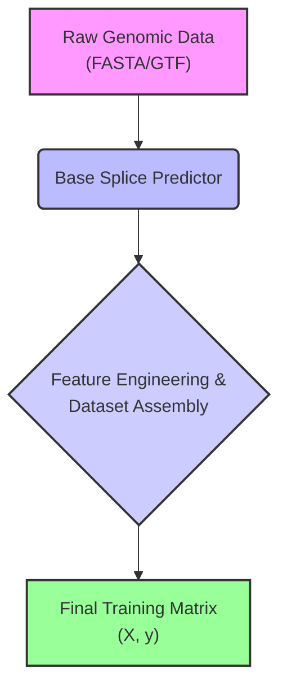
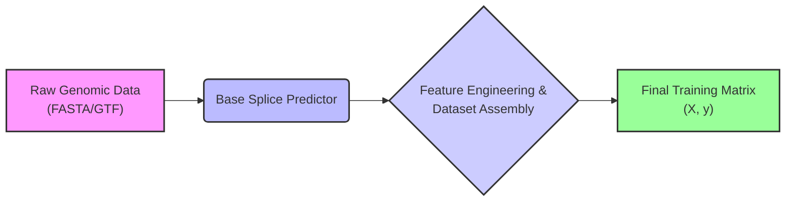
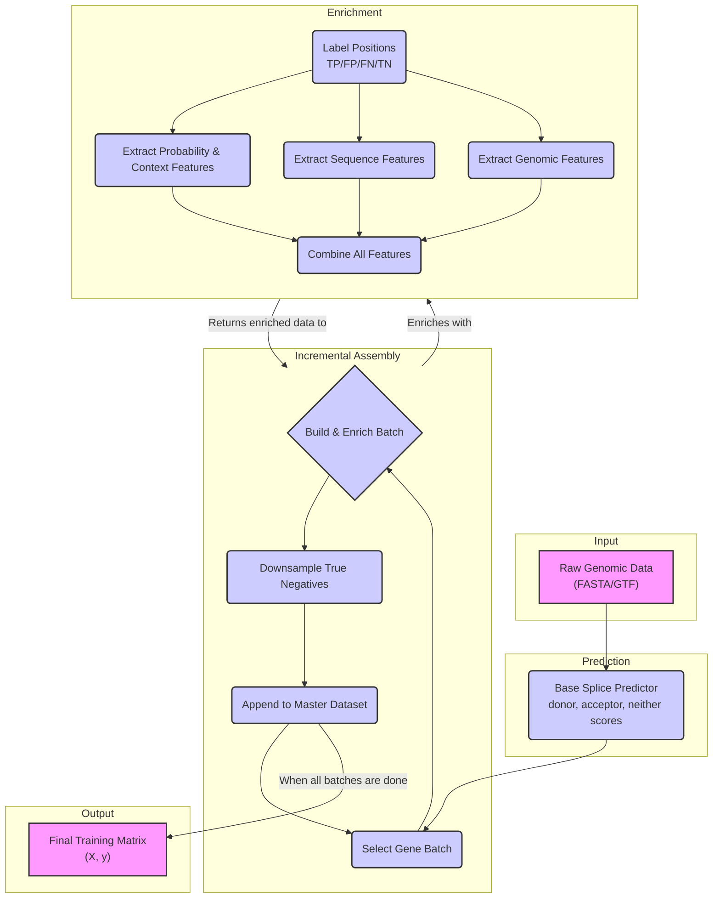
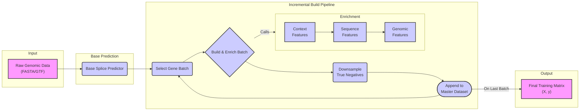

# Meta-Model Feature Engineering and Dataset Assembly Workflow

This document provides a comprehensive overview of the feature engineering and training data assembly workflow used to produce the feature matrix for the MetaSpliceAI meta-model.

## High-Level Workflow

The entire pipeline is a multi-stage process that progressively enriches raw SpliceAI predictions to create a feature-rich dataset suitable for training a high-performance meta-model.

```
1. Base Model Predictions
(Raw donor, acceptor, neither probabilities for every position)
           │
           ▼
2. Enhanced Evaluation & Context Collection (`enhanced_evaluation.py`)
(Labels each position as TP/FP/FN/TN and collects raw probability scores from the local neighborhood)
           │
           ▼
3. Incremental Dataset Assembly (`incremental_builder.py`)
   ┌───────────────────────────────────────────────────────────────────┐
   │ Loop over batches of genes:                                       │
   │   a. Build Base Data: Generate sequence data for the gene batch.  │
   │           │                                                       │
   │           ▼                                                       │
   │   b. Feature Enrichment:                                          │
   │      - Calculate Probability & Context Features (`enhanced_workflow.py`) │
   │      - Calculate Sequence (k-mer) Features (`sequence_featurization.py`) │
   │      - Patch in Genomic Features (e.g., gene type)               │
   │           │                                                       │
   │           ▼                                                       │
   │   c. Downsample True Negatives: Intelligently reduce the number   │
   │      of non-splice sites to create a balanced dataset.            │
   │           │                                                       │
   │           ▼                                                       │
   │   d. Append to Master Dataset: Save the processed batch to a      │
   │      partitioned Parquet dataset.                                 │
   └───────────────────────────────────────────────────────────────────┘
           │
           ▼
4. Final Training Matrix
(A single, harmonized feature matrix (X) and label vector (y) ready for model training)
```

---

## Phase 1: Feature Generation

This phase focuses on creating a rich, multi-faceted feature set.

### 1. Probability and Context-Aware Features

This is the most sophisticated part of the feature engineering process, primarily handled by `enhanced_workflow.py` and `enhanced_evaluation.py`.

-   **Foundation**: The process starts by evaluating raw predictions from a base model to label every genomic position as a TP, FP, FN, or TN. For each position, it captures the three raw probability scores (`donor_score`, `acceptor_score`, `neither_score`) and the scores of their immediate neighbors (2 upstream, 2 downstream).
-   **Derived Probability Features**: From the raw scores at a single position, it calculates features that capture the internal dynamics of the probabilities, such as:
    -   `relative_donor_probability`: How strong is the donor signal relative to the acceptor signal?
    -   `donor_acceptor_logodds`: The log-odds ratio between the donor and acceptor scores.
    -   `probability_entropy`: Measures the uncertainty in the three-score probability distribution. A low entropy indicates a confident prediction for one class.
-   **Context & Signal Shape Features**: These features analyze the *shape* of the probability signal in the local window, which is critical for distinguishing true splice sites from noise. Key features include:
    -   `donor_is_local_peak`: A binary flag indicating if the score is higher than its immediate neighbors.
    -   `donor_peak_height_ratio`: How many times stronger is the central score compared to the average of its neighbors? This quantifies the "sharpness" of the signal.
    -   `donor_signal_strength`: The absolute difference between the central score and the average of its neighbors.
    -   `donor_second_derivative`: Approximates the curvature of the signal, helping to identify sharp peaks.
-   **Cross-Type Features**: These features directly compare the donor and acceptor signal patterns at the same location (e.g., `donor_acceptor_peak_ratio`), helping the model learn to differentiate between the two splice site types.

### 2. Sequence Motif Features

Handled by `sequence_featurization.py`, this adds features based on the underlying DNA sequence.

-   **k-mer Counts**: The primary method is to extract the DNA sequence around each candidate splice site and count the occurrences of short DNA words of a specific length (k-mers, e.g., 6-mers). This allows the model to learn sequence motifs associated with strong or weak splice sites.
-   **Feature Harmonization**: A key step (`harmonize_all_feature_sets`) ensures that the feature set is consistent across all data subsets (TP, FP, etc.), preventing errors during model training.

### 3. Genomic Features

These are typically "patched" in during the final dataset assembly step. They provide broader biological context, such as:
-   **Gene Biotype**: Is the gene protein-coding, lncRNA, etc.?
-   **Structural Features**: Information about the gene's structure, like the total number of splice sites.

---

## Phase 2: Training Data Assembly

This phase, orchestrated by `incremental_builder.py`, constructs the final dataset in a robust and memory-efficient manner.

-   **Motivation**: A full-genome analysis produces an enormous number of true negative (TN) positions, which would overwhelm system memory if processed all at once. The incremental approach solves this.
-   **The Incremental Loop**:
    1.  **Gene Selection**: It first selects a list of target genes, often prioritizing those with the most prediction errors to focus the model on the hardest examples.
    2.  **Batching**: The gene list is split into small, manageable batches (e.g., 1,000 genes at a time).
    3.  **Per-Batch Processing**: The builder loops through each batch, performing the full feature generation pipeline described in Phase 1.
    4.  **Intelligent Downsampling**: After a batch is fully featurized, it intelligently downsamples the vast number of TNs. This is crucial for creating a balanced dataset that doesn't bias the model towards simply predicting "not a splice site."
    5.  **Append to Master Dataset**: The final, processed data for the batch is appended to a master Apache Parquet dataset on disk. This dataset is partitioned by chromosome, allowing for highly efficient reading and analysis later.

---

## Final Output

The result of this entire pipeline is a single, clean, and comprehensive training dataset ready for machine learning.

-   **Feature Matrix (X)**: A large table where rows are candidate splice sites and columns are all the features described above (probability, context, sequence, and genomic).
-   **Label Vector (y)**: A corresponding vector of labels for each site. The system supports two distinct labeling schemes for different modeling goals:
    -   **`meta_model` mode**: A multi-class label (`0`=donor, `1`=acceptor, `2`=neither) for training the final, production-level meta-model.
    -   **`error_analysis` mode**: A binary label (`1`=error, `0`=correct) for training diagnostic models that aim to understand *why* the base model fails.

---

## Flowcharts

### Simplified Workflow (Vertical)



### Simplified Workflow (Horizontal for Slides)



### Detailed Workflow (Vertical)



### Detailed Workflow (Horizontal for Slides)


