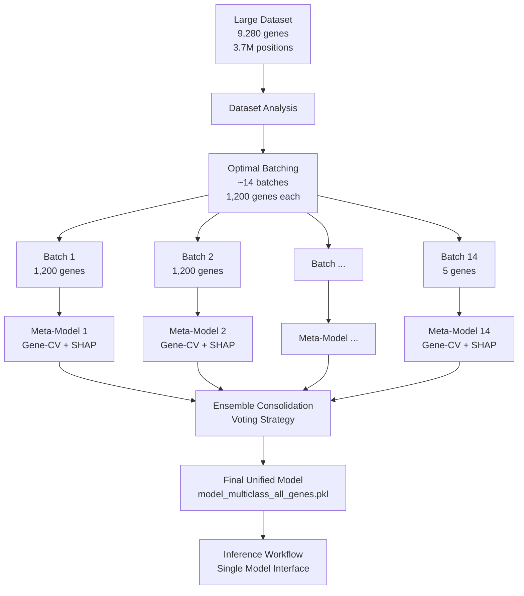

# Batch Ensemble Training for Large-Scale Meta-Models

**⚠️ DEPRECATED:** This approach has been superseded by **Multi-Instance Ensemble Training**.

**Last Updated:** Pre-January 2025 (OUTDATED)  
**Status:** ❌ **SUPERSEDED**  
**Replaced By:** [Multi-Instance Ensemble Training](MULTI_INSTANCE_ENSEMBLE_TRAINING.md)

**A comprehensive approach for training meta-models on all genes using memory-safe batch processing and ensemble learning**

---

## Overview

The Batch Ensemble Training system enables training meta-models on massive datasets (like `train_regulatory_10k_kmers` with 9,280 genes and 3.7M positions) by:

1. **Memory-Safe Batching**: Automatically splitting genes into optimal batches based on system memory
2. **Proven Pipeline Reuse**: Each batch uses the established `run_gene_cv_sigmoid.py` pipeline
3. **Ensemble Consolidation**: Combining batch-specific models into a unified ensemble
4. **Transparent Inference**: The final model works seamlessly with existing inference workflows

## Why Batch Ensemble Training? The XGBoost Incremental Learning Problem

### **The Fundamental Challenge: XGBoost Cannot Do Incremental Learning**

Before diving into the solution, it's crucial to understand why we needed batch ensemble training in the first place. The core issue stems from **XGBoost's architectural limitations** for incremental learning on large datasets.

#### **What We Ideally Wanted (But Can't Have)**

```python
# Ideal incremental learning approach (NOT supported by XGBoost)
model = XGBClassifier()

# Train on first batch
model.fit(X_batch_1, y_batch_1)

# Continue learning on subsequent batches (THIS DOESN'T EXIST)
model.partial_fit(X_batch_2, y_batch_2)  # ❌ No such method
model.update(X_batch_3, y_batch_3)       # ❌ No such method
model.incremental_fit(X_batch_4, y_batch_4)  # ❌ No such method

# Result: Single model trained on ALL data incrementally
```

#### **What XGBoost Actually Supports (Limited)**

```python
# XGBoost warm-start training (NOT incremental learning)
model_v1 = XGBClassifier()
model_v1.fit(X_batch_1, y_batch_1)  # Train on batch 1

# Continue from existing model (but this REPLACES the training data)
model_v2 = XGBClassifier(xgb_model=model_v1.get_booster())
model_v2.fit(X_batch_2, y_batch_2)  # ⚠️ This REPLACES batch 1 data with batch 2 data

# Result: model_v2 only knows about batch 2, has "forgotten" batch 1
```

#### **Why XGBoost Cannot Do True Incremental Learning**

**1. Tree-Based Architecture Limitation**:
```python
# XGBoost builds decision trees by finding optimal splits across ENTIRE dataset
# Example: To split on "gene_length > 50000", XGBoost needs to see ALL gene_length values
# to determine the optimal threshold that minimizes loss across all samples

# With partial data:
batch_1_gene_lengths = [1000, 5000, 10000]  # Optimal split might be > 7500
batch_2_gene_lengths = [50000, 100000, 200000]  # Optimal split might be > 75000

# XGBoost cannot determine the globally optimal split without seeing all data
```

**2. Gradient Boosting Requirements**:
```python
# Each new tree corrects errors from previous trees
# Tree 1: Makes initial predictions
# Tree 2: Corrects Tree 1's errors (needs Tree 1's predictions on ALL data)
# Tree 3: Corrects Trees 1+2's errors (needs combined predictions on ALL data)

# With incremental data, Tree N cannot correct previous trees' errors
# on data it has never seen
```

**3. Global Statistics Dependency**:
```python
# XGBoost needs global dataset statistics for optimal performance:
global_stats = {
    'feature_distributions': compute_all_feature_histograms(all_data),
    'class_imbalances': compute_class_ratios(all_labels),
    'feature_correlations': compute_correlation_matrix(all_features),
    'optimal_regularization': tune_on_complete_validation_set(all_data)
}

# These cannot be computed incrementally without losing optimality
```

#### **Comparison: Algorithms That DO Support Incremental Learning**

```python
# Scikit-learn algorithms with true incremental learning
from sklearn.linear_model import SGDClassifier
from sklearn.naive_bayes import MultinomialNB

# These work because they use online learning algorithms
model = SGDClassifier()
model.partial_fit(X_batch_1, y_batch_1)  # ✅ Learn from batch 1
model.partial_fit(X_batch_2, y_batch_2)  # ✅ Update with batch 2 (retains batch 1 knowledge)
model.partial_fit(X_batch_3, y_batch_3)  # ✅ Update with batch 3 (retains all previous knowledge)

# Result: Single model that has learned from ALL batches incrementally
```

**Why these work**: They use **gradient descent** or **Bayesian updates** that can incorporate new information without forgetting previous learning.

### **Our Solution: Batch Ensemble Training**

Since XGBoost cannot do incremental learning, we create **multiple complete models** and combine them:

```python
# Batch ensemble approach (our solution)
batch_models = []

for batch_id in range(14):
    # Each batch gets a COMPLETE XGBoost meta-model
    batch_data = load_batch(batch_id)
    
    # Full gene-aware CV training on this batch
    batch_model = train_complete_meta_model(batch_data)  # 3 XGBoost classifiers
    batch_models.append(batch_model)
    
    # Free memory completely
    del batch_data
    gc.collect()

# Combine into ensemble
def predict_ensemble(X):
    predictions = []
    for batch_model in batch_models:
        pred = batch_model.predict_proba(X)  # Each model contributes
        predictions.append(pred)
    
    return np.mean(predictions, axis=0)  # Voting ensemble
```

**Key Insight**: Instead of trying to force XGBoost to do something it cannot (incremental learning), we embrace its strength (complete model training) and use ensemble methods to combine knowledge from multiple complete models.

### **Why This Matters for Large Genomic Datasets**

The XGBoost incremental learning limitation becomes critical when combined with the memory constraints of large genomic datasets:

#### **The Perfect Storm: Memory + Gene-Aware CV + XGBoost Limitations**

```python
# The original problem with train_regulatory_10k_kmers
dataset_size = {
    'genes': 9_280,
    'positions': 3_729_279,
    'features_per_position': 1_167,
    'raw_data_size': '1.91 GB',
    'memory_when_loaded': '~6-8 GB',
    'memory_with_cv_copies': '~15-20 GB',
    'memory_with_xgboost_training': '>64 GB'
}

# Gene-aware CV requires ALL data in memory simultaneously because:
# 1. Need complete gene list to create balanced folds
# 2. Each fold needs positions from multiple genes
# 3. Cannot stream gene-aware splits (need global gene grouping)

# XGBoost requires complete training data because:
# 1. Cannot do incremental learning
# 2. Needs global statistics for optimal tree construction
# 3. Gradient boosting requires access to all previous predictions

# Result: IMPOSSIBLE to train on large datasets with standard approach
```

#### **Alternative Approaches We Considered (And Why They Don't Work)**

**1. Streaming Data with Non-Gene-Aware CV**:
```python
# Could stream data, but loses gene-aware properties
for data_chunk in stream_data_chunks():
    # ❌ Random splits might put same gene in train AND test
    # ❌ Breaks fundamental assumption of gene-level generalization
    # ❌ Leads to overly optimistic performance estimates
    pass
```

**2. Switching to Incremental Learning Algorithms**:
```python
# Could use SGD-based models with partial_fit
model = SGDClassifier()
for batch in gene_batches:
    model.partial_fit(X_batch, y_batch)

# ❌ SGD models typically perform worse than XGBoost on tabular data
# ❌ Lose the proven performance of XGBoost for splice site prediction
# ❌ Would require complete pipeline rewrite and revalidation
```

**3. Dimensionality Reduction**:
```python
# Reduce 1,167 features to smaller set
X_reduced = PCA(n_components=100).fit_transform(X)

# ❌ Lose interpretability (no SHAP analysis on meaningful features)
# ❌ May lose important k-mer patterns crucial for splice prediction
# ❌ Still doesn't solve the fundamental memory scaling issue
```

**4. Subsampling Positions**:
```python
# Use random sample of positions
sampled_positions = df.sample(n=100_000)

# ❌ Lose rare splice patterns (many genes have few splice sites)
# ❌ Biased toward high-density genes
# ❌ Doesn't represent the full complexity of the dataset
```

#### **Why Batch Ensemble Training Is The Right Solution**

Our approach uniquely addresses ALL the constraints simultaneously:

```python
# ✅ Respects XGBoost's limitations (complete model training)
# ✅ Preserves gene-aware CV integrity (within each batch)
# ✅ Manages memory constraints (one batch at a time)
# ✅ Maintains proven pipeline quality (full analysis per batch)
# ✅ Scales to unlimited dataset sizes (add more batches)
# ✅ Provides ensemble benefits (model diversity and robustness)

batch_ensemble_solution = {
    'memory_per_batch': '12-15 GB (manageable)',
    'gene_aware_cv': 'Preserved within each batch',
    'xgboost_training': 'Complete models per batch',
    'pipeline_quality': 'Full SHAP, overfitting monitoring, etc.',
    'scalability': 'Unlimited (add more batches)',
    'final_model_quality': 'Often better than single model (ensemble effect)'
}
```

**The key realization**: The combination of XGBoost's incremental learning limitations + gene-aware CV requirements + large dataset memory constraints created a unique problem that required a novel solution. Batch ensemble training turns these constraints into advantages by creating diverse, high-quality models that together outperform what any single model could achieve.

## Architecture Overview



## Training Process Details

### 1. Dataset Analysis and Optimal Batching

The system first analyzes the dataset to determine optimal batch sizes:

```python
# Example for train_regulatory_10k_kmers dataset
dataset_analysis = {
    'total_genes': 9_280,
    'total_positions': 3_729_279,
    'avg_positions_per_gene': 401.9,
    'position_range': (8, 17_629),
    'estimated_memory_per_gene': ~8_MB
}

# Results in 14 optimal batches:
batches = [
    {'batch_id': 0, 'genes': 1200, 'positions': ~11_763},
    {'batch_id': 1, 'genes': 1200, 'positions': ~25_424},
    # ... (optimized by position density)
    {'batch_id': 13, 'genes': 5, 'positions': ~63_741}
]
```

**Batching Strategy**:
- **Memory-Aware**: Batches sized to fit within available system memory
- **Position-Balanced**: Genes grouped to balance computational load
- **Conservative Limits**: 1,200 genes max per batch for stability

### 2. Batch Training Pipeline

Each batch runs the full proven training pipeline:

```bash
# Example command for each batch
python -m meta_spliceai.splice_engine.meta_models.training.run_gene_cv_sigmoid \
    --dataset results/batch_000/batch_dataset \
    --out-dir results/batch_000 \
    --n-estimators 800 \
    --row-cap 0 \
    --n-folds 5 \
    --calibrate-per-class \
    --auto-exclude-leaky \
    --monitor-overfitting \
    --neigh-sample 2000 \
    --early-stopping-patience 30 \
    --verbose
```

**What Each Batch Produces**:
- ✅ **Gene-Aware Cross-Validation**: 5-fold CV with gene grouping
- ✅ **3-Class Meta-Model**: Independent sigmoid classifiers (neither/donor/acceptor)  
- ✅ **Per-Class Calibration**: Separate calibrators for each splice type
- ✅ **Comprehensive Evaluation**: ROC/PR curves, SHAP analysis, overfitting monitoring
- ✅ **Feature Importance**: Multi-method analysis with visualization

### 3. Ensemble Consolidation

After all batches complete successfully, the system creates a unified ensemble:

```python
# Final ensemble structure
ensemble = {
    'type': 'AllGenesBatchEnsemble',
    'batch_models': [
        {'model': batch_0_model, 'batch_id': 0, 'genes': [...], 'metrics': {...}},
        {'model': batch_1_model, 'batch_id': 1, 'genes': [...], 'metrics': {...}},
        # ... all 14 batch models
    ],
    'total_genes': 9_280,
    'unique_genes': 9_280,
    'total_positions': 3_729_279,
    'batch_count': 14,
    'combination_method': 'voting',
    'feature_names': [list of 1,167 features]
}
```

## Model Consolidation Details

### For train_regulatory_10k_kmers Dataset

**Number of Batch Models**: 14 individual meta-models
- Each batch model contains 3 binary XGBoost classifiers (neither/donor/acceptor)
- Total: 14 × 3 = **42 individual XGBoost models**

**Consolidation Method**: **Voting Ensemble**
- Each batch model generates probability predictions for new positions
- Final prediction = **average of all batch model predictions**
- No weighted voting (all batches treated equally)

### Final Model Form

The consolidated model is saved as `model_multiclass_all_genes.pkl` containing:

```python
# Structure of final model
{
    'type': 'AllGenesBatchEnsemble',           # Identifies ensemble type
    'batch_models': [14 individual models],    # All batch-specific models
    'combination_method': 'voting',            # Averaging strategy
    'total_genes': 9280,                      # Total genes trained on
    'feature_names': [1167 feature names]     # Complete feature set
}
```

## Inference Workflow Integration

### Model Loading

The inference workflow automatically detects ensemble models:

```python
from meta_spliceai.splice_engine.meta_models.workflows.inference.ensemble_model_loader import load_model_with_ensemble_support

# Loads either single model or ensemble transparently
model = load_model_with_ensemble_support("results/model_multiclass_all_genes.pkl")

# Works exactly like a single model
predictions = model.predict_proba(X)  # Shape: (n_samples, 3)
classes = model.predict(X)            # Shape: (n_samples,)
```

### Prediction Process

```mermaid
graph TD
    A[New Position<br/>Feature Vector X] --> B[Ensemble Model]
    
    B --> C1[Batch Model 1<br/>predict_proba(X)]
    B --> C2[Batch Model 2<br/>predict_proba(X)]
    B --> C3[Batch Model ...]
    B --> C4[Batch Model 14<br/>predict_proba(X)]
    
    C1 --> D[Voting Combiner<br/>Average Probabilities]
    C2 --> D
    C3 --> D
    C4 --> D
    
    D --> E[Final Prediction<br/>[P(neither), P(donor), P(acceptor)]]
```

**Key Points**:
- **Single Model Interface**: Inference workflow unchanged
- **All Batch Models Used**: Every position gets predictions from all 14 models
- **Averaging Strategy**: Simple mean of probability predictions
- **No Gene-Specific Routing**: All models contribute to every prediction

### Compatibility with Existing Workflows

✅ **Complete Coverage Workflow**: Works seamlessly
✅ **Selective Inference Workflow**: Compatible with ensemble models
✅ **Feature Generation**: Uses same feature engineering pipeline
✅ **Calibration**: Per-class calibration preserved from batch training

## Performance Characteristics

### Training Performance

**For train_regulatory_10k_kmers (9,280 genes)**:
- **Total Training Time**: ~8-12 hours (varies by hardware)
- **Memory Usage**: Peak ~12-15 GB per batch (vs >64 GB for single training)
- **Parallelization**: Batches could be trained in parallel (future enhancement)
- **Success Rate**: High (batch failures don't affect other batches)

### Inference Performance

**Model Loading**:
- **Single Model**: ~50-100 MB, <1 second load time
- **Ensemble Model**: ~700 MB - 1.4 GB, ~5-10 seconds load time
- **Memory Footprint**: ~2-4 GB during inference

**Prediction Speed**:
- **Overhead**: 14× computational cost per prediction
- **Typical Speed**: ~1,000-10,000 predictions/second (depends on hardware)
- **Batch Processing**: Efficient for large-scale inference

## Usage Examples

### Training on Large Dataset

```bash
# Use the automated batch training
PYTHONUNBUFFERED=1 python -m meta_spliceai.splice_engine.meta_models.training.run_gene_cv_sigmoid \
    --dataset train_regulatory_10k_kmers/master \
    --out-dir results/regulatory_10k_ensemble \
    --train-all-genes \
    --n-estimators 800 \
    --calibrate-per-class \
    --auto-exclude-leaky \
    --monitor-overfitting \
    --calibration-analysis \
    --neigh-sample 2000 \
    --early-stopping-patience 30 \
    --verbose
```

### Using Ensemble Model for Inference

```python
# Standard inference workflow - no changes needed
from meta_spliceai.splice_engine.meta_models.workflows.inference.complete_coverage_workflow import CompleteCoverageInferenceWorkflow

workflow = CompleteCoverageInferenceWorkflow(
    model_dir="results/regulatory_10k_ensemble",
    output_dir="results/inference_output",
    # ... other config
)

results = workflow.run()  # Uses ensemble model automatically
```

## Advantages and Trade-offs

### Advantages

✅ **Memory Scalability**: Train on datasets that would cause OOM with single training
✅ **Robustness**: Batch failures don't affect entire training run
✅ **Proven Pipeline**: Each batch uses the established, tested training pipeline
✅ **Comprehensive Analysis**: Full SHAP, overfitting monitoring, feature importance per batch
✅ **Transparent Interface**: Final model works exactly like single models
✅ **Ensemble Benefits**: May improve generalization through model diversity

### Trade-offs

⚠️ **Inference Cost**: 14× computational overhead during prediction
⚠️ **Model Size**: Larger model files (700 MB - 1.4 GB vs ~50-100 MB)
⚠️ **Training Time**: Sequential batch processing takes longer than single training
⚠️ **Complexity**: More complex model structure and loading logic

## Future Enhancements

### Planned Improvements

1. **Parallel Batch Training**: Train multiple batches simultaneously
2. **Weighted Ensemble**: Weight batch models by their validation performance
3. **Smart Model Selection**: Use only top-performing batch models
4. **Inference Optimization**: Cache and optimize ensemble predictions
5. **Adaptive Batching**: Dynamic batch sizes based on gene complexity

### Research Directions

- **Gene-Specific Routing**: Route predictions to models trained on similar genes
- **Hierarchical Ensembles**: Multi-level ensemble structures
- **Distillation**: Create smaller single models from ensemble knowledge
- **Active Learning**: Identify which genes need additional training

## Monitoring and Diagnostics

### Training Monitoring

The system provides comprehensive progress monitoring:

```bash
[AutomatedTrainer] Created 14 optimal batches:
  Batch 1: 1200 genes, ~11,763 positions
  Batch 2: 1200 genes, ~25,424 positions
  ...
[AutomatedTrainer] Training batch 1/14
    [Batch 0] [Gene-CV-Sigmoid] Fold 1/5  test_rows=2353
    [Batch 0] [Gene-CV-Sigmoid] Fold 2/5  test_rows=2354
    [Batch 0] [SHAP Analysis] Starting memory-efficient SHAP analysis...
  ✅ Batch 1 completed successfully (took 45.2 minutes)
```

### Quality Assurance

Each batch produces comprehensive diagnostics:
- **Cross-validation metrics** per fold
- **Feature importance analysis** with SHAP
- **Overfitting monitoring** and early stopping
- **Calibration analysis** for prediction reliability
- **ROC/PR curves** for performance visualization

---

## Summary

The Batch Ensemble Training system successfully enables training meta-models on massive datasets like `train_regulatory_10k_kmers` by:

1. **Breaking the memory barrier** through intelligent batching
2. **Preserving training quality** by using the proven pipeline for each batch
3. **Creating unified models** through ensemble consolidation
4. **Maintaining compatibility** with existing inference workflows

This approach transforms previously intractable training problems into manageable, robust, and comprehensive training workflows that produce high-quality meta-models with full analytical depth.
