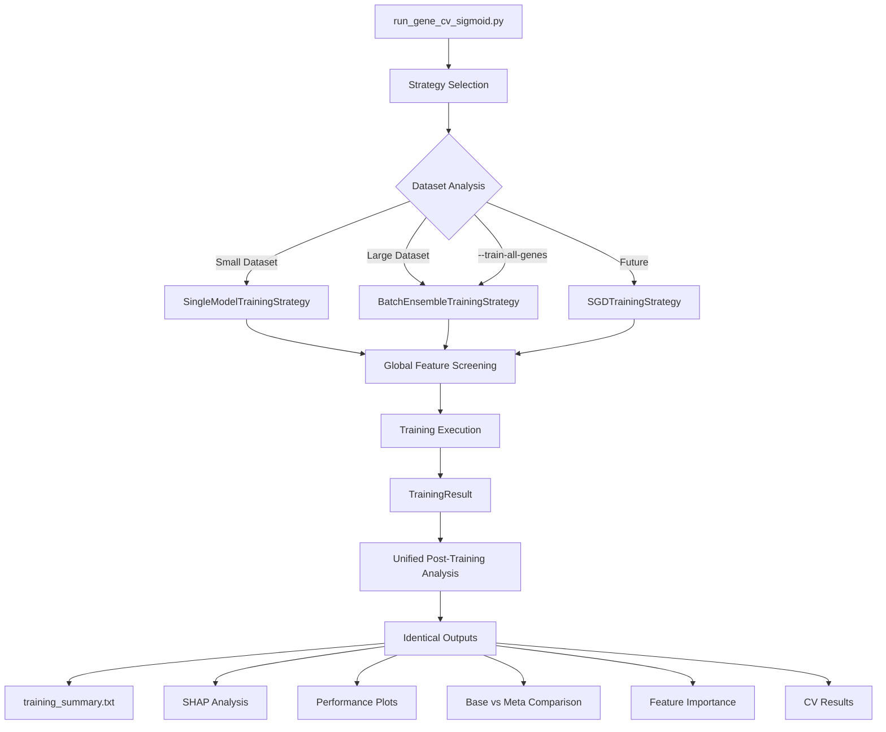

# Unified Meta-Model Training System

**A comprehensive abstraction layer for pluggable training methodologies with consistent outputs**

---

## Overview

The Unified Training System provides a pluggable abstraction for different meta-model training approaches while ensuring **identical outputs and post-training analysis** regardless of the underlying training methodology.

### Key Design Principles

1. **Training Methodology Abstraction**: Single XGBoost, batch ensemble, future models - all use the same interface
2. **Consistent Output Format**: All strategies produce identical analysis artifacts
3. **Global Feature Screening**: Unified feature exclusion across all training approaches  
4. **Unified Post-Training Analysis**: Same comprehensive analysis regardless of training method
5. **Easy Backend Swapping**: Change training methodology without affecting downstream code

## System Architecture



## Training Strategies

### 1. Single Model Training Strategy

**Best for**: Small to medium datasets (≤4,000 genes, ≤32GB memory)

```python
strategy = SingleModelTrainingStrategy()
# - Uses traditional XGBoost training on full dataset
# - Single meta-model with 3 binary classifiers
# - Full gene-aware cross-validation
# - Direct training on all available data
```

**Advantages**:
- ✅ Fastest training time
- ✅ Simplest model structure  
- ✅ Lowest inference overhead
- ✅ Full cross-validation on all data

**Limitations**:
- ❌ Memory constraints for large datasets
- ❌ Cannot handle >4,000 genes or >32GB datasets

### 2. Batch Ensemble Training Strategy

**Best for**: Large datasets (>4,000 genes, >32GB memory)

```python
strategy = BatchEnsembleTrainingStrategy(
    max_genes_per_batch=1200,
    max_memory_gb=12.0
)
# - Splits genes into memory-safe batches
# - Trains individual meta-models per batch
# - Combines into voting ensemble
# - Includes ensemble-level cross-validation
```

**Advantages**:
- ✅ Handles unlimited dataset size
- ✅ Memory-safe processing
- ✅ Robust to individual batch failures
- ✅ Ensemble benefits (improved generalization)
- ✅ Full analysis per batch + ensemble analysis

**Limitations**:
- ❌ Longer training time (sequential batches)
- ❌ Higher inference cost (14× for large datasets)
- ❌ More complex model structure

### 3. Future Training Strategies

The system is designed to easily accommodate future training approaches:

```python
class SGDTrainingStrategy(TrainingStrategy):
    """Incremental learning with SGDClassifier for very large datasets."""
    
    def train_model(self, dataset_path, out_dir, args, X_df, y_series, genes):
        # Implement true incremental learning
        # Process data in streaming fashion
        # Single model trained incrementally
        pass

class DistributedTrainingStrategy(TrainingStrategy):
    """Distributed training across multiple machines."""
    
class NeuralNetworkTrainingStrategy(TrainingStrategy):
    """Deep learning approach with TensorFlow/PyTorch."""
```

## Global Feature Screening

### Problem Solved

**Before**: Each batch performed independent feature screening, leading to:
- ❌ Inconsistent feature sets across batches
- ❌ Incompatible ensemble models
- ❌ Unreliable feature importance analysis

**After**: Global feature screening ensures:
- ✅ **Identical feature sets** across all training approaches
- ✅ **Compatible ensemble models**
- ✅ **Consistent feature importance** analysis

### Implementation

```python
# 1. Sample representative data (10% of genes)
sample_df = load_representative_sample(dataset_path, sample_fraction=0.1)

# 2. Run comprehensive leakage analysis
excluded_features = run_global_leakage_analysis(sample_df, args)

# 3. Save global exclusion list
save_global_exclusions(excluded_features, out_dir / "global_excluded_features.txt")

# 4. Apply to all training strategies
for batch in batches:
    apply_global_exclusions(batch, excluded_features)
```

## Unified Post-Training Analysis

### Consistent Outputs

**All training strategies produce identical analysis artifacts:**

| Artifact | Description | Single Model | Batch Ensemble |
|----------|-------------|--------------|----------------|
| `training_summary.txt` | Comprehensive training overview | ✅ | ✅ |
| `gene_cv_metrics.csv` | Cross-validation results | ✅ | ✅ |
| `shap_analysis/` | Feature importance analysis | ✅ | ✅ |
| `roc_curves_meta.pdf` | Performance visualizations | ✅ | ✅ |
| `meta_evaluation_summary.json` | Model evaluation results | ✅ | ✅ |
| `base_vs_meta_performance.tsv` | Base model comparison | ✅ | ✅ |
| `feature_importance_analysis/` | Multi-method feature analysis | ✅ | ✅ |
| `overfitting_analysis/` | Overfitting monitoring | ✅ | ✅ |

### Analysis Pipeline

```python
def run_unified_post_training_analysis(training_result, dataset_path, out_dir, args):
    """Same analysis regardless of training methodology."""
    
    # 1. Generate training summary
    generate_training_summary(training_result, out_dir, args)
    
    # 2. Model evaluation and diagnostics  
    run_model_evaluation(training_result, dataset_path, out_dir, args)
    
    # 3. SHAP analysis and feature importance
    run_shap_analysis(training_result, dataset_path, out_dir, args)
    
    # 4. Performance visualizations
    generate_performance_visualizations(training_result, out_dir, args)
    
    # 5. Base vs meta comparison
    run_base_meta_comparison(training_result, dataset_path, out_dir, args)
    
    # 6. Comprehensive report
    generate_comprehensive_report(training_result, analysis_results, out_dir)
```

## Usage Examples

### Automatic Strategy Selection

```bash
# System automatically selects optimal strategy
python -m meta_spliceai.splice_engine.meta_models.training.run_gene_cv_sigmoid \
    --dataset train_pc_1000_3mers/master \
    --out-dir results/auto_strategy \
    --n-estimators 800 \
    --calibrate-per-class \
    --verbose

# Output: "✅ Selected: Single XGBoost Model"
```

### Force Batch Ensemble Training

```bash
# Force batch ensemble even for small datasets
python -m meta_spliceai.splice_engine.meta_models.training.run_gene_cv_sigmoid \
    --dataset train_pc_1000_3mers/master \
    --out-dir results/forced_ensemble \
    --train-all-genes \
    --n-estimators 800 \
    --calibrate-per-class \
    --verbose

# Output: "🔥 Selected: Batch Ensemble (1200 genes/batch) (forced by --train-all-genes)"
```

### Large Dataset Training

```bash
# Automatically uses batch ensemble for large datasets
python -m meta_spliceai.splice_engine.meta_models.training.run_gene_cv_sigmoid \
    --dataset train_regulatory_10k_kmers/master \
    --out-dir results/large_dataset \
    --n-estimators 800 \
    --calibrate-per-class \
    --verbose

# Output: "✅ Selected: Batch Ensemble (1200 genes/batch)"
```

## Training Summary Examples

### Single Model Training Summary

```
META-MODEL TRAINING SUMMARY
==================================================

Training Date: 2025-01-27T15:30:45
Training Strategy: Single XGBoost Model
Script: run_gene_cv_sigmoid.py (unified pipeline)

DATASET INFORMATION:
--------------------
Total Genes: 1,002
Total Positions: 584,379
Features Used: 117
Features Excluded: 8
Output Directory: results/single_model_run

TRAINING PARAMETERS:
--------------------
CV Folds: 5
N Estimators: 800
Calibration: per_class

PERFORMANCE SUMMARY:
--------------------
CV Accuracy: 0.982 ± 0.003
CV F1 Macro: 0.963 ± 0.005

GENERATED ARTIFACTS:
--------------------
✅ model_multiclass.pkl - Trained meta-model
✅ training_summary.txt - This summary
✅ feature_manifest.csv - Feature list
✅ gene_cv_metrics.csv - Cross-validation results
✅ shap_analysis/ - Feature importance analysis
✅ performance_plots/ - ROC/PR curves and visualizations
✅ meta_evaluation_summary.json - Model evaluation results
```

### Batch Ensemble Training Summary

```
META-MODEL TRAINING SUMMARY
==================================================

Training Date: 2025-01-27T15:30:45
Training Strategy: Batch Ensemble (1200 genes/batch)
Script: run_gene_cv_sigmoid.py (unified pipeline)

DATASET INFORMATION:
--------------------
Total Genes: 9,280
Total Positions: 3,729,279
Features Used: 1,167
Features Excluded: 23
Output Directory: results/batch_ensemble_run

TRAINING PARAMETERS:
--------------------
CV Folds: 5
N Estimators: 800
Calibration: per_class
Batch Count: 14
Max Genes per Batch: 1200
Ensemble Method: voting

PERFORMANCE SUMMARY:
--------------------
Ensemble Batches: 14
Average Batch Accuracy: 0.974
Ensemble CV Accuracy: 0.978 ± 0.004

FEATURE CONSISTENCY:
--------------------
Global Feature Screening: ✅ Applied
Feature Count: 1,167

GENERATED ARTIFACTS:
--------------------
✅ model_multiclass_all_genes.pkl - Final ensemble model
✅ ensemble_cv_results.csv - Ensemble generalization evaluation
✅ training_summary.txt - This summary
✅ feature_manifest.csv - Feature list
✅ gene_cv_metrics.csv - Cross-validation results
✅ shap_analysis/ - Unified feature importance
✅ performance_plots/ - ROC/PR curves and visualizations
✅ meta_evaluation_summary.json - Model evaluation results
```

## Cross-Validation for Ensemble Models

### The Problem

Individual batch models are trained on subsets of genes, but we need to evaluate the **final ensemble's generalization ability** on unseen genes.

### The Solution

**Ensemble Cross-Validation**: After training all batches, run gene-aware CV on the final ensemble:

```python
def run_ensemble_cross_validation(ensemble_model, full_dataset, n_folds=5):
    """Evaluate ensemble generalization on unseen genes."""
    
    # Load full dataset
    df = load_dataset(full_dataset)
    genes = df['gene_id'].unique()
    
    # Gene-aware CV splits (genes not seen during ensemble training)
    gkf = GroupKFold(n_splits=n_folds)
    
    for fold, (train_idx, test_idx) in enumerate(gkf.split(df, groups=df['gene_id'])):
        test_genes = df.iloc[test_idx]['gene_id'].unique()
        
        # Evaluate ensemble on completely unseen genes
        ensemble_predictions = ensemble_model.predict_proba(X[test_idx])
        accuracy = accuracy_score(y[test_idx], ensemble_predictions.argmax(axis=1))
        
        print(f"Fold {fold+1}: Ensemble accuracy on {len(test_genes)} unseen genes: {accuracy:.3f}")
```

**Key Benefits**:
- ✅ **True generalization assessment** of the final ensemble
- ✅ **Gene-aware evaluation** (no gene leakage between train/test)
- ✅ **Comparable to single model CV** results
- ✅ **Identifies ensemble overfitting** vs. individual batch overfitting

## Inference Compatibility

### Transparent Model Loading

The inference workflow automatically detects and loads the appropriate model type:

```python
# Works for both single models and ensembles
from meta_spliceai.splice_engine.meta_models.workflows.inference.ensemble_model_loader import load_model_with_ensemble_support

# Automatically detects model type
model = load_model_with_ensemble_support("results/model_multiclass*.pkl")

# Identical interface for both
predictions = model.predict_proba(X)  # Works for single or ensemble
classes = model.predict(X)            # Works for single or ensemble
```

### Model Type Detection

```python
# Single model
model = load_model_with_ensemble_support("results/model_multiclass.pkl")
# Output: "[EnsembleLoader] Detected standard single model"

# Ensemble model  
model = load_model_with_ensemble_support("results/model_multiclass_all_genes.pkl")
# Output: "[EnsembleLoader] Detected multi-batch ensemble model"
#         "  Batch models: 14"
#         "  Total genes: 9,280"
#         "  Combination method: voting"
```

## Benefits of Unified System

### For Users

- ✅ **Consistent Experience**: Same command-line interface and outputs
- ✅ **Automatic Optimization**: System selects best strategy for dataset
- ✅ **No Learning Curve**: Existing workflows continue to work
- ✅ **Comprehensive Analysis**: Full analysis regardless of training method

### For Developers

- ✅ **Easy Extension**: Add new training strategies without changing downstream code
- ✅ **Consistent Testing**: Same test suite works for all strategies
- ✅ **Modular Design**: Training, analysis, and inference are cleanly separated
- ✅ **Future-Proof**: Easy to integrate new model types (SGD, neural networks, etc.)

### For Research

- ✅ **Fair Comparisons**: All methods get identical analysis and evaluation
- ✅ **Reproducible Results**: Consistent feature screening and evaluation
- ✅ **Comprehensive Documentation**: Detailed training summaries for all methods
- ✅ **Extensible Framework**: Easy to add new training approaches for research

## Migration Path

### Existing Workflows

**No changes required** - existing commands continue to work:

```bash
# This still works exactly as before
python -m meta_spliceai.splice_engine.meta_models.training.run_gene_cv_sigmoid \
    --dataset train_pc_1000_3mers/master \
    --out-dir results/legacy_compatible \
    --n-estimators 800 \
    --calibrate-per-class
```

### New Features Available

**Enhanced capabilities** without breaking changes:

```bash
# New: Automatic strategy selection
python -m meta_spliceai.splice_engine.meta_models.training.run_gene_cv_sigmoid \
    --dataset any_size_dataset/master \
    --out-dir results/auto_optimized \
    --n-estimators 800 \
    --calibrate-per-class
    # System automatically selects optimal strategy

# New: Global feature screening
# Consistent features across all training approaches

# New: Unified post-training analysis  
# Same comprehensive analysis for all methods

# New: Enhanced training summaries
# Detailed documentation regardless of training method
```

## Future Enhancements

### Planned Features

1. **Parallel Batch Training**: Train multiple batches simultaneously
2. **Weighted Ensemble Voting**: Weight batch models by validation performance
3. **SGD Incremental Training**: True incremental learning for very large datasets
4. **Distributed Training**: Multi-machine training for massive datasets
5. **Neural Network Integration**: Deep learning training strategies
6. **Adaptive Batching**: Dynamic batch sizes based on gene complexity
7. **Model Distillation**: Create smaller single models from ensemble knowledge

### Research Directions

- **Gene-Specific Routing**: Route predictions to models trained on similar genes
- **Hierarchical Ensembles**: Multi-level ensemble structures for very large datasets
- **Active Learning**: Identify which genes need additional training
- **Transfer Learning**: Leverage pre-trained models for new datasets

---

## Summary

The Unified Training System transforms meta-model training from a single-approach pipeline into a **flexible, extensible, and future-proof framework** that:

1. **Abstracts training methodology** while ensuring consistent outputs
2. **Automatically optimizes** for dataset characteristics
3. **Maintains backward compatibility** with existing workflows  
4. **Provides comprehensive analysis** regardless of training approach
5. **Enables easy integration** of future training methods

This system ensures that whether you're training on 1,000 genes or 10,000 genes, using XGBoost or future neural networks, you get the **same high-quality analysis and documentation** that enables reproducible research and reliable model deployment.


