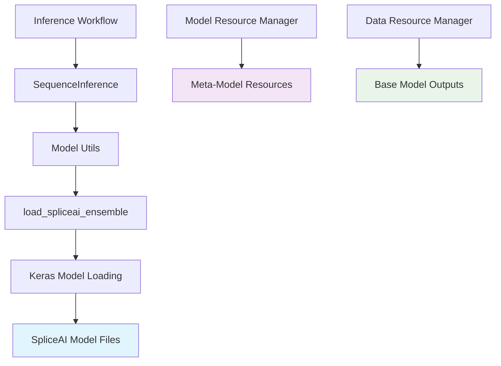
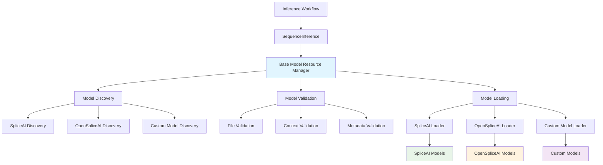

# Model Loading Architecture

This document describes the technical architecture for model loading in the MetaSpliceAI meta-learning system.

## 🏗️ Architecture Overview

### **Current Architecture**



### **Proposed Enhanced Architecture**



## 🔧 Current Implementation Analysis

### **1. Model Loading Chain**

#### **Entry Point: SequenceInference**
```python
# In sequence_inference.py
class SequenceInference:
    def __init__(self, models: Optional[List] = None, mode: str = "base_only"):
        if models is None:
            # Default to SpliceAI models
            from meta_spliceai.splice_engine.meta_models.utils.model_utils import load_spliceai_ensemble
            models = load_spliceai_ensemble(context=10_000)
        
        self.models = models
```

#### **Model Utils: load_spliceai_ensemble**
```python
# In model_utils.py
def load_spliceai_ensemble(context: int = 10000) -> List:
    """
    Load SpliceAI ensemble models from systematic path.
    
    Current implementation:
    1. Uses systematic path: data/models/spliceai/
    2. Loads ensemble of 5 models: spliceai1.h5 through spliceai5.h5
    3. Context parameter for API consistency (doesn't affect model selection)
    4. Direct Keras model loading without validation
    """
    from keras.models import load_model
    import os
    
    # Load SpliceAI ensemble models from systematic path
    model_dir = "data/models/spliceai/"
    paths = [os.path.join(model_dir, f"spliceai{i}.h5") for i in range(1, 6)]
    models = [load_model(path) for path in paths]
    
    # Note: Context parameter is for API consistency only
    return models
```

### **2. Current Limitations**

#### **❌ Hardcoded Paths**
```python
# Current: Hardcoded model directory
model_dir = "data/models/spliceai/"

# Should be: Systematic path discovery
model_dir = self.get_base_model_directory("spliceai")
```

#### **❌ No Error Handling**
```python
# Current: Direct loading without validation
model = load_model(model_path)

# Should be: Validation and error handling
if not os.path.exists(model_path):
    raise FileNotFoundError(f"Model not found: {model_path}")

try:
    model = load_model(model_path)
    self.validate_model(model)
except Exception as e:
    raise ModelLoadingError(f"Failed to load model: {e}")
```

#### **❌ No Context Management**
```python
# Current: Context parameter ignored in model loading
def load_spliceai_ensemble(context: int = 10000) -> List:
    # Context parameter is included for API consistency,
    # but doesn't affect model loading itself

# Should be: Context-aware model selection or validation
context_config = self.get_context_config(base_model_type, context)
models = self.load_models_for_context(context_config)
```

#### **❌ No Model Validation**
```python
# Current: No validation
return [model]

# Should be: Model validation
self.validate_model_architecture(model, expected_context)
self.validate_model_outputs(model)
return [model]
```

## 🚀 Proposed Enhanced Architecture

### **1. Base Model Resource Manager**

#### **Core Interface**
```python
class BaseModelResourceManager:
    """Centralized manager for base model resources."""
    
    def __init__(self, project_root: Optional[Path] = None):
        self.project_root = project_root or self._find_project_root()
        self.base_model_configs = self._load_base_model_configs()
    
    def discover_models(self, base_model_type: str) -> Dict[str, Any]:
        """Discover available models for a base model type."""
        pass
    
    def validate_model(self, base_model_type: str, context_window: int) -> Dict[str, Any]:
        """Validate model resources."""
        pass
    
    def load_model(self, base_model_type: str, context_window: int) -> List[Any]:
        """Load model with validation."""
        pass
```

#### **Model Discovery**
```python
def discover_models(self, base_model_type: str) -> Dict[str, Any]:
    """Discover available models for a base model type."""
    config = self.base_model_configs[base_model_type]
    model_dir = self.project_root / config["model_dir"]
    
    discovered = {
        "model_directory": str(model_dir),
        "available_models": [],
        "context_windows": [],
        "metadata": None
    }
    
    # Discover model files
    for pattern in config["file_patterns"]:
        model_files = list(model_dir.glob(pattern))
        for model_file in model_files:
            context = self._extract_context_from_filename(model_file.name)
            discovered["available_models"].append({
                "file_path": str(model_file),
                "context_window": context,
                "file_size": model_file.stat().st_size,
                "last_modified": model_file.stat().st_mtime
            })
    
    # Extract unique context windows
    discovered["context_windows"] = list(set(
        model["context_window"] for model in discovered["available_models"]
    ))
    
    return discovered
```

#### **Model Validation**
```python
def validate_model(self, base_model_type: str, context_window: int) -> Dict[str, Any]:
    """Validate model resources for a specific context."""
    validation = {
        "base_model_type": base_model_type,
        "context_window": context_window,
        "validation_passed": False,
        "issues": [],
        "recommendations": []
    }
    
    try:
        # Check model directory
        config = self.base_model_configs[base_model_type]
        model_dir = self.project_root / config["model_dir"]
        
        if not model_dir.exists():
            validation["issues"].append(f"Model directory not found: {model_dir}")
            return validation
        
        # Check for model file
        model_file = self._get_model_filename(base_model_type, context_window)
        model_path = model_dir / model_file
        
        if not model_path.exists():
            validation["issues"].append(f"Model file not found: {model_path}")
            validation["recommendations"].append(f"Available contexts: {self._get_available_contexts(base_model_type)}")
            return validation
        
        # Validate model file
        if not self._validate_model_file(model_path, base_model_type):
            validation["issues"].append(f"Model file validation failed: {model_path}")
            return validation
        
        # Check metadata
        metadata_path = model_dir / config["metadata_file"]
        if metadata_path.exists():
            validation["metadata_found"] = True
            validation["metadata"] = self._load_metadata(metadata_path)
        
        validation["validation_passed"] = True
        validation["model_path"] = str(model_path)
        
    except Exception as e:
        validation["issues"].append(f"Validation error: {e}")
    
    return validation
```

#### **Model Loading**
```python
def load_model(self, base_model_type: str, context_window: int) -> List[Any]:
    """Load model with comprehensive validation."""
    # Validate model first
    validation = self.validate_model(base_model_type, context_window)
    
    if not validation["validation_passed"]:
        raise ModelLoadingError(f"Model validation failed: {validation['issues']}")
    
    # Load model using appropriate loader
    loader_func = self._get_loader_function(base_model_type)
    model_path = validation["model_path"]
    
    try:
        model = loader_func(model_path)
        
        # Post-loading validation
        self._validate_loaded_model(model, base_model_type, context_window)
        
        return [model]
        
    except Exception as e:
        raise ModelLoadingError(f"Failed to load model: {e}")
```

### **2. Model Loader Functions**

#### **SpliceAI Loader**
```python
def _load_spliceai_model(self, model_path: str) -> Any:
    """Load SpliceAI model with validation."""
    from keras.models import load_model
    
    try:
        model = load_model(model_path)
        
        # Validate model architecture
        self._validate_spliceai_architecture(model)
        
        return model
        
    except Exception as e:
        raise ModelLoadingError(f"SpliceAI model loading failed: {e}")

def _validate_spliceai_architecture(self, model: Any) -> None:
    """Validate SpliceAI model architecture."""
    # Check input shape (one-hot encoded DNA)
    if len(model.input_shape) != 2 or model.input_shape[1] != 4:
        raise ModelValidationError("Invalid SpliceAI input shape")
    
    # Check output shape (donor and acceptor)
    if len(model.output_shape) != 2:
        raise ModelValidationError("Invalid SpliceAI output shape")
    
    # Check model type
    if not hasattr(model, 'predict'):
        raise ModelValidationError("Model does not have predict method")
```

#### **OpenSpliceAI Loader**
```python
def _load_openspliceai_model(self, model_path: str) -> Any:
    """Load OpenSpliceAI model with validation."""
    import torch
    
    try:
        model = torch.load(model_path, map_location='cpu')
        
        # Validate model architecture
        self._validate_openspliceai_architecture(model)
        
        return model
        
    except Exception as e:
        raise ModelLoadingError(f"OpenSpliceAI model loading failed: {e}")

def _validate_openspliceai_architecture(self, model: Any) -> None:
    """Validate OpenSpliceAI model architecture."""
    # Check if model is a PyTorch model
    if not hasattr(model, 'state_dict'):
        raise ModelValidationError("Invalid OpenSpliceAI model format")
    
    # Check model methods
    if not hasattr(model, 'forward'):
        raise ModelValidationError("Model does not have forward method")
```

### **3. Configuration Management**

#### **Base Model Configurations**
```python
def _load_base_model_configs(self) -> Dict[str, Dict[str, Any]]:
    """Load base model configurations."""
    return {
        "spliceai": {
            "model_dir": "data/models/spliceai/",
            "file_patterns": ["spliceai_5k.h5", "spliceai_10k.h5", "spliceai_50k.h5"],
            "context_windows": [5000, 10000, 50000],
            "loader_function": "_load_spliceai_model",
            "metadata_file": "metadata/model_info.json",
            "validation_rules": {
                "input_shape": (None, 4),
                "output_shape": (None, 2),
                "min_file_size": 1024 * 1024  # 1MB
            }
        },
        "openspliceai": {
            "model_dir": "data/models/openspliceai/",
            "file_patterns": ["openspliceai_*.pth"],
            "context_windows": [10000, 50000],
            "loader_function": "_load_openspliceai_model",
            "metadata_file": "metadata/model_info.json",
            "validation_rules": {
                "min_file_size": 1024 * 1024  # 1MB
            }
        }
    }
```

### **4. Error Handling and Logging**

#### **Custom Exceptions**
```python
class ModelLoadingError(Exception):
    """Raised when model loading fails."""
    pass

class ModelValidationError(Exception):
    """Raised when model validation fails."""
    pass

class ModelDiscoveryError(Exception):
    """Raised when model discovery fails."""
    pass
```

#### **Comprehensive Logging**
```python
def load_model(self, base_model_type: str, context_window: int) -> List[Any]:
    """Load model with comprehensive logging."""
    logger.info(f"🔍 Loading {base_model_type} model with context {context_window}")
    
    # Discovery
    discovered = self.discover_models(base_model_type)
    logger.info(f"📁 Found {len(discovered['available_models'])} models in {discovered['model_directory']}")
    
    # Validation
    validation = self.validate_model(base_model_type, context_window)
    if not validation["validation_passed"]:
        logger.error(f"❌ Model validation failed: {validation['issues']}")
        raise ModelLoadingError(f"Model validation failed: {validation['issues']}")
    
    # Loading
    try:
        model = self._load_model_with_validation(base_model_type, validation["model_path"])
        logger.info(f"✅ Successfully loaded {base_model_type} model")
        return [model]
        
    except Exception as e:
        logger.error(f"❌ Model loading failed: {e}")
        raise ModelLoadingError(f"Model loading failed: {e}")
```

## 🔄 Integration Points

### **1. SequenceInference Integration**
```python
# Enhanced SequenceInference
class SequenceInference:
    def __init__(self, models: Optional[List] = None, 
                 base_model_type: str = "spliceai",
                 context_window: int = 10000,
                 mode: str = "base_only"):
        
        if models is None:
            # Use BaseModelResourceManager for systematic loading
            from meta_spliceai.splice_engine.meta_models.workflows.inference.base_model_resource_manager import BaseModelResourceManager
            
            manager = BaseModelResourceManager()
            models = manager.load_model(base_model_type, context_window)
        
        self.models = models
        self.base_model_type = base_model_type
        self.context_window = context_window
        self.mode = mode
```

### **2. Model Utils Integration**
```python
# Enhanced model utils
def load_spliceai_ensemble(context: int = 10000) -> List:
    """Load SpliceAI models with systematic resource management."""
    from meta_spliceai.splice_engine.meta_models.workflows.inference.base_model_resource_manager import BaseModelResourceManager
    
    manager = BaseModelResourceManager()
    return manager.load_model("spliceai", context)

def load_openspliceai_ensemble(context: int = 10000) -> List:
    """Load OpenSpliceAI models with systematic resource management."""
    from meta_spliceai.splice_engine.meta_models.workflows.inference.base_model_resource_manager import BaseModelResourceManager
    
    manager = BaseModelResourceManager()
    return manager.load_model("openspliceai", context)
```

## 📊 Performance Considerations

### **1. Model Caching**
```python
class BaseModelResourceManager:
    def __init__(self):
        self._model_cache = {}
        self._cache_ttl = 3600  # 1 hour
    
    def load_model(self, base_model_type: str, context_window: int) -> List[Any]:
        """Load model with caching."""
        cache_key = f"{base_model_type}_{context_window}"
        
        if cache_key in self._model_cache:
            cached_time, models = self._model_cache[cache_key]
            if time.time() - cached_time < self._cache_ttl:
                logger.debug(f"Using cached model: {cache_key}")
                return models
        
        # Load and cache model
        models = self._load_model_with_validation(base_model_type, context_window)
        self._model_cache[cache_key] = (time.time(), models)
        
        return models
```

### **2. Lazy Loading**
```python
class LazyModelLoader:
    """Lazy loading wrapper for models."""
    
    def __init__(self, base_model_type: str, context_window: int):
        self.base_model_type = base_model_type
        self.context_window = context_window
        self._model = None
        self._loaded = False
    
    def get_model(self):
        """Get model, loading if necessary."""
        if not self._loaded:
            manager = BaseModelResourceManager()
            self._model = manager.load_model(self.base_model_type, self.context_window)
            self._loaded = True
        
        return self._model
```

## 🔗 Related Documentation

- **[SpliceAI Integration](./SPLICEAI_INTEGRATION.md)**: SpliceAI-specific integration details
- **[Base Model Resource Management](./BASE_MODEL_RESOURCE_MANAGEMENT.md)**: Resource management analysis
- **[Base Models README](./README.md)**: Overview of base model system

---

*This architecture document is part of the MetaSpliceAI meta-learning system. For questions or contributions, please refer to the main project documentation.*
