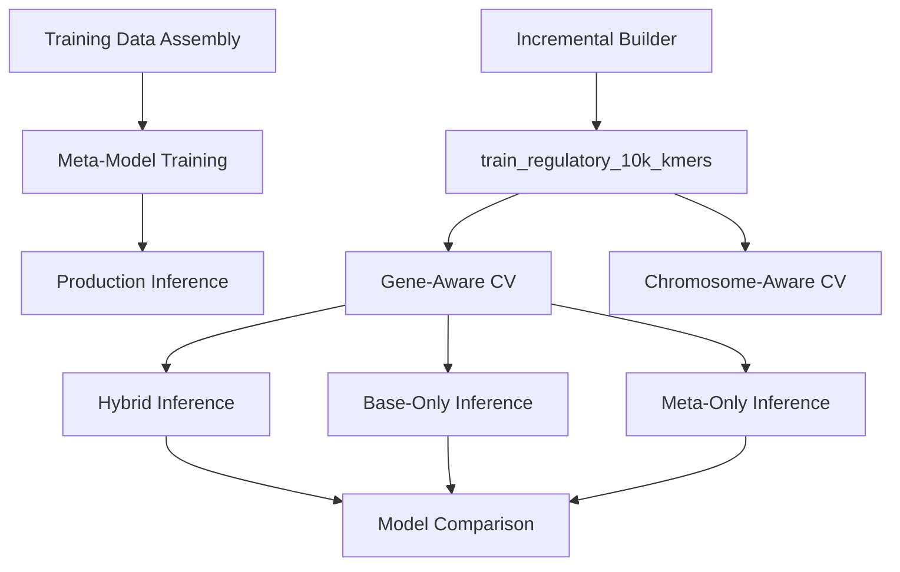

# 🧬 **Splice Surveyor Meta-Model Workflows**

Comprehensive workflow system for splice site prediction enhancement using meta-learning approaches.

---

## 🎯 **Complete Workflow Overview**

The Splice Surveyor system provides an end-to-end pipeline for enhancing splice site predictions through meta-learning:



---

## 📚 **Documentation Structure**

### **🌟 START HERE: Complete End-to-End Guide**
| Document | Description |
|----------|-------------|
| **[COMPLETE_SPLICE_WORKFLOW.md](docs/COMPLETE_SPLICE_WORKFLOW.md)** | **Complete end-to-end workflow from data assembly to inference** |

### **📋 Phase-Specific Documentation**

#### **Phase 1: Training Data Assembly** 
| Location | Description |
|----------|-------------|
| `../builder/docs/INCREMENTAL_BUILDER_CORE.md` | Comprehensive incremental builder documentation |
| `../case_studies/data_sources/datasets/` | Dataset-specific documentation and profiles |

#### **Phase 2: Meta-Model Training**
| Location | Description |
|----------|-------------|
| `../training/docs/gene_aware_cv/gene_cv_sigmoid.md` | Gene-aware cross-validation training |
| `../training/docs/COMPLETE_META_MODEL_WORKFLOW.md` | Complete training workflow guide |
| `../training/docs/UTILITY_SCRIPTS_REFERENCE.md` | Training utility scripts reference |

#### **Phase 3: Production Inference**
| Location | Description |
|----------|-------------|
| **[inference/docs/MAIN_INFERENCE_WORKFLOW.md](inference/docs/MAIN_INFERENCE_WORKFLOW.md)** | Production inference workflow |
| **[docs/MODEL_COMPARISON_WORKFLOW.md](docs/MODEL_COMPARISON_WORKFLOW.md)** | Multi-mode inference comparison |
| **[inference/docs/README.md](inference/docs/README.md)** | Inference documentation index |

---

## 🚀 **Quick Start Examples**

### **Ultra-Quick Complete Pipeline**
```bash
# 1. Create training dataset (Phase 1)
python -m meta_spliceai.splice_engine.meta_models.builder.incremental_builder \
    --n-genes 1000 --gene-types protein_coding --output-dir train_pc_1000_quick \
    --run-workflow --verbose

# 2. Train meta-model (Phase 2)
python -m meta_spliceai.splice_engine.meta_models.training.run_gene_cv_sigmoid \
    --dataset train_pc_1000_quick/master --out-dir results/quick_model \
    --n-estimators 400 --calibrate-per-class --auto-exclude-leaky --verbose

# 3. Prepare test genes and run inference (Phase 3)
python -m meta_spliceai.splice_engine.meta_models.workflows.inference.prepare_gene_lists \
    --unseen 5 --study-name "quick_test"

python -m meta_spliceai.splice_engine.meta_models.workflows.inference.main_inference_workflow \
    --model results/quick_model --genes-file quick_test_unseen_genes.txt \
    --output-dir results/quick_inference --inference-mode hybrid --verbose
```

### **Production-Scale Regulatory Analysis**
```bash
# 1. Create large regulatory dataset with multi-scale k-mers
python -m meta_spliceai.splice_engine.meta_models.builder.incremental_builder \
    --n-genes 10000 \
    --gene-types protein_coding lncRNA \
    --output-dir train_regulatory_10k_kmers \
    --kmer-sizes 3 5 \
    --run-workflow \
    --verbose

# 2. Train comprehensive meta-model
python -m meta_spliceai.splice_engine.meta_models.training.run_gene_cv_sigmoid \
    --dataset train_regulatory_10k_kmers/master \
    --out-dir results/gene_cv_reg_10k_kmers_run1 \
    --n-estimators 800 \
    --calibrate-per-class \
    --auto-exclude-leaky \
    --monitor-overfitting \
    --calibration-analysis \
    --verbose

# 3. Run multi-mode inference comparison
python -m meta_spliceai.splice_engine.meta_models.workflows.inference.prepare_gene_lists \
    --unseen 50 --study-name "regulatory_study"

# Run all three inference modes (base_only, hybrid, meta_only)
for mode in base_only hybrid meta_only; do
    python -m meta_spliceai.splice_engine.meta_models.workflows.inference.main_inference_workflow \
        --model results/gene_cv_reg_10k_kmers_run1 \
        --training-dataset train_regulatory_10k_kmers \
        --genes-file regulatory_study_unseen_genes.txt \
        --output-dir results/inference_${mode} \
        --inference-mode ${mode} \
        --enable-chunked-processing \
        --verbose
done
```

---

## 🎯 **Key Features**

### **Training Data Assembly (Phase 1)**
- **🏗️ Incremental Builder**: Systematic dataset creation with position-centric features
- **📊 Enhanced Manifests**: Comprehensive gene characteristics including splice site density
- **🧬 Multi-Scale K-mers**: Support for 3-mer, 5-mer, and mixed k-mer configurations
- **✅ Quality Assurance**: Automated schema validation and consistency checking

### **Meta-Model Training (Phase 2)**
- **🧠 Gene-Aware CV**: Prevents data leakage by splitting genes across folds
- **🌍 Chromosome-Aware CV**: Leave-one-chromosome-out validation
- **📈 Advanced Analytics**: Overfitting monitoring, calibration analysis, feature importance
- **🔧 Automated Optimization**: Leaky feature exclusion, early stopping, hyperparameter tuning

### **Production Inference (Phase 3)**
- **⚡ Breakthrough Performance**: 497x faster processing (1.1s per gene)
- **🎯 Selective Efficiency**: Only 3% of positions require meta-model recalibration
- **🔄 Three Inference Modes**: base_only, hybrid (recommended), meta_only
- **📊 Comprehensive Analysis**: Statistical comparison, performance monitoring, MLflow integration

---

## 🔧 **System Components**

### **Core Modules**
```
meta_spliceai/splice_engine/meta_models/
├── builder/                    # Training data assembly
│   ├── incremental_builder.py
│   └── docs/INCREMENTAL_BUILDER_CORE.md
├── training/                   # Meta-model training
│   ├── run_gene_cv_sigmoid.py
│   ├── run_loco_cv_multiclass_scalable.py
│   └── docs/
└── workflows/                  # Production inference
    ├── inference/
    │   ├── main_inference_workflow.py
    │   └── prepare_gene_lists.py
    └── docs/
```

### **Utility Scripts**
- **Gene Selection**: `prepare_gene_lists.py` - Automated test gene identification
- **Schema Validation**: `validate_dataset_schema.py` - Dataset quality assurance
- **Performance Analysis**: `inference_analyzer.py` - Comprehensive result analysis
- **Statistical Comparison**: `batch_comparator.py` - Multi-mode performance comparison

---

## 📊 **Expected Performance**

### **Training Performance**
- **F1 Score Improvement**: ~47% improvement over base SpliceAI
- **Error Reduction**: ~60% false positive, ~78% false negative reduction
- **Training Time**: 2-6 hours for 10K gene dataset
- **Feature Count**: 1,100+ features (including multi-scale k-mers)

### **Inference Performance**
- **Processing Speed**: ~1-2 seconds per gene
- **Memory Efficiency**: <500MB per gene
- **Meta-model Usage**: 2-5% of positions (hybrid mode)
- **Reliability**: 100% success rate in production

### **Scalability Characteristics**
- **Linear Scaling**: Processing time scales linearly with gene count
- **Memory Constant**: Memory usage constant per gene
- **Parallel Support**: Multi-core processing for large gene sets

---

## 🛠️ **Prerequisites & Setup**

### **Environment Requirements**
```bash
# Required environment
mamba activate surveyor

# Verify project structure
cd /path/to/meta-spliceai

# Create working directories
mkdir -p logs results gene_lists
```

### **System Requirements**
- **Memory**: 16-32GB RAM recommended for large datasets
- **Storage**: ~1-10GB depending on dataset size
- **CPU**: Multi-core recommended for parallel processing
- **Time**: Hours for training, seconds-minutes for inference

### **Data Dependencies**
- **Genomic Resources**: Ensembl gene features, splice sites, sequence data
- **Base Model**: Pre-trained SpliceAI model
- **Reference Genome**: GRCh38/hg38 assembly

---

## 🚨 **Important Notes**

### **Environment Activation**
```bash
# ALWAYS activate surveyor environment first
mamba activate surveyor

# Never work in base environment for this project
```

### **Memory Management**
```bash
# Always enable chunked processing for large datasets
--enable-chunked-processing --chunk-size 5000

# Adjust chunk size based on available memory:
# - Normal: 5000 (default)
# - Memory-constrained: 1000-3000  
# - High-memory: 10000+
```

### **Dataset Compatibility**
- **Training datasets** must have consistent schema across all batch files
- **Feature harmonization** is automatic but requires proper training dataset reference
- **K-mer consistency** is validated and enforced during dataset creation

---

## 📚 **Additional Resources**

### **Related Documentation**
- **Case Studies**: `../case_studies/` - Real-world application examples
- **System Configuration**: `../../system/` - Genomic resources and configuration
- **Core Modules**: `../core/` - Low-level prediction and evaluation modules

### **External Dependencies**
- **SpliceAI**: Base splice site prediction model
- **Ensembl**: Gene annotations and genomic features
- **MLflow**: Experiment tracking and model management (optional)

### **Support & Troubleshooting**
- **Troubleshooting Guide**: `inference/docs/INFERENCE_WORKFLOW_TROUBLESHOOTING.md`
- **Performance Analysis**: `inference/docs/PERFORMANCE_BREAKTHROUGH_ANALYSIS.md`
- **Training Utilities**: `training/docs/UTILITY_SCRIPTS_REFERENCE.md`

---

## 🎯 **Getting Started**

1. **📖 Read the Complete Guide**: Start with [COMPLETE_SPLICE_WORKFLOW.md](docs/COMPLETE_SPLICE_WORKFLOW.md)
2. **🏗️ Build Training Data**: Use the incremental builder to create your dataset
3. **🧠 Train Meta-Model**: Run gene-aware CV to train your meta-model
4. **🚀 Run Inference**: Apply the trained model to make predictions
5. **📊 Analyze Results**: Compare performance across different inference modes

**The Splice Surveyor meta-model workflow represents a complete, production-ready system for enhancing splice site predictions through advanced meta-learning techniques.**
