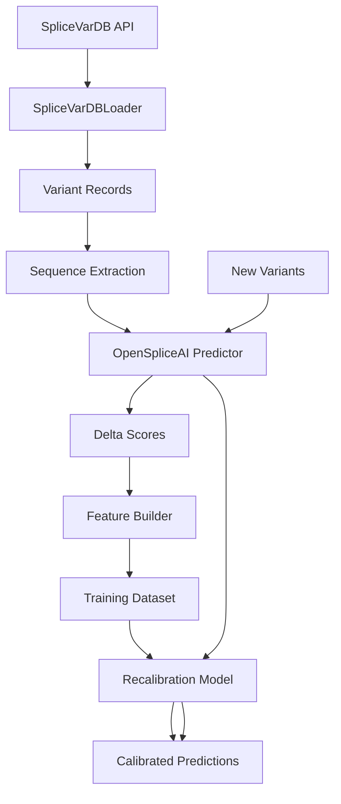

# Integration Guide: SpliceVarDB + OpenSpliceAI Recalibration

This guide explains how to integrate the new `openspliceai_recalibration` package with your existing MetaSpliceAI infrastructure.

## 🎯 Overview

The `openspliceai_recalibration` package provides a **parallel experimental track** to the existing `meta_models` package:

| Aspect | `meta_models` | `openspliceai_recalibration` |
|--------|--------------|------------------------------|
| **Base Model** | SpliceAI (Keras/TF) | OpenSpliceAI (PyTorch) |
| **Approach** | Meta-learning layer | Direct recalibration |
| **Data Source** | Custom genomic datasets | SpliceVarDB validated variants |
| **Status** | Production | Experimental |

## 📁 Package Structure

```
splice_engine/
├── meta_models/                          # EXISTING: SpliceAI-based
│   ├── training/
│   ├── openspliceai_adapter/            # Coordinate reconciliation
│   └── ...
│
├── openspliceai_recalibration/          # NEW: OpenSpliceAI-based
│   ├── core/                            # Prediction & recalibration
│   ├── data/                            # SpliceVarDB loading
│   ├── training/                        # Training pipelines
│   ├── workflows/                       # End-to-end workflows
│   └── examples/
│
└── case_studies/                        # EXISTING: External data
    ├── data_sources/
    │   └── splicevardb.py              # Basic ingester (enhanced in new package)
    └── workflows/
```

## 🔄 Data Flow



## 🚀 Quick Start

### 1. Install OpenSpliceAI Models

```bash
# Download OpenSpliceAI models (if not already done)
./scripts/base_model/download_openspliceai_models.sh

# Verify models are installed
ls -la data/models/openspliceai/
```

### 2. Set Up SpliceVarDB Access

```bash
# Option 1: Set API token (if you have registered access)
export SPLICEVARDB_TOKEN="your_token_here"

# Option 2: Use demo data (automatic fallback for development)
# No token needed - will use built-in demo variants
```

### 3. Run Training Pipeline

```bash
# Basic usage with demo data
python -m meta_spliceai.splice_engine.openspliceai_recalibration.examples.train_with_splicevardb

# With real data and reference genome
python -m meta_spliceai.splice_engine.openspliceai_recalibration.examples.train_with_splicevardb \
    --reference-genome /path/to/hg38.fa \
    --data-dir ./data/splicevardb \
    --output-dir ./models/recalibration \
    --recalibration-method xgboost \
    --verbose

# Quick test with limited variants
python -m meta_spliceai.splice_engine.openspliceai_recalibration.examples.train_with_splicevardb \
    --max-variants 100 \
    --test-mode
```

## 🔧 Integration with Existing Code

### Using with Case Studies

```python
from meta_spliceai.splice_engine.case_studies.workflows import DiseaseValidationWorkflow
from meta_spliceai.splice_engine.openspliceai_recalibration import SpliceVarDBTrainingPipeline

# Train recalibration model
pipeline = SpliceVarDBTrainingPipeline(
    data_dir="./data/splicevardb",
    output_dir="./models/recalibration"
)
results = pipeline.run()
model = results["model"]

# Validate on disease cohorts
validator = DiseaseValidationWorkflow(
    work_dir="./validation",
    model=model  # Use recalibrated model
)

disease_results = validator.run_disease_specific_validation(
    diseases=["cystic_fibrosis", "breast_cancer"],
    databases=["SpliceVarDB", "ClinVar"]
)
```

### Comparing with Meta Models

```python
from meta_spliceai.splice_engine.meta_models.training import MetaModelTrainer
from meta_spliceai.splice_engine.openspliceai_recalibration import SpliceVarDBTrainingPipeline

# Train SpliceAI meta-model
spliceai_trainer = MetaModelTrainer(base_model="spliceai")
spliceai_model = spliceai_trainer.train(training_data)

# Train OpenSpliceAI recalibrator
openspliceai_pipeline = SpliceVarDBTrainingPipeline()
openspliceai_results = openspliceai_pipeline.run()
openspliceai_model = openspliceai_results["model"]

# Compare performance
comparison = compare_models(
    models={"SpliceAI Meta": spliceai_model, "OpenSpliceAI Recal": openspliceai_model},
    test_data=test_variants
)
```

### Using OpenSpliceAI Adapter

The `meta_models/openspliceai_adapter` provides coordinate reconciliation that can be used by both packages:

```python
from meta_spliceai.splice_engine.meta_models.openspliceai_adapter import AlignedSpliceExtractor

# Extract splice sites with perfect equivalence
extractor = AlignedSpliceExtractor(coordinate_system="metaspliceai")
splice_sites = extractor.extract_splice_sites(
    gtf_file="annotations.gtf",
    fasta_file="genome.fa"
)

# Use in either meta_models or openspliceai_recalibration workflows
```

## 📊 Sharing Resources

### Shared Resources

These components are shared between both packages:

1. **OpenSpliceAI Models**: `data/models/openspliceai/`
2. **Reference Genome**: `data/reference/hg38.fa`
3. **SpliceVarDB Cache**: `data/splicevardb/cache/`
4. **Coordinate Reconciliation**: `meta_models/openspliceai_adapter/`

### Independent Resources

These are package-specific:

1. **Training Data**: Separate datasets per package
2. **Trained Models**: Separate model directories
3. **Features**: Different feature engineering approaches
4. **Evaluation**: Independent evaluation frameworks

## 🔬 Use Cases

### Use Case 1: Variant-Focused Research

When focusing on splice-altering variants:

```python
# Use openspliceai_recalibration for variant-specific analysis
from meta_spliceai.splice_engine.openspliceai_recalibration import (
    OpenSpliceAIPredictor,
    SpliceVarDBLoader
)

# Load validated variants
loader = SpliceVarDBLoader(output_dir="./data/splicevardb")
variants = loader.load_validated_variants()

# Predict with OpenSpliceAI
predictor = OpenSpliceAIPredictor()
predictions = predictor.predict_batch(variants)
```

### Use Case 2: General Splice Prediction

For general splice site analysis:

```python
# Use meta_models for comprehensive analysis
from meta_spliceai.splice_engine.meta_models.workflows import (
    run_enhanced_splice_prediction_workflow
)

results = run_enhanced_splice_prediction_workflow(
    local_dir="./data",
    target_genes=["STMN2", "UNC13A"],
    do_extract_sequences=True,
    do_extract_splice_sites=True
)
```

### Use Case 3: Comparative Analysis

Compare both approaches:

```python
# Run both pipelines on same data
from meta_spliceai.splice_engine.meta_models.training import MetaModelTrainer
from meta_spliceai.splice_engine.openspliceai_recalibration import SpliceVarDBTrainingPipeline

# SpliceAI approach
spliceai_results = MetaModelTrainer().train(data)

# OpenSpliceAI approach
openspliceai_results = SpliceVarDBTrainingPipeline().run()

# Compare
compare_approaches(spliceai_results, openspliceai_results)
```

## 🧪 Testing Integration

### Unit Tests

```bash
# Test SpliceVarDB loader
python -m pytest meta_spliceai/splice_engine/openspliceai_recalibration/tests/test_splicevardb_loader.py

# Test OpenSpliceAI predictor
python -m pytest meta_spliceai/splice_engine/openspliceai_recalibration/tests/test_base_predictor.py

# Test integration
python -m pytest meta_spliceai/splice_engine/openspliceai_recalibration/tests/test_integration.py
```

### End-to-End Tests

```bash
# Run complete pipeline with test data
python meta_spliceai/splice_engine/openspliceai_recalibration/examples/train_with_splicevardb.py \
    --test-mode \
    --max-variants 50 \
    --verbose
```

## 📝 Configuration

### Using YAML Configuration

```python
from meta_spliceai.splice_engine.openspliceai_recalibration.workflows import SpliceVarDBTrainingPipeline
import yaml

# Load configuration
with open("configs/my_config.yaml") as f:
    config_dict = yaml.safe_load(f)

# Create pipeline with config
pipeline = SpliceVarDBTrainingPipeline(config=config_dict)
results = pipeline.run()
```

### Environment Variables

```bash
# SpliceVarDB access
export SPLICEVARDB_TOKEN="your_token"

# OpenSpliceAI models
export OPENSPLICEAI_MODEL_DIR="./data/models/openspliceai"

# Reference genome
export REFERENCE_GENOME="./data/reference/hg38.fa"

# Run pipeline
python train_with_splicevardb.py
```

## 🐛 Troubleshooting

### Common Issues

1. **OpenSpliceAI models not found**
   ```bash
   ./scripts/base_model/download_openspliceai_models.sh
   ```

2. **SpliceVarDB API access issues**
   - Falls back to demo data automatically
   - Register at https://splicevardb.org for full access

3. **Memory issues with large datasets**
   ```python
   config = PipelineConfig(
       batch_size=50,  # Reduce batch size
       low_memory_mode=True
   )
   ```

4. **Device issues (GPU/CPU)**
   ```python
   predictor = OpenSpliceAIPredictor(device="cpu")  # Force CPU
   ```

## 🔗 Related Documentation

- [OpenSpliceAI Recalibration README](README.md)
- [SpliceVarDB Loader Documentation](data/README.md)
- [Meta Models Documentation](../meta_models/README.md)
- [Case Studies Documentation](../case_studies/README.md)

## 🤝 Contributing

When extending this package:

1. Keep it independent from `meta_models`
2. Use OpenSpliceAI as the base model
3. Focus on variant-induced splicing
4. Maintain compatibility with `case_studies`
5. Document integration points

---

*For questions or issues, please refer to the main project documentation or create an issue.*


