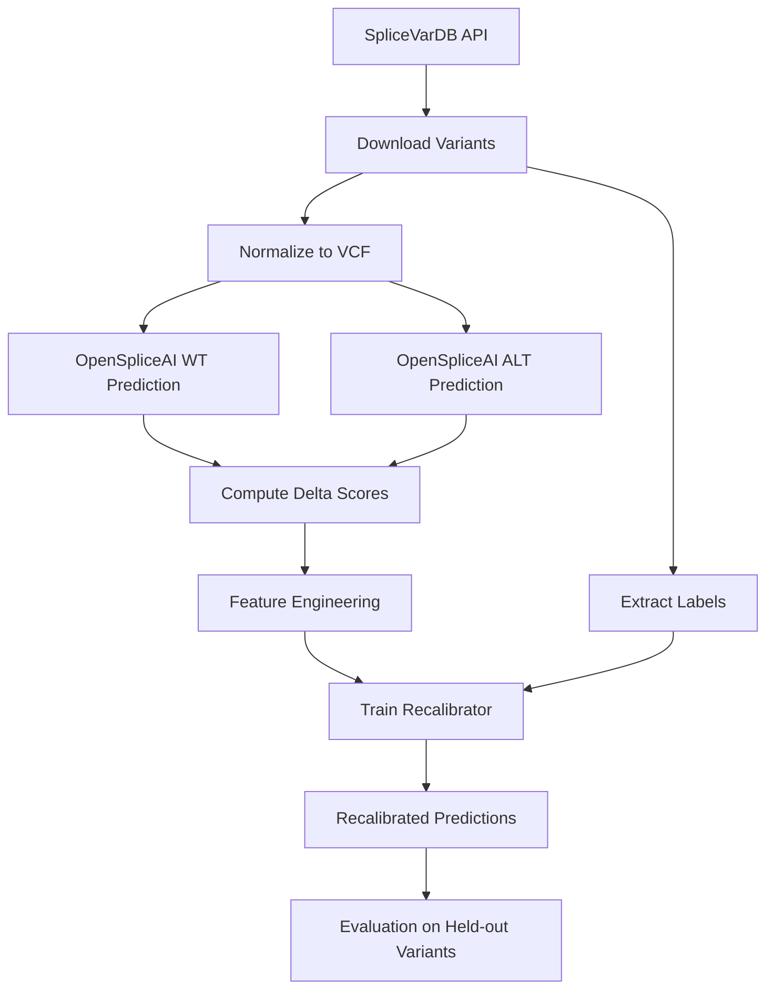

# OpenSpliceAI Recalibration Package

**Experimental package for direct recalibration of OpenSpliceAI predictions using SpliceVarDB**

## 🎯 Overview

This package provides an independent experimental framework for:
1. **Direct OpenSpliceAI Integration**: Uses OpenSpliceAI PyTorch models as the base predictor
2. **SpliceVarDB Training**: Leverages 50K+ experimentally validated splice variants
3. **Recalibration Models**: Adjusts/calibrates OpenSpliceAI predictions for improved accuracy
4. **Variant-Induced Splicing**: Focuses on splice-altering variants and alternative splicing

### Why Separate from `meta_models`?

| Aspect | `meta_models` | `openspliceai_recalibration` |
|--------|--------------|------------------------------|
| **Base Model** | SpliceAI (Keras/TF) | OpenSpliceAI (PyTorch) |
| **Approach** | Meta-learning layer | Direct recalibration |
| **Training Data** | Custom genomic datasets | SpliceVarDB validated variants |
| **Status** | Production/mature | Experimental |
| **Goal** | General splice prediction | Variant-induced splicing focus |

## 🏗️ Architecture

```
openspliceai_recalibration/
│
├── core/                          # Core recalibration logic
│   ├── base_predictor.py         # OpenSpliceAI model wrapper
│   ├── recalibrator.py           # Recalibration models (isotonic, Platt scaling, etc.)
│   └── delta_analyzer.py         # Delta score analysis and feature engineering
│
├── data/                          # Data ingestion and processing
│   ├── splicevardb_loader.py     # SpliceVarDB API client and data loader
│   ├── variant_processor.py      # Variant normalization (VCF, HGVS)
│   └── feature_builder.py        # Delta features for training
│
├── training/                      # Training pipelines
│   ├── dataset_builder.py        # Training dataset construction
│   ├── trainer.py                # Recalibration model training
│   └── evaluator.py              # Performance evaluation
│
├── workflows/                     # End-to-end workflows
│   ├── splicevardb_pipeline.py   # Complete SpliceVarDB training workflow
│   └── inference_pipeline.py     # Production inference workflow
│
└── examples/
    └── train_with_splicevardb.py # Complete example
```

## 📊 SpliceVarDB Integration

### Data Source

- **Database**: [SpliceVarDB](https://splicevardb.org/) (Sullivan et al. 2024)
- **Variants**: 50,000+ experimentally validated splice-altering variants
- **Genes**: 8,000+ genes with splice variant annotations
- **Evidence**: Minigene assays, RNA-seq, RT-PCR validation
- **API**: `https://compbio.ccia.org.au/splicevardb-api`

### Workflow



## 🚀 Quick Start

### 1. Download SpliceVarDB Data

```bash
# Set your SpliceVarDB API token (if registered)
export SPLICEVARDB_TOKEN="your_token_here"

# Download all validated variants
python -m meta_spliceai.splice_engine.openspliceai_recalibration.data.splicevardb_loader \
    --output-dir ./data/splicevardb \
    --build GRCh38 \
    --variant-set validated
```

### 2. Train Recalibration Model

```python
from meta_spliceai.splice_engine.openspliceai_recalibration import SpliceVarDBTrainingPipeline

# Initialize pipeline
pipeline = SpliceVarDBTrainingPipeline(
    data_dir="./data/splicevardb",
    model_dir="./models/openspliceai_recalibration",
    base_model_type="openspliceai"
)

# Train recalibration model
results = pipeline.run(
    training_strategy="grouped_cv",  # Gene-level cross-validation
    recalibration_method="isotonic",  # Isotonic regression
    feature_set="delta_full"  # Full delta feature set
)

print(f"Base OpenSpliceAI AUC: {results['base_auc']:.3f}")
print(f"Recalibrated AUC: {results['recalibrated_auc']:.3f}")
print(f"Improvement: {results['improvement']:+.3f}")
```

### 3. Apply Recalibration

```python
from meta_spliceai.splice_engine.openspliceai_recalibration import OpenSpliceAIRecalibrator

# Load trained recalibrator
recalibrator = OpenSpliceAIRecalibrator.load("./models/openspliceai_recalibration/best_model.pkl")

# Predict on new variants
new_variants = [
    {"chrom": "7", "pos": 117199644, "ref": "C", "alt": "T", "gene": "CFTR"},
    # ... more variants
]

predictions = recalibrator.predict_batch(new_variants)

for var, pred in zip(new_variants, predictions):
    print(f"{var['gene']} {var['chrom']}:{var['pos']}")
    print(f"  Donor gain: {pred['donor_gain_raw']:.3f} → {pred['donor_gain_calibrated']:.3f}")
    print(f"  Acceptor gain: {pred['acceptor_gain_raw']:.3f} → {pred['acceptor_gain_calibrated']:.3f}")
    print(f"  Splice-altering probability: {pred['splice_altering_prob']:.3f}")
```

## 📋 Recalibration Methods

### 1. **Isotonic Regression** (Default)
- Non-parametric calibration
- Preserves ranking
- Handles non-linear score distributions

### 2. **Platt Scaling**
- Logistic regression on scores
- Fast and interpretable
- Works well with fewer samples

### 3. **Beta Calibration**
- Flexible parametric approach
- Better tail behavior than Platt
- Good for imbalanced datasets

### 4. **XGBoost Recalibrator**
- Uses delta features + context
- Most flexible but requires more data
- Can capture complex patterns

## 🔬 Training Strategies

### Gene-Level Cross-Validation

Hold out entire genes to test generalization:

```python
pipeline = SpliceVarDBTrainingPipeline(
    data_dir="./data/splicevardb",
    cv_strategy="gene_holdout",
    test_genes=["CFTR", "BRCA1", "BRCA2"]  # Classic splice variant genes
)
```

### Region-Stratified Splits

Ensure balanced representation across splice regions:

```python
pipeline = SpliceVarDBTrainingPipeline(
    data_dir="./data/splicevardb",
    cv_strategy="region_stratified",
    stratify_by=["canonical", "cryptic", "deep_intronic"]
)
```

### Evidence-Weighted Training

Weight samples by experimental validation strength:

```python
pipeline = SpliceVarDBTrainingPipeline(
    data_dir="./data/splicevardb",
    use_sample_weights=True,
    weight_scheme={
        "RNA-seq": 1.5,
        "minigene": 1.2,
        "RT-PCR": 1.1,
        "computational": 0.5
    }
)
```

## 📊 Evaluation Metrics

### Overall Performance
- **AUC-ROC**: Overall discrimination
- **AUC-PR**: Performance with class imbalance
- **Calibration Error**: Reliability of probability estimates

### Region-Specific Performance
- **Canonical sites**: Classic splice site mutations
- **Cryptic sites**: Novel splice site activation
- **Deep intronic**: Far from annotated exons

### Clinical Relevance
- **Sensitivity at 95% specificity**: Clinical decision threshold
- **Top-K accuracy**: Ranking quality for candidate variants

## 🔗 Integration with Case Studies

This package integrates with the `case_studies` infrastructure:

```python
from meta_spliceai.splice_engine.case_studies.workflows import DiseaseValidationWorkflow
from meta_spliceai.splice_engine.openspliceai_recalibration import OpenSpliceAIRecalibrator

# Load recalibrator
recalibrator = OpenSpliceAIRecalibrator.load("./models/best_model.pkl")

# Validate on disease-specific cohorts
validator = DiseaseValidationWorkflow(
    work_dir="./validation",
    model=recalibrator
)

results = validator.run_disease_specific_validation(
    diseases=["cystic_fibrosis", "breast_cancer"],
    databases=["SpliceVarDB", "ClinVar"]
)
```

## 🛠️ Development Status

| Component | Status | Priority |
|-----------|--------|----------|
| SpliceVarDB Loader | 🟡 Draft | 🔴 High |
| OpenSpliceAI Wrapper | 🔴 TODO | 🔴 High |
| Delta Feature Builder | 🟡 Draft | 🔴 High |
| Recalibration Models | 🔴 TODO | 🟠 Medium |
| Training Pipeline | 🔴 TODO | 🔴 High |
| Evaluation Framework | 🔴 TODO | 🟠 Medium |
| Documentation | 🟢 Complete | ✅ Done |

**Legend**: 🔴 TODO | 🟡 In Progress | 🟢 Complete

## 📚 References

### SpliceVarDB
- Sullivan, Patricia J., et al. "SpliceVarDB: a database of splice variants with experimental validation." *bioRxiv* (2024).
- Website: https://splicevardb.org/
- API: https://compbio.ccia.org.au/splicevardb-api

### OpenSpliceAI
- Zhang, Charlie, et al. "OpenSpliceAI: A highly efficient and scalable implementation of SpliceAI." *GitHub* (2023).
- Models: https://github.com/chengzhongshan/openSpliceAI-PyTorch

## 🤝 Contributing

This is an experimental package. Key areas for contribution:
1. Implementing recalibration methods
2. Feature engineering for delta scores
3. Evaluation on additional datasets
4. Integration with variant calling pipelines

---

*Part of the MetaSpliceAI experimental modules*


