# MetaSpliceAI Presentation Materials

This directory contains comprehensive presentation materials for MetaSpliceAI's VCF variant analysis capabilities, featuring interactive flowcharts and detailed technical documentation.

## Available Presentations

### 📊 [VCF Variant Analysis Workflows](VCF_Variant_Analysis_Workflows.md)
**Target Audience**: Research teams, bioinformaticians, clinical analysts

**Content Overview**:
- Complete pipeline overview with Mermaid flowcharts
- Production VCF processing workflow
- Coordinate system validation strategy
- End-to-end analysis pipeline
- Clinical applications and use cases

**Key Features**:
- 20 comprehensive slides
- Interactive workflow diagrams
- Real-world examples with ClinVar data
- Performance benchmarks and optimization tips

---

### 🔧 [VCF Technical Architecture](VCF_Technical_Architecture.md)
**Target Audience**: Software engineers, system architects, technical leads

**Content Overview**:
- Deep dive into implementation details
- Design patterns and architectural decisions
- Error handling and recovery strategies
- Performance optimization techniques
- Extensibility and maintenance considerations

**Key Features**:
- 20 technical slides
- Code examples and design patterns
- Architecture diagrams
- Testing and quality assurance strategies
- Future scalability planning

---

### ⚡ [VCF Quick Reference Guide](VCF_Quick_Reference.md)
**Target Audience**: End users, analysts, researchers

**Content Overview**:
- Essential commands and workflows
- Troubleshooting guide
- Best practices and recommendations
- API reference and examples
- Configuration options

**Key Features**:
- 20 practical slides
- Command-line examples
- Common usage patterns
- Error resolution steps
- Performance expectations

---

## Flowcharts and Diagrams

### Production VCF Processing Pipeline

```mermaid
graph TD
    A[Raw VCF] --> B[vcf_preprocessing.py]
    B --> C[Normalized VCF]
    C --> D[vcf_coordinate_verifier.py]
    D --> E{Quality Check}
    E -->|Pass| F[✅ Analysis Ready]
    E -->|Fail| G[❌ Investigate Issues]
```


### Coordinate Verification Workflow

```mermaid
graph TD
    A[Raw VCF + FASTA] --> B[vcf_coordinate_verifier.py]
    B --> C{Coordinates Consistent?}
    C -->|Yes| D[✅ Ready for Analysis]
    C -->|No| E[❌ Fix Coordinate Issues]
```


## Usage Instructions

### For Presentations
1. **Markdown Rendering**: Use any Markdown viewer that supports Mermaid diagrams
2. **Slide Conversion**: Convert to PDF/PowerPoint using tools like `pandoc` or `marp`
3. **Interactive Viewing**: Use GitHub/GitLab for interactive Mermaid rendering

### For Documentation
- Reference these materials in project documentation
- Link to specific slides for detailed explanations
- Use flowcharts in other documentation contexts

### Converting to Presentation Formats

**Convert to PDF**:
```bash
# Using pandoc
pandoc VCF_Variant_Analysis_Workflows.md -o presentation.pdf

# Using marp (if installed)
marp VCF_Variant_Analysis_Workflows.md --pdf
```

**Convert to PowerPoint**:
```bash
pandoc VCF_Variant_Analysis_Workflows.md -o presentation.pptx
```

## Integration with Documentation

These presentation materials complement the main documentation:

- **[VCF_VARIANT_ANALYSIS_WORKFLOW.md](../meta_spliceai/splice_engine/case_studies/docs/VCF_VARIANT_ANALYSIS_WORKFLOW.md)**: Technical implementation details
- **[CLINVAR_WORKFLOW_STEPS_1_2_TUTORIAL.md](../meta_spliceai/splice_engine/case_studies/docs/tutorials/CLINVAR_WORKFLOW_STEPS_1_2_TUTORIAL.md)**: Hands-on tutorial
- **[VCF_VARIANT_ANALYSIS_REFERENCE.md](../meta_spliceai/splice_engine/case_studies/docs/VCF_VARIANT_ANALYSIS_REFERENCE.md)**: Comprehensive reference guide

## Maintenance Notes

**Updating Presentations**:
- Keep flowcharts synchronized with actual implementation
- Update performance benchmarks as system evolves
- Refresh examples with latest data and file versions
- Maintain consistency across all presentation materials

**Version Control**:
- Track changes to maintain presentation history
- Update version references in slides when tools change
- Coordinate updates with main documentation changes

---

*These presentation materials provide comprehensive coverage of MetaSpliceAI's VCF analysis capabilities, from high-level workflows to detailed technical implementation.*
