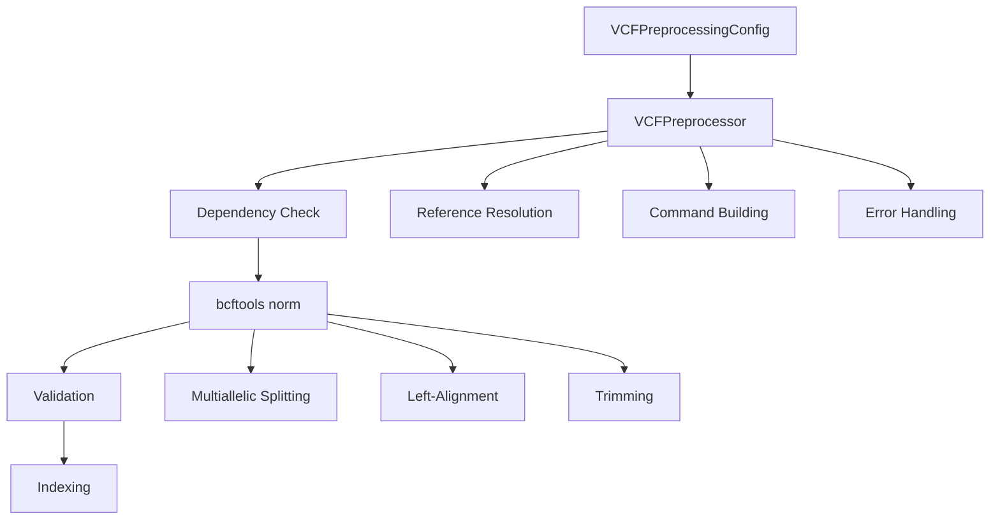

# MetaSpliceAI VCF Analysis: Technical Architecture
## Deep Dive into Implementation and Design Patterns

---

## Slide 1: Architecture Overview
### Modular Design Philosophy

**Core Principles**:
- **Separation of concerns**: Each module handles specific functionality
- **Composability**: Components can be used independently or together
- **Extensibility**: Easy to add new validation or processing steps
- **Testability**: Each component has clear interfaces and responsibilities

**Module Hierarchy**:
```
case_studies/
├── workflows/          # High-level orchestration
├── tools/             # Command-line utilities
├── formats/           # Data format handling
└── docs/              # Documentation and tutorials
```

---

## Slide 2: VCF Preprocessing Architecture
### bcftools Integration Strategy



**Key Design Patterns**:
- **Configuration object**: Encapsulates all processing parameters
- **Builder pattern**: Constructs bcftools commands dynamically
- **Strategy pattern**: Different preprocessing strategies for different use cases

---

## Slide 3: Enhanced Path Resolution System
### Smart File Discovery Architecture

```python
class EnhancedPathResolver:
    def __init__(self):
        self.resource_manager = CaseStudyResourceManager()
        self.search_locations = [
            ".",  # Current directory
            "data/ensembl/clinvar/vcf/",
            "data/ensembl/",
            # ... resource manager paths
        ]
    
    def resolve_vcf_path(self, vcf_input: str) -> Path:
        # 1. Try as absolute path
        # 2. Try as relative path
        # 3. Search standard locations
        # 4. Query resource manager
        # 5. Provide helpful error with available files
```

**Benefits**:
- **User experience**: Simplified command-line usage
- **Maintainability**: Centralized path logic
- **Debugging**: Clear error messages with suggestions

---

## Slide 4: Coordinate Verification Engine
### Multi-Strategy Validation Approach

```python
class VCFCoordinateVerifier:
    def __init__(self, fasta_path, enable_normalization=True):
        self.fasta = Fasta(fasta_path)
        self.variant_standardizer = VariantStandardizer() if enable_normalization else None
    
    def verify_single_position(self, chrom, pos, expected_ref, gene_strand=None):
        # 1. Basic coordinate lookup
        basic_result = self._basic_verification(chrom, pos, expected_ref)
        
        # 2. Normalization fallback if needed
        if not basic_result['match'] and self.variant_standardizer:
            normalized_result = self._verify_with_normalization(...)
            
        # 3. Gene context interpretation
        if gene_strand:
            gene_context = self._add_gene_context(...)
```

**Verification Strategies**:
1. **Direct lookup**: Exact position matching
2. **Normalization**: Complex indel handling via variant standardizer
3. **Context search**: Find equivalent representations in nearby sequence

---

## Slide 5: Variant Standardization Patterns
### Two-Tier Processing Architecture

**Design Rationale**:
```
File-Level Processing     Individual Variant Processing
     (Production)              (Diagnostic)
         |                         |
   vcf_preprocessing.py    variant_standardizer.py
         |                         |
   bcftools (external)      Python (in-memory)
         |                         |
   Batch processing         Single variant analysis
```

**When to Use Each**:
- **File-level**: Production workflows, large datasets, standardized output
- **Individual**: Debugging, verification, complex case analysis

**Integration Point**: `vcf_coordinate_verifier.py` uses individual-level for fallback normalization

---

## Slide 6: Error Handling Strategy
### Graceful Degradation with Diagnostics

**Error Hierarchy**:
```python
class CoordinateVerificationError(Exception):
    """Base class for coordinate verification errors."""
    pass

class ChromosomeNotFoundError(CoordinateVerificationError):
    def __init__(self, chrom, available_chroms):
        self.available_chroms = available_chroms[:10]  # Show sample
        super().__init__(f"Chromosome {chrom} not found")

class ReferenceAllelleMismatchError(CoordinateVerificationError):
    def __init__(self, expected, actual, suggestions):
        self.suggestions = suggestions
        super().__init__(f"Expected {expected}, found {actual}")
```

**Error Recovery**:
1. **Automatic retries**: Try alternative chromosome names
2. **Fallback strategies**: Use normalization for complex cases
3. **Helpful diagnostics**: Suggest specific fixes

---

## Slide 7: Sequence Construction Engine
### Context-Aware Sequence Management

```python
class SequenceInferenceInterface:
    @staticmethod
    def create_variant_gene_ids(base_gene_id, chrom, pos, ref, alt, variant_index=None):
        """Generate unique IDs for multiallelic support."""
        if base_gene_id:
            suffix = f"ALT_{pos}_{ref}_{alt}"
            if variant_index is not None:
                suffix += f"_{variant_index}"
            return f"{base_gene_id}_WT", f"{base_gene_id}_{suffix}"
        else:
            # Fallback for unknown genes
            return f"TEMP_WT_{chrom}_{pos}", f"TEMP_ALT_{chrom}_{pos}_{ref}_{alt}"
```

**Design Features**:
- **Multiallelic support**: Unique IDs for each variant at same position
- **Traceability**: Gene ID preserved in temporary identifiers
- **Collision avoidance**: Position and allele information in IDs

---

## Slide 8: Resource Management Integration
### Centralized Data Location Strategy

```python
class CaseStudyResourceManager:
    def get_fasta_file(self, build="GRCh38"):
        """Return path to reference FASTA."""
        candidates = [
            self.data_dir / "ensembl" / f"Homo_sapiens.{build}.dna.primary_assembly.fa",
            self.data_dir / "reference" / f"{build}.fa",
            # ... other standard locations
        ]
        return self._find_existing_file(candidates)
        
    def get_clinvar_vcf(self, version="latest"):
        """Return path to ClinVar VCF."""
        # Similar pattern for VCF files
```

**Integration Points**:
- **Path resolver**: Uses resource manager for standard file discovery
- **VCF preprocessor**: Automatic reference FASTA resolution
- **Coordinate verifier**: Default FASTA selection

---

## Slide 9: Validation Framework Design
### Comprehensive Quality Assurance

```python
def generate_report(self, results_df: pd.DataFrame) -> str:
    """Generate validation report with actionable insights."""
    
    # Calculate metrics
    consistency_score = self._calculate_consistency(results_df)
    
    # Classify issues
    if consistency_score >= 95:
        assessment = "CONSISTENT"
        recommendations = self._get_success_recommendations()
    elif consistency_score >= 80:
        assessment = "MOSTLY_CONSISTENT" 
        recommendations = self._get_minor_issue_recommendations()
    else:
        assessment = "INCONSISTENT"
        recommendations = self._get_major_issue_recommendations()
    
    return self._format_report(assessment, recommendations, results_df)
```

**Report Components**:
- **Quantitative metrics**: Consistency scores, error rates
- **Qualitative assessment**: Human-readable status
- **Actionable recommendations**: Specific next steps
- **Genome browser integration**: Direct investigation links

---

## Slide 10: Command-Line Interface Design
### User-Friendly Argument Handling

```python
def create_enhanced_argument_parser(description):
    """Create parser with enhanced path resolution."""
    parser = argparse.ArgumentParser(
        description=description,
        formatter_class=argparse.RawDescriptionHelpFormatter,
        epilog="""
Examples:
  # Simple filename (auto-discovery)
  --vcf clinvar_20250831.vcf.gz
  
  # Relative path
  --vcf data/clinvar/clinvar_20250831.vcf.gz
  
  # Absolute path
  --vcf /full/path/to/file.vcf.gz
        """
    )
    return parser

def resolve_file_arguments(args):
    """Resolve file paths using enhanced path resolver."""
    resolver = EnhancedPathResolver()
    
    if hasattr(args, 'vcf') and args.vcf:
        args.vcf = str(resolver.resolve_vcf_path(args.vcf))
    
    if hasattr(args, 'fasta') and args.fasta:
        args.fasta = str(resolver.resolve_fasta_path(args.fasta))
    
    return args
```

---

## Slide 11: Testing Strategy
### Multi-Level Test Coverage

**Test Categories**:
```
Unit Tests
├── Path resolution logic
├── Coordinate verification algorithms  
├── Variant standardization functions
└── Error handling scenarios

Integration Tests
├── VCF preprocessing workflows
├── End-to-end coordinate validation
├── File format compatibility
└── Resource manager integration

System Tests
├── Large dataset processing (ClinVar)
├── Performance benchmarks
├── Memory usage validation
└── Error recovery testing
```

**Test Data Strategy**:
- **Synthetic data**: Controlled test cases for edge conditions
- **Real data**: ClinVar subsets for integration testing
- **Negative cases**: Invalid inputs, missing files, corrupt data

---

## Slide 12: Performance Optimization
### Efficient Large-Scale Processing

**Optimization Strategies**:
```python
# 1. Lazy loading
@property
def fasta(self):
    if not hasattr(self, '_fasta'):
        self._fasta = Fasta(self.fasta_path)
    return self._fasta

# 2. Batch processing
def verify_vcf_variants(self, vcf_path, max_variants=10):
    with pysam.VariantFile(vcf_path) as vcf:
        for batch in self._batch_records(vcf, batch_size=1000):
            yield self._process_batch(batch)

# 3. Caching
@lru_cache(maxsize=1000)
def _extract_sequence_context(self, chrom, start, end):
    return str(self.fasta[chrom][start:end]).upper()
```

**Memory Management**:
- **Streaming processing**: Handle large VCFs without loading entirely
- **Reference caching**: Cache frequently accessed sequence regions
- **Resource cleanup**: Proper file handle management

---

## Slide 13: Extensibility Patterns
### Plugin Architecture for New Features

**Extension Points**:
```python
class VariantValidator:
    """Base class for variant validation strategies."""
    
    def validate(self, variant, context):
        raise NotImplementedError

class BasicCoordinateValidator(VariantValidator):
    def validate(self, variant, context):
        # Basic REF allele checking
        pass

class NormalizationValidator(VariantValidator):
    def validate(self, variant, context):
        # Complex indel normalization
        pass

# Validator registry
VALIDATORS = {
    'basic': BasicCoordinateValidator,
    'normalization': NormalizationValidator,
    # Easy to add new validators
}
```

**Adding New Features**:
1. **New validation strategies**: Implement `VariantValidator` interface
2. **New file formats**: Extend path resolver with new search patterns
3. **New genome builds**: Add to resource manager configuration

---

## Slide 14: Configuration Management
### Flexible Parameter Handling

```python
@dataclass
class VCFPreprocessingConfig:
    """Configuration object with sensible defaults."""
    
    # Required parameters
    input_vcf: Path
    output_vcf: Path
    
    # Optional with defaults
    reference_fasta: Optional[Path] = None  # Auto-resolved
    split_multiallelics: bool = True
    left_align: bool = True
    min_qual: Optional[float] = None
    threads: int = 1
    
    def __post_init__(self):
        """Validate configuration after initialization."""
        if not self.input_vcf.exists():
            raise FileNotFoundError(f"Input VCF not found: {self.input_vcf}")
```

**Configuration Patterns**:
- **Dataclasses**: Type-safe configuration objects
- **Defaults**: Sensible defaults for common use cases
- **Validation**: Early parameter validation with clear error messages

---

## Slide 15: Logging and Monitoring
### Comprehensive Operation Tracking

```python
import logging

class VCFCoordinateVerifier:
    def __init__(self, fasta_path):
        self.logger = logging.getLogger(__name__)
        self.logger.info(f"Loading reference FASTA: {fasta_path}")
        
        # Performance tracking
        self.stats = {
            'variants_processed': 0,
            'matches_found': 0,
            'normalization_fallbacks': 0,
            'errors_encountered': 0
        }
    
    def verify_single_position(self, chrom, pos, expected_ref):
        self.stats['variants_processed'] += 1
        
        try:
            result = self._do_verification(chrom, pos, expected_ref)
            if result['match']:
                self.stats['matches_found'] += 1
            return result
            
        except Exception as e:
            self.stats['errors_encountered'] += 1
            self.logger.error(f"Verification failed for {chrom}:{pos}: {e}")
            raise
```

**Monitoring Features**:
- **Progress tracking**: Real-time processing statistics
- **Performance metrics**: Processing rates, error rates
- **Diagnostic logging**: Detailed operation traces for debugging

---

## Slide 16: Error Recovery Mechanisms
### Robust Handling of Edge Cases

**Recovery Strategies**:
```python
def _verify_with_fallback_strategies(self, chrom, pos, expected_ref):
    """Try multiple strategies for difficult cases."""
    
    strategies = [
        self._basic_verification,
        self._try_alternative_chromosome_names,
        self._normalization_verification,
        self._context_search_verification
    ]
    
    last_error = None
    for strategy in strategies:
        try:
            result = strategy(chrom, pos, expected_ref)
            if result['match']:
                self.logger.info(f"Success with {strategy.__name__}")
                return result
        except Exception as e:
            last_error = e
            continue
    
    # All strategies failed
    raise CoordinateVerificationError(f"All strategies failed: {last_error}")
```

**Graceful Degradation**:
- **Multiple strategies**: Try different approaches before failing
- **Informative errors**: Collect and report all attempted strategies
- **Partial success**: Continue processing even with some failures

---

## Slide 17: Integration Patterns
### Seamless Workflow Composition

**Workflow Integration**:
```python
def run_complete_vcf_validation(vcf_path, fasta_path, output_dir):
    """Complete validation workflow."""
    
    # 1. Preprocess VCF
    config = VCFPreprocessingConfig(
        input_vcf=vcf_path,
        output_vcf=output_dir / "normalized.vcf.gz"
    )
    preprocessor = VCFPreprocessor(config)
    normalized_vcf = preprocessor.normalize_vcf()
    
    # 2. Validate coordinates
    verifier = VCFCoordinateVerifier(fasta_path)
    validation_results = verifier.verify_vcf_variants(normalized_vcf)
    
    # 3. Generate comprehensive report
    report = verifier.generate_report(validation_results)
    
    return {
        'normalized_vcf': normalized_vcf,
        'validation_results': validation_results,
        'report': report
    }
```

**Composition Benefits**:
- **Modular workflows**: Combine components as needed
- **Consistent interfaces**: Standard input/output patterns
- **Reusable components**: Same modules in different contexts

---

## Slide 18: Documentation Strategy
### Self-Documenting Code and Examples

**Documentation Levels**:
```python
class VCFCoordinateVerifier:
    """
    Verify VCF coordinates against reference FASTA sequences.
    
    This tool helps identify coordinate system mismatches between
    VCF files and reference genomes, which can cause silent failures
    in downstream analysis.
    
    Examples:
        >>> verifier = VCFCoordinateVerifier("GRCh38.fa")
        >>> result = verifier.verify_single_position("1", 12345, "A")
        >>> print(f"Match: {result['match']}")
    """
    
    def verify_single_position(self, chrom: str, pos: int, expected_ref: str) -> Dict:
        """
        Verify a single genomic position.
        
        Args:
            chrom: Chromosome name (e.g., "1", "chr1")
            pos: 1-based genomic position
            expected_ref: Expected reference allele from VCF
            
        Returns:
            Dict with verification results including:
            - match: Boolean indicating if REF matches FASTA
            - status: "SUCCESS", "MISMATCH", or "ERROR"
            - context: Surrounding sequence context
            
        Raises:
            CoordinateVerificationError: If verification cannot be completed
        """
```

**Documentation Integration**:
- **Inline examples**: Runnable code in docstrings
- **Type hints**: Clear parameter and return types
- **Error documentation**: Explicit exception documentation

---

## Slide 19: Future Architecture Considerations
### Scalability and Extensibility Planning

**Planned Architectural Improvements**:
```
Current: Single-machine processing
Future: Distributed processing with Dask/Ray

Current: File-based workflows  
Future: Streaming data processing

Current: Python-only implementation
Future: Performance-critical parts in Rust/C++

Current: CLI-focused interfaces
Future: REST API and web interface
```

**Extension Points**:
- **New genome builds**: Parameterized reference handling
- **New variant types**: Pluggable validation strategies  
- **New file formats**: Extensible parser registry
- **New validation methods**: Strategy pattern implementation

---

## Slide 20: Summary: Technical Excellence
### Architecture Principles Realized

**✅ Modularity**: Clear separation of concerns with well-defined interfaces

**✅ Robustness**: Comprehensive error handling and graceful degradation

**✅ Usability**: Smart defaults and helpful error messages

**✅ Performance**: Efficient processing of large datasets

**✅ Extensibility**: Plugin architecture for new features

**✅ Maintainability**: Clean code patterns and comprehensive documentation

**✅ Testability**: Multi-level test coverage with real and synthetic data

**✅ Integration**: Seamless workflow composition and tool interoperability

---

*This technical architecture presentation demonstrates the engineering excellence behind MetaSpliceAI's VCF analysis capabilities, showcasing production-ready design patterns and implementation strategies.*
