# MetaSpliceAI VCF Variant Analysis Workflows
## Comprehensive Presentation Materials

---

## Slide 1: Overview
### MetaSpliceAI VCF Variant Analysis Pipeline

**Objective**: Transform raw VCF files into splice site impact predictions

**Key Features**:
- 🔄 **Robust VCF preprocessing** with bcftools normalization
- ✅ **Coordinate system validation** ensuring data consistency
- 🧬 **Sequence-centric analysis** for variant impact assessment
- 🤖 **Meta-model enhancement** beyond OpenSpliceAI base predictions

---

## Slide 2: Production VCF Processing Pipeline
### From Raw VCF to Analysis-Ready Data

```mermaid
graph TD
    A[Raw VCF] --> B[vcf_preprocessing.py]
    B --> C[Normalized VCF]
    C --> D[vcf_coordinate_verifier.py]
    D --> E{Quality Check}
    E -->|Pass| F[✅ Analysis Ready]
    E -->|Fail| G[❌ Investigate Issues]
    
    B --> B1[Multiallelic Splitting]
    B --> B2[Left-Alignment]
    B --> B3[Indexing & Validation]
    
    D --> D1[Coordinate Verification]
    D --> D2[Reference Allele Check]
    D --> D3[Genome Build Validation]
```



**Key Benefits**:
- **Standardized representation**: All variants normalized to canonical form
- **Quality assurance**: Systematic validation before analysis
- **Production-ready**: Robust error handling and validation

---

## Slide 3: Coordinate Verification Workflow
### Ensuring VCF-FASTA Consistency

```mermaid
graph TD
    A[Raw VCF + FASTA] --> B[vcf_coordinate_verifier.py]
    B --> C{Coordinates Consistent?}
    C -->|Yes| D[✅ Ready for Analysis]
    C -->|No| E[❌ Fix Coordinate Issues]
    
    B --> B1[Sample Variants]
    B --> B2[Extract Reference Sequences]
    B --> B3[Compare REF vs FASTA]
    B --> B4[Generate Consistency Score]
    
    E --> E1[Check Genome Build]
    E --> E2[Verify Chromosome Naming]
    E --> E3[Apply VCF Normalization]
```



**Validation Metrics**:
- **≥95% consistency**: Excellent coordinate alignment
- **80-94% consistency**: Minor issues (chromosome naming, small offsets)
- **<80% consistency**: Major problems (genome build mismatch)

---

## Slide 4: Complete Analysis Pipeline
### End-to-End Variant Impact Assessment

```
Raw VCF → VCF Normalization → Coordinate Validation → Variant Parsing → 
Sequence Construction → OpenSpliceAI Scoring → Meta-Model Analysis → 
Alternative Splice Prediction
```

### Pipeline Components

| Stage | Tool/Module | Purpose |
|-------|-------------|---------|
| **Preprocessing** | `vcf_preprocessing.py` | Normalize variants, split multiallelic |
| **Validation** | `vcf_coordinate_verifier.py` | Verify coordinate consistency |
| **Parsing** | `variant_standardizer.py` | Standardize variant representation |
| **Sequence** | `sequence_inference.py` | WT/ALT sequence construction |
| **Base Scoring** | OpenSpliceAI | Initial splice site predictions |
| **Enhancement** | Meta-models | Refined predictions with context |
| **Analysis** | Splice analyzers | Alternative splicing patterns |

---

## Slide 5: VCF Preprocessing Deep Dive
### bcftools-Based Normalization Strategy

**Why Normalization Matters**:
```
Before: chr1:1005 A -> - (delete one A in homopolymer)
After:  chr1:1001 A -> - (left-aligned, canonical position)
```

**Processing Steps**:
1. **Multiallelic Splitting** (`-m -both`)
   - Splits complex variants into simple records
   - Preserves INFO field annotations
   
2. **Left-Alignment** (`-f reference.fa`)
   - Moves indels to leftmost equivalent position
   - Ensures consistent representation across datasets
   
3. **Trimming & Validation**
   - Removes redundant nucleotides
   - Creates tabix index for efficient querying

**Impact**: Eliminates representation artifacts that could confound analysis

---

## Slide 6: Coordinate System Validation
### Preventing Silent Analysis Failures

**The Problem**:
- VCF files may use different genome builds (GRCh37 vs GRCh38)
- Chromosome naming inconsistencies (chr1 vs 1)
- Coordinate system differences (0-based vs 1-based)

**Our Solution**:
```python
# Sample 100+ variants and verify REF alleles match FASTA
verifier = VCFCoordinateVerifier(fasta_path)
results = verifier.verify_vcf_variants(vcf_path, max_variants=100)
consistency_score = calculate_consistency(results)
```

**Validation Output**:
```
COORDINATE SYSTEM CONSISTENCY: 95.0%
✅ COORDINATE SYSTEM ASSESSMENT: CONSISTENT
Total variants processed: 100
Reference allele matches: 95
```

---

## Slide 7: Smart Path Resolution
### User-Friendly File Handling

**Enhanced Usability**:
```bash
# Instead of full paths:
--vcf /home/user/data/ensembl/clinvar/vcf/clinvar_20250831.vcf.gz

# Support simple filenames:
--vcf clinvar_20250831.vcf.gz

# System automatically searches:
# - Current directory
# - data/ensembl/clinvar/vcf/
# - Resource manager locations
```

**Benefits**:
- **Simplified commands**: Reduce user errors from complex paths
- **Intelligent search**: Automatic discovery of standard data locations
- **Clear error messages**: Helpful suggestions when files not found

---

## Slide 8: Strand-Aware Analysis
### Gene-Centric Variant Interpretation

**The Challenge**: VCF coordinates are always forward-strand relative, but genes can be on either strand.

**Example**: ABCA4 gene (minus strand)
```
VCF:  chr1:94062595 G→A (forward strand coordinates)
Gene: chr1:94062595 C→T (gene transcription direction)
```

**Our Implementation**:
```bash
python vcf_coordinate_verifier.py \
    --verify-position chr1:94062595:G:A \
    --gene-strand - \
    --gene-name ABCA4
```

**Output includes**:
- Genomic coordinates (VCF perspective)
- Gene-centric coordinates (transcription direction)
- Automatic base complementing for minus-strand genes

---

## Slide 9: Variant Standardization
### Handling Complex Indel Normalization

**Two-Tier Approach**:

1. **File-Level**: `vcf_preprocessing.py`
   - Uses bcftools for entire VCF transformation
   - Production pipeline processing
   - Batch normalization with validation

2. **Individual Variant**: `variant_standardizer.py`
   - In-memory normalization for single variants
   - Diagnostic and verification purposes
   - Complex indel resolution

**When Each is Used**:
- **File-level**: Production workflows, batch processing
- **Individual**: Coordinate verification, debugging, analysis

---

## Slide 10: Sequence Construction Pipeline
### WT/ALT Sequence Generation

**Process Flow**:
```python
# 1. Extract reference sequence with context
wt_sequence = extract_reference_sequence(chrom, pos, context_size=5000)

# 2. Apply variant to create alternate sequence
alt_sequence = apply_variant_to_sequence(wt_sequence, variant)

# 3. Create analysis contexts
wt_context = create_splice_context(wt_sequence, variant_pos)
alt_context = create_splice_context(alt_sequence, variant_pos)
```

**Variant Types Supported**:
- **SNVs**: Direct base substitution
- **Insertions**: Sequence insertion after reference base
- **Deletions**: Sequence removal from reference
- **Complex**: Multi-step normalization and application

---

## Slide 11: OpenSpliceAI Integration
### Delta Score Computation

**Scoring Strategy**:
```python
# Get predictions for both sequences
wt_scores = openspliceai_predict(wt_context['sequence'])
alt_scores = openspliceai_predict(alt_context['sequence'])

# Compute impact delta
delta_scores = {
    'donor_delta': alt_scores['donor'] - wt_scores['donor'],
    'acceptor_delta': alt_scores['acceptor'] - wt_scores['acceptor']
}
```

**Impact Classification**:
- **High impact**: |Δ| ≥ 0.5
- **Moderate impact**: |Δ| ≥ 0.2
- **Low impact**: |Δ| ≥ 0.1
- **Minimal impact**: |Δ| < 0.1

---

## Slide 12: Meta-Model Enhancement
### Beyond Base Model Predictions

**Feature Engineering**:
```python
meta_features = {
    'variant_type': variant.variant_type,
    'length_change': len(variant.alt) - len(variant.ref),
    'gc_content_change': gc_alt - gc_wt,
    'donor_delta': delta_scores['donor_delta'],
    'acceptor_delta': delta_scores['acceptor_delta'],
    'conservation_score': get_phylop_score(variant),
    'splice_region_overlap': check_splice_region(variant)
}
```

**Enhancement Benefits**:
- **Contextual awareness**: Considers sequence composition and conservation
- **Multi-modal features**: Combines base scores with genomic annotations
- **Confidence estimation**: Provides prediction uncertainty metrics

---

## Slide 13: Alternative Splice Site Detection
### Cryptic Site Identification

**Detection Pipeline**:
```python
# 1. Full sequence prediction
alt_predictions = openspliceai_predict_full(alt_sequence)

# 2. Peak detection
donor_peaks = find_peaks(alt_predictions['donor'], height=0.3)
acceptor_peaks = find_peaks(alt_predictions['acceptor'], height=0.3)

# 3. Motif extraction
cryptic_sites = extract_splice_motifs(peaks, alt_sequence)
```

**Clinical Relevance**:
- **Exon skipping**: Loss of canonical sites with cryptic activation
- **Intron retention**: Canonical site disruption without alternatives
- **Alternative splicing**: Multiple cryptic sites creating new isoforms

---

## Slide 14: Genome Browser Integration
### Seamless Variant Investigation

**Automatic URL Generation**:
```python
# For any verified variant
chrom, pos = "1", 94062595

ucsc_url = f"https://genome.ucsc.edu/cgi-bin/hgTracks?db=hg38&position=chr{chrom}:{pos-50}-{pos+50}"
ensembl_url = f"https://www.ensembl.org/Homo_sapiens/Location/View?r={chrom}:{pos-50}-{pos+50}"
igv_coords = f"chr{chrom}:{pos-50}-{pos+50}"
```

**Integration Points**:
- **Coordinate verification**: Direct links to investigate mismatches
- **Variant analysis reports**: Quick visualization access
- **Troubleshooting**: Visual confirmation of genomic context

---

## Slide 15: Performance & Scalability
### Production-Ready Implementation

**Processing Benchmarks** (3.6M ClinVar variants):
- **Coordinate validation**: ~30 seconds (100 variants sampled)
- **VCF normalization**: ~3-4 minutes
- **Variant parsing**: ~1-2 minutes
- **Memory usage**: ~2-4GB peak

**Scalability Features**:
- **Batch processing**: Memory-efficient variant handling
- **Indexed access**: Fast region-specific queries
- **Parallel processing**: Multi-chromosome analysis support
- **Resource management**: Automatic path resolution and caching

---

## Slide 16: Quality Assurance Framework
### Comprehensive Validation Strategy

**Multi-Level Validation**:
1. **File integrity**: VCF format compliance, index consistency
2. **Coordinate consistency**: REF allele verification against FASTA
3. **Normalization validation**: Multiallelic splitting verification
4. **Sequence accuracy**: WT/ALT construction validation
5. **Prediction sanity**: Score range and distribution checks

**Error Handling**:
- **Graceful degradation**: Continue processing with warnings
- **Detailed diagnostics**: Specific error messages with solutions
- **Recovery suggestions**: Automatic fix recommendations

---

## Slide 17: Clinical Applications
### Real-World Use Cases

**ClinVar Integration**:
- **Pathogenic variant analysis**: Systematic splice impact assessment
- **Variant reclassification**: Enhanced evidence for VUS interpretation
- **Population screening**: Large-scale variant effect prediction

**Diagnostic Applications**:
- **Rare disease analysis**: Novel variant interpretation
- **Pharmacogenomics**: Splice-affecting variants in drug metabolism
- **Cancer genomics**: Somatic variant splice impact analysis

---

## Slide 18: Future Enhancements
### Roadmap for Advanced Features

**Planned Improvements**:
1. **Structural variant support**: Complex rearrangement analysis
2. **Tissue-specific models**: Context-aware splice predictions
3. **Population frequency integration**: Variant prioritization
4. **Interactive visualization**: Web-based analysis interface
5. **Clinical annotation**: Automated ClinVar/HGMD integration

**Technical Enhancements**:
- **GPU acceleration**: Faster large-scale processing
- **Distributed computing**: Cloud-native scalability
- **Real-time analysis**: Streaming variant processing

---

## Slide 19: Command Reference
### Essential Commands for Common Tasks

**Coordinate System Validation**:
```bash
python vcf_coordinate_verifier.py \
    --vcf clinvar_20250831.vcf.gz \
    --fasta Homo_sapiens.GRCh38.dna.primary_assembly.fa \
    --validate-coordinates
```

**VCF Preprocessing**:
```python
from vcf_preprocessing import preprocess_clinvar_vcf
normalized_vcf = preprocess_clinvar_vcf(
    input_vcf="clinvar.vcf.gz",
    output_dir="processed/"
)
```

**Variant Analysis**:
```python
from sequence_inference import predict_splice_scores
results = predict_splice_scores(
    sequence="ATCGATCG...",
    model_path="meta_model.pkl"
)
```

---

## Slide 20: Summary
### MetaSpliceAI VCF Analysis Advantages

**🔧 Robust Processing**:
- Comprehensive VCF normalization and validation
- Smart path resolution and error handling
- Production-ready scalability

**🎯 Accurate Analysis**:
- Coordinate system consistency verification
- Strand-aware variant interpretation
- Meta-model enhanced predictions

**🚀 User-Friendly**:
- Simplified command interfaces
- Automatic genome browser integration
- Clear diagnostic messages

**📊 Clinical Ready**:
- Validated on large datasets (ClinVar, GRCh38)
- Comprehensive quality assurance
- Seamless integration with existing workflows

---

*This presentation provides a comprehensive overview of the MetaSpliceAI VCF variant analysis workflow, from data preprocessing to clinical interpretation.*
